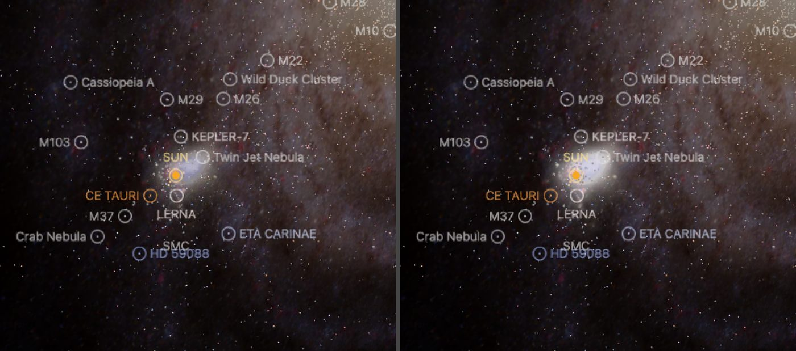
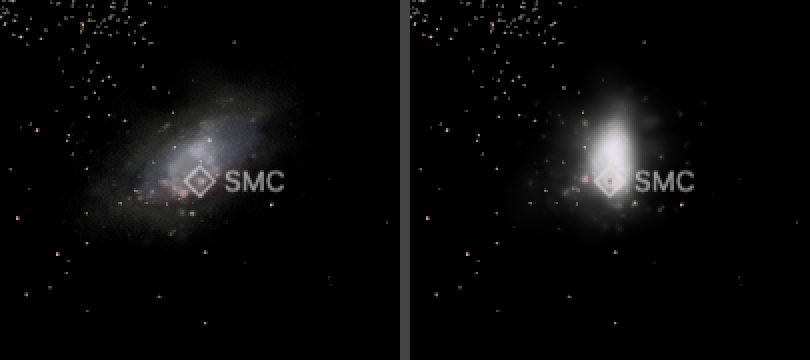

# Small Magellanic Cloud (SMC)

Five published images color one shared three-dimensional emission model; **Horálek optical is the default**. Each dataset carries the same 272 directional slices (80 x, 64 y, 128 z), packed into three WebP axis atlases, and the same 1,803 catalogue stars. Switching datasets changes color and never geometry. Nothing here measures gas or dust depth.

The shape is a hypothesis with two parts. A broad envelope carries 82.79% of the image light along the depth distribution of a **VMC-constrained ellipsoid**, and 476 fitted detail components sit at conditional modes of the **Garver stellar simulation** along their own sightlines. Catalogue-star depths are realizations inside that model, not distances.

## Sources

| Source / dataset | Role and selected input |
| --- | --- |
| [Tatton et al. (2021) red clump](https://doi.org/10.1093/mnras/staa3857) with [ESO VMC DR5.1 PSF photometry](https://www.eso.org/rm/api/v1/public/releaseDescriptions/155) | 489,760 observed tracers constrain the envelope shape; their distances are standard-candle estimates, not geometry. |
| [Garver, Nidever, Debattista & Deg simulation](https://doi.org/10.5061/dryad.1vhhmgr82) | 225,000 stellar particles supply conditional line-of-sight modes for the detail components. |
| [Horálek optical, iotw2615a](https://noirlab.edu/public/images/iotw2615a/) | 6069 × 4045-pixel wide-field photograph; also the baseline the emission model was fitted to. |
| [ESO VISTA, eso1714a](https://www.eso.org/public/images/eso1714a/) | Y/J/Ks near-infrared display; 4000 × 3540 pixels. |
| [SMASH, noirlab2030b](https://noirlab.edu/public/images/noirlab2030b/) | DECam g/r/i/z optical survey image, 3827 × 3190 pixels; also the publisher sky anchor every relative registration is matched to. |
| [DSS2, heic0514c](https://esahubble.org/images/heic0514c/) | 13096 × 13616-pixel photographic plate composite; narrower footprint than VISTA or SMASH. |
| [AllWISE color HiPS through CDS](https://alasky.cds.unistra.fr/MocServer/query?ID=CDS%2FP%2FallWISE%2Fcolor&get=record&fmt=json) | W4/W2/W1 false color over a 10° TAN field, 4000² pixels; not native detector sampling. |
| [Bonanos et al. (2010)](https://cdsarc.cds.unistra.fr/viz-bin/cat/J/AJ/140/416) | Observed sky positions and Johnson V for 1,803 selected massive stars. |
| [Nidever et al. (2011)](https://arxiv.org/abs/1104.2594) | [Stellar extent](source/stellar-extent.json): SMC red giants detected out to about 11 kpc. Inside that radius the SMC's caption hides. It marks where stars are still measured, not a boundary. |

None of the images covers the full Bridge, Wing or tidal debris. Exact input identities, credits, reuse terms and processing pins are in the [source manifest](source/manifest.json). The [investigation ledger](investigations.json) records selected and rejected routes; "included" means used by this delivery, not scientifically validated.

## Processing

1. **Shape.** The simulation particles and a Gaussian ellipsoid are each fitted to VMC red-clump sky positions and distance moduli on training regions. Withheld deviance per observed count, lower better: **ellipsoid 0.45749**, affine simulation 0.60119, simulation with bounded regional weights 0.59503. See [`fit.json`](source/evidence/smc/constrained/fit.json), [`fit-evidence.json`](source/evidence/smc/constrained/fit-evidence.json) and [the shape trial](../../../labs/nebula/models/smc/constrained/README.md).
2. **Emission.** The registered, star-removed Horálek image is smoothed and divided by the integrated ellipsoid column to give an envelope gain, so image brightness scales the envelope but never moves it in depth. The remaining detail is fitted with 476 components at the strongest simulation mode along each ray. [`emission-envelope-ellipsoid.json`](source/evidence/smc/constrained/emission-envelope-ellipsoid.json) is the recipe; [EMISSION-METHOD.md](../../../labs/nebula/models/smc/constrained/EMISSION-METHOD.md) explains the method.
3. **Datasets.** [`finite-datasets-ellipsoid.json`](source/evidence/smc/constrained/finite-lenses-ellipsoid.json) bakes each registered image onto that one geometry ([appearance receipt](source/lens-settings-evidence.json)). The [compact inputs](source/compact/inputs.json) carry what a replay needs; each delivered byte's laboratory record is under [`bake-inputs/references/`](source/bake-inputs/references).
4. **Stars.** Table 3 rows with finite V ≤ 16 whose ray lands on covered footprint; each depth inverts the joint emission and ellipsoid density at a fixed per-star quantile. [Star preparation](../../../labs/nebula/models/smc/stars/README.md) records the selection.
5. **Far view.** From afar the cloud is one image on a plane fixed in its frame, drawn as the Milky Way's backing is. [`prepare-galaxy-backing.mts`](../../../packages/bake/cli/prepare-galaxy-backing.mts) reads the [backing recipe](source/backing/recipe.json) and lays each dataset's own Sun-facing impostor view through the frame's centre, across the line of sight from Earth. No image is re-encoded. The frame's z axis is that line of sight, and the model was fitted to the sky image along it; it defines no disc plane. From Earth the plane therefore shows what the volume draws, and the hand-over keeps the same position, size and orientation. The plane replaced a camera-facing billboard of the same view, which spun as the camera orbited the cloud. After a rebake of the bank, run it again with `node packages/bake/cli/prepare-galaxy-backing.mts src/objects/smc-volume backing`.

`prepared/` is generated, not committed: `pnpm prepare:nebulae --if-missing` rebuilds the bank and its atlases from the compact inputs alone, and the [object descriptor](object.json) pins the result. Application provenance reads the evidence and recipe copies listed in [provenance references](source/provenance-references.json).

## Evidence

- **Fit.** Total front-projection relative squared error 0.006282; projection RMSE 0.01264 after fitting against 0.04694 before. 8 of the 476 components (0.35% of projected light) found no prior support and keep an authored finite depth.
- **Registration.** The [alignment report](source/evidence/smc/registration/alignment-report.json) qualifies all five shipped images. AllWISE has its own check against 7,172 bright W1 stars; SMASH's absolute solution remains the publisher's.
- **Stars against images.** Of the 40 brightest stars projected onto each original, those within 1 px of a photographic peak: Horálek 22 (median 0.67 px), DSS2 35 (0.70 px), VISTA 20 (3.12 px), AllWISE 14 (3.84 px), SMASH 9 (5.26 px). Mirroring east–west gives 0 for every image.
- **App.** Each dataset decodes one texture at the Earth framing, the world camera is unchanged across all five switches, and all 1,803 stars mount and toggle. The side views show line-of-sight extent rather than a flat sheet.
- **Replay.** From a removed `prepared/`, all 1,360 regenerated slice textures are byte-identical to the promotion output.
- **Far view (2026-10-07).** Zooming out of this page, the plane alone and the volume alone at the switch distance keep the same position, size and orientation; the plane is brighter.

## Known problems

- From well off the Earth line of sight the far plane is foreshortened, while the volume keeps its 25 kpc depth. The hand-over there is a cross-fade between two different shapes: from the Local Group view the plane is narrower and brighter than the volume it gives way to.

  

- The envelope is the ellipsoid's shape hypothesis and the detail components are conditioned on the simulation that the same VMC comparison disfavours. The two carry different depth hypotheses, and neither is measured gas geometry. The model records `materialGatePassed: false`.
- Photometric red-clump distances include intrinsic luminosity scatter, photometric error, reddening uncertainty and contamination, and have not been deconvolved into geometric depth. Large-scale extensions outside the survey footprint remain model-dependent.
- Faint concentric ripples remain in the outer halo where alpha is still quantized. Detail resolution is bounded by the 384-pixel fit and 128 slabs.
- Star removal leaves crowded and saturated stars and can remove compact nebular light. A bright foreground cluster is masked by an authored exclusion rather than classified.
- The dust and survey-band lab composites are not shipped: the AllWISE W2 background gradient, W3 Galactic cirrus and scattered light, SPIRE covering only about 26% of the field and uncorrected DSS2 plate-to-plate steps are still present in them.
- The earlier SMASH image-layer delivery is retired; its [source record](source/provenance.json) and [recipe](source/recipe.json) are kept as documents.
