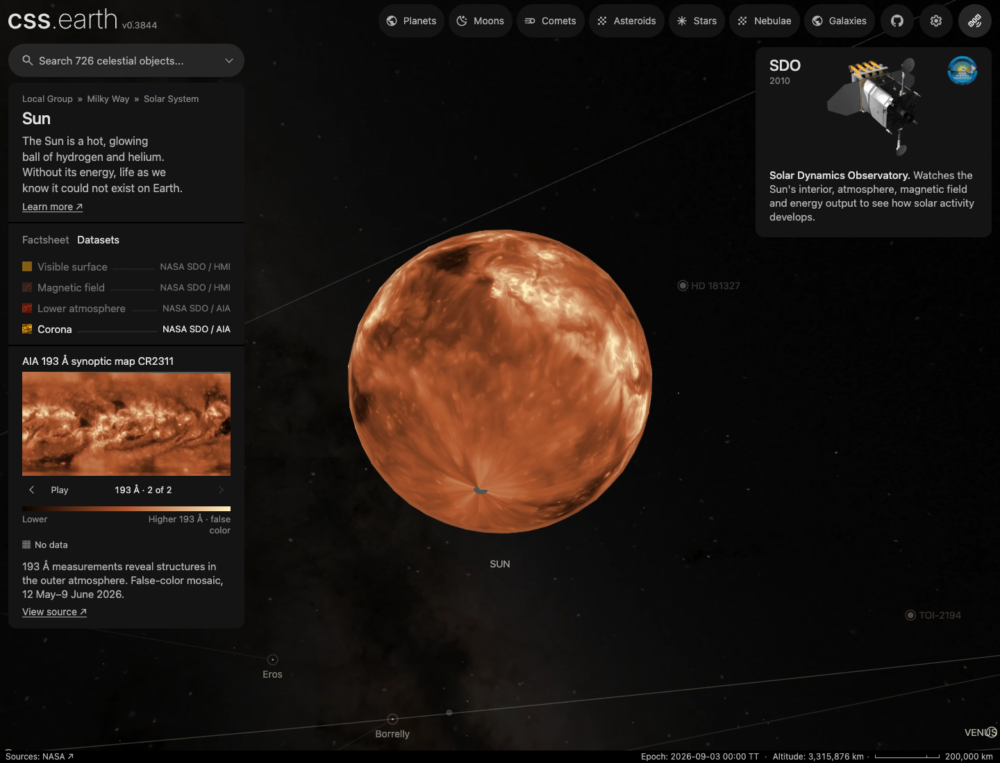

# Sun

`/sun/` — Maps spanning Carrington Rotation 2311, 12 May–9 June 2026.
They combine observations across one rotation, not one simultaneous view.

Source selections, recorded trials and open questions are in the [investigation ledger](investigations.json).

The [navigation marker recipe](source/preparation/navigation.json) retains the existing credited image and crop, then prepares a circular alpha edge so the photographic background cannot cover surrounding objects. The same silhouette is used by its larger context image where configured.

## Sources

| View | Source | What it means |
| --- | --- | --- |
| Visible surface | JSOC SDO/HMI `hmi.Ic_noLimbDark_720s`, 28 frames of CR2311 | Strips near the centre of each day’s disc form a map; JSOC removed the limb darkening. Colours and polar coverage are display choices. |
| Magnetic field | JSOC HMI, CR2311 | Magnetic field pointing into or out of the Sun, shown in false color. |
| Lower atmosphere | SDO AIA 304 Å CR2311 FITS | Ultraviolet light from the chromosphere and transition region, shown in false color. |
| Corona · 171 Å | SDO AIA 171 Å CR2311 FITS | Ultraviolet light from the quiet corona and upper transition region. |
| Corona · 193 Å | SDO AIA 193 Å CR2311 FITS | A different band sensitive to coronal and hot flare plasma. The arrows switch between the two corona maps. |

### Solar System overview

The Solar System overview is hosted by the Sun scene. Its credits also include
the planets, moons, asteroids and comets in the [shared world](source/presentation/solar-system.json),
not just the solar maps above. Each body keeps its imagery, shape, measurements
and full acknowledgments in its [own object package](../).

The [shared orbital preparation](../../../packages/bake/cli/prepare-solar-geometry.mts)
combines analytical models with retained Horizons states. These prepared
positions and orbit paths use the displayed scene epoch; they are not live
ephemerides. The footer's provider list combines the existing prepared source
credits of the bodies in this overview.

The [world navigation recipe](source/navigation/universe.json) samples every
prepared orbit at 90 vertices, including open comet paths. This changes the
display path, not the source positions or orbital model. Seen from its centre,
a chord of an N-vertex circle strays (π/N)²/2 of the radius. On a 1,440 px
view with the 60° field, that is 1.7 px at 60 vertices and 0.8 px at 90, so a
moon's orbit seen from its planet no longer shows corners
(60 against 90: the
Moon's orbit from 1.1 million km and Ganymede's from 1.9 million km). A host detail view
defers its satellites' paths until the satellite system is opened or a
satellite is targeted.

## Evidence

Checked on 27 September 2026.
The check record records the native-source restoration,
FITS and preparation tests, and desktop/mobile arrow checks. Both arrows retain the mounted
scene and camera. The mobile capture
shows the same dataset at 390 × 844, DPR 2. These are display checks, not a new scientific review.



All 798 inventoried files restored from R2 into an empty scene installation and matched their
recorded byte counts and hashes. Total install size is 18,510,138 bytes, up from 17,562,761;
the new 193 Å images account for 331,234 bytes. These are installed sizes, not production
page-transfer measurements. FITS tests, focused source/selector tests, bake boundaries and
preparation typechecks passed. Two wider checks skipped unrelated missing inputs: the
`a0952p69` descriptor for all-object legends and a Charon LEISA cube for the FITS fixture
inventory. No full application build or all-body suite is claimed.

The 193 Å addition and AIA gap repair use the same CR2311 geometry and existing renderer.
The [FITS map tests](../../../packages/bake/src/objects/interpretation/fits-map.test.mts) check north/south
pixel centres, preserved zero and negative values, floating-point BLANK handling, native
byte anchors, common observation dates and transparent off-limb plates. The prior row
rounding displaced nearest-neighbour samples by half a source pixel; centre-based flooring
removes that displacement.

NASA's 193 Å file has an unterminated WAVELNTH string. The shared FITS reader accepts only
a numeric wavelength followed by a plain ion label for that keyword, reports a warning,
and preserves the original card. Other unterminated strings still fail. The downloaded
file and its image samples are unchanged.

Photosphere and longitude review (measured on `main`; unchanged continuum and magnetic recipes retain these results):

- The old photosphere was built from daily browse JPEGs and sampled each day's
  disc on the wrong side of its central meridian between frames. With the
  sign fixed, 100% of sunspot pixels fall within 1° of strong field in JSOC's
  own `hmi.mrsynop_small_720s[2311]` magnetic map, against 76% before; the old
  map also showed doubled, half-strength spots where two frames blended
  ([before, after and the magnetic field](source/reference/photosphere-before-after.png)).
- Longitude direction (Solar System audit, measured on `main`):
  every Sun map was mirrored east–west. JSOC's magnetic-map header (CTYPE1
  `CRLN-CEA`, CDELT1 −0.5, pixel 1 at Carrington longitude 0.3°) and the AIA
  synoptic maps run Carrington longitude up to the right. Carrington longitude
  grows in the direction of rotation, which is the renderer's east-positive
  sense (`packages/telescope-cli/src/archives/interferometry/surface-dataset.mts`: east longitude grows
  from 0 at the left edge), so the maps are used as stored. The earlier review
  reversed all of them and the HMI photosphere projection laid its columns out
  from 360° down to 0°. Both are fixed; the runtime-contract test checks that
  the magnetic dataset colours negative field at the left of a test map.
- The photosphere now reads 28 JSOC `hmi.Ic_noLimbDark_720s` frames (daily at
  00:00 TAI from 13 May to 9 June, plus 26 May 12:00 for the missing midnight,
  all QUALITY 0). Each frame is placed by its pinned DRMS record: CRPIX,
  CDELT, CROTA2, RSUN_OBS and the observer's CRLN_OBS and CRLT_OBS. This replaces
  the disc detection, the radial normalization and the approximate B0 formula.
  Each map column blends the two frames whose central meridians bracket it.
- The rim darkening plate uses the limb darkening JSOC removed, measured as the
  ratio of the 13 May `hmi.Ic_720s` frame to its flattened twin. The record's
  LDCoef0–5 do not follow a polynomial in 1 − μ (up to 6% off near μ = 0.2), so
  the coefficients are not used.
- Colours follow SDO's own browse colour table, measured by registering the
  13 May browse JPEG on the `hmi.Ic_720s` frame: I/I₀ = 0.56 → (249, 85, 1) up
  to 1.08 → (255, 178, 37), with a tight 10–90% spread (≤ 16 levels). Below
  0.56 sunspots are only a few JPEG pixels wide and the table is not
  measurable; the palette ramps linearly to black there.
- The JSOC segments are Rice tile-compressed FITS. `@cssearth/fits` (`packages/fits/src/rice.ts`)
  decodes them; on the full 13 May frame every one of the 16.8 million samples
  equals astropy's raw integer through BSCALE/BZERO, with BLANK samples in the
  same places. The [oracle table](../../../packages/core/src/node/oracle/README.md) lists the
  committed fixture.
- Unit tests and the
  shared browser conformance harness
  define the package checks. The [four-dataset render](source/reference/rendered-lenses.png)
  of this version was inspected after the scene reported ready: active regions
  sit in the same places in every dataset.

## Known problems

- Polar silhouette dent: the shared sphere closes each pole with one flat
  patch at the 78.75° band boundary (z = R·sin 78.75° + offset ≈ 0.981 R), so
  seen from the equator the disc is about 1.9% of R (≈ 6 CSS px at the default
  310 px radius) short at each pole. The retired lane hid this behind 32 band
  leaves up to 89° plus a centre cap; the limb plate's rim alpha (≤ 0.68 for
  the FITS datasets, ≤ 0.36 for the continuum) does not cover it. A polar band
  extension of the shared geometry would remove it.
- The visible-surface and magnetic-field maps still continue unobserved polar values. These filled areas are display approximations. The ultraviolet maps instead mark their missing samples with the shared gray grid.
- Ultraviolet colors are display scales for detector counts, not temperature or calibrated radiance. Brightness should not be compared numerically between wavelength bands.
- The Sun has no entry in the shared solar geometry tables; its presentation
  axis (7.25° tilt) and world frame are authored in
  `source/presentation/solar-system.json` and `source/navigation/universe.json`,
  not derived from an ephemeris. The prepared sky keeps the retired lane's
  visual baseline registration; it is not astrometrically registered.
- The shape radius is the IAU nominal 695,700 km (the world frame's
  `bodyRadiusM`); the NASA fact sheet's rounded "700,000 km" stays a fact
  sheet value only.

[Inputs](source/manifest.json) · [Object definition](object.json) · [Preparation settings](source/preparation) · [Delivered files](inventory.json) · [Credits](NOTICE.md)

## Methods and source notes

<details>
<summary>Map dimensions and missing-sample treatment</summary>

- Photosphere: JSOC `hmi.Ic_noLimbDark_720s` continuum intensity (limb
  darkening removed by JSOC) from 28 frames across CR2311, placed by each
  frame's recorded geometry and coloured with SDO's measured browse colour
  table. Continuation beyond 80° latitude is a display approximation.
- Magnetic field: JSOC `hmi.mrsynop_small_720s[2311]`, the 720 x 360 radial
  magnetic-field map for Carrington Rotation 2311. The FITS grid is equally
  spaced in sine latitude. Preparation resamples it to equal latitude, keeps
  its east-positive longitude axis and uses a declared bipolar
  blue-to-amber false-colour scale.
- Lower atmosphere: NASA SDO AIA 304 Å CR2311 FITS synoptic map, 3,600 × 1,080,
  east-positive longitude as stored, displayed in false color with a
  logarithmic intensity scale.
- Corona: NASA SDO AIA 171 Å and 193 Å CR2311 FITS synoptic maps, each 3,600 × 1,080,
  east-positive longitude as stored, displayed in false color with a
  logarithmic intensity scale.

CR2311 covers 2026-05-12 through 2026-06-09. A synoptic map combines central meridian
observations across one solar rotation; it is a full-surface temporal map, not a simultaneous
snapshot. The three AIA headers give the same TAI interval: 2026-05-12 21:56:01 through
2026-06-09 02:57:22. Preparation preserves nonfinite AIA samples as gaps. Finite zero and
negative samples stay dark; the invalid floating-point BLANK=1000 card does not erase
measured values of 1000. No latitude or Fourier polar continuation is applied to these maps.

Each surface declares its interpretation in the `science.synoptic` block of
`source/preparation/raster.json`; the shared observation adapter decodes the
source values and applies the colour transform before the raster lane packs the
latitude bands, projects the poles and encodes the textures at both prepared
densities. The 193 Å display uses an authored brown-to-cream palette and a logarithmic
10–1100 counts/pixel range; the existing 171 Å and 304 Å palettes and ranges are retained.
The legends in `source/content/object.json` name the same palette stops
as the raster recipe.

The continuum frames and FITS maps are processed mission products. Strip assembly,
resampling, coverage marking and color mapping are our additional steps; the textures are
display outputs.

The 2026-05-27 AIA browse photographs remain recorded as historical inputs, but no longer
supply off-limb context. All off-limb plates are transparent. The existing prepared rim
plate remains a display treatment, not a reconstruction of the corona outside the disk.

</details>

<details>
<summary>Globe projection, limb smoothing and sky source</summary>

PolyCSS maps the prepared 1,024 × 512 global texture onto 448 HTML surface elements arranged by
longitude and latitude, the shared raster-lane sphere. Each pole adds one flat cap element textured
from the 512 × 256 polar sprite, for 450 visible surface elements in total. Camera pitch and yaw
change the visible source texels, and the body animation rotates actual global longitudes around
the authored solar axis.

The visible-surface and magnetic-field maps use Fourier continuation inside one latitude
band of each pole before packing. This is a display treatment, not another pole observation.
The three ultraviolet maps retain their source samples and mark missing coverage instead.

Each dataset also has one source-derived, antialiased 512-pixel limb asset. It covers only the
outer edge to smooth the visible corners of the surface elements; its transparent center does
not replace the globe material. The emissive presentation has no lighting track: no Shadows
toggle, no directional Sun, no terminator. At device DPR 1 and 2, the scene uses the same
highest-resolution surface, polar, limb and off-limb images, selected once when the scene
opens.

</details>

## Virtual Telescope API

The [source observation declarations](source/observations.json) expose 32 manifest-declared
native disk-map inputs through `telescope:query`: 28 HMI continuum frames, the HMI radial-field map,
and AIA 171/193/304 synoptic maps. The declarations also include a COR1-A density cube. No solar branch is required in the shared query or qualification code.

```sh
node packages/telescope-cli/run-typed-module.mjs packages/telescope-cli/src/query.mts --target sun --wavelength 0.0170,0.0172 \
  --any-time --min-arcsec 2 --kind image --result telescope-product --json
```

Execute a returned qualification action to acquire and decode an exact observation. The receipt
attests source integrity and decoding. HMI keyword metadata, AIA's time-dependent synoptic grid,
unknown achieved resolution and missing uncertainty remain explicit limitations. These products
are usable native arrays; they are not yet qualified shared body maps. The display maps described
above retain their existing separate preparation and provenance.
