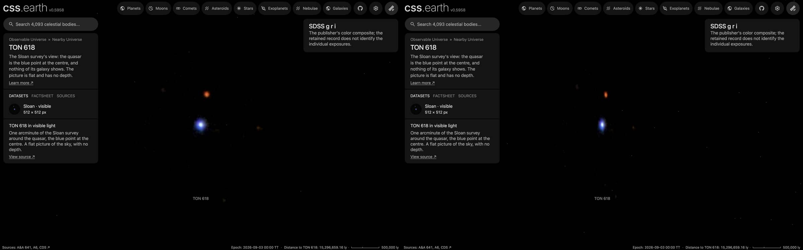

# TON 618 picture

A published picture of TON 618 stands at its place and distance as one flat image facing the Sun. It is a picture
of the sky: nothing in it has depth, and seen from the side it is a line.

## Sources

| Selected source | Input and meaning |
| --- | --- |
| [CDS (SDSS) CDS/P/SDSS9/color](https://alasky.cds.unistra.fr/MocServer/query?ID=CDS%2FP%2FSDSS9%2Fcolor&get=record) | [Record](../../sources/sdss-dr9-color-hips.json). SDSS g, r and i as blue, green and red. The publisher's file, 512 × 512 px (`source/source.jpg`, made by [`picture-source.mts`](../../../packages/bake/authoring/far-destinations/picture-source.mts); not tracked). [CC BY](https://www.sdss.org/collaboration/#image-use), credit: Sloan Digital Sky Survey DR9; color HiPS by CDS (CNRS/Unistra). A display composite, not calibrated photometry. |
| [Lyke et al. (2020), The Sloan Digital Sky Survey Quasar Catalog: Sixteenth Data Release, ApJS 250, 8](https://cdsarc.cds.unistra.fr/viz-bin/cat/VII/289) | [Record](../../sources/sdss-dr16q-2020.json). Position 187.1040°, 31.4771° and redshift 2.22: row SDSS J122824.96+312837.6: RAJ2000 187.104039, DEJ2000 31.477127; row SDSS J122824.96+312837.6: z 2.22, source VI (visual inspection). |
| [Planck Collaboration (2020)](https://arxiv.org/abs/1807.06209) | [Record](../../sources/planck-2018-cosmology.json). The cosmology that turns the redshift into a distance: comoving distance 5,616 Mpc, light travel time 10.83 billion years, age of the universe then 2,954 million years (Astropy 8.0.1, `Planck18`). |

## The picture

- **Placement:** The cutout is asked of the CDS hips2fits service as a tangent-plane image centred on the catalogue position, 60 arcsec across at 512 px (0.117 arcsec per pixel, finer than the survey's 0.396 arcsec pixels), north up. Its geometry is the request's; no registration was measured.
- **Plane:** the picture's own tangent plane, facing the Sun. The picture is centred on the object. The recipe's small inclination is not a measurement: the bake needs a plane with some depth along the sight line. This is where a sky picture lies, not a measured orientation of the object.
- **Size:** 1.00 arcmin across, 1.63 Mpc × 1.63 Mpc at the object's comoving distance (the angle times the distance). The page frames 816.8 kpc, half the picture's short side.
- **Sky:** light below 12 of 255 is taken as sky and left transparent, so the universe's own dots show through it. The floor is a presentation value set just above the frame's own background (its 75th percentile), so the frame does not show as a grey square; faint light below it is lost.
- **Edges:** the outer 4% of the frame fades out, so the picture has no hard rectangular edge.
- **Bytes:** one image at 512 px on its long side (WebP quality 70, alpha quality 80), as the Milky Way's backing image is.

## Evidence

The TON 618 page in headless Chromium at 1440 × 900, device pixel ratio 2, on this branch on 2026-10-02: the default
arrival and the camera turned part of the way round.

## Measured, chosen and inferred

| Value | Kind |
| --- | --- |
| Position 187.1040°, 31.4771° and redshift 2.22 | Measured: the papers above |
| Distance 5,616 Mpc | Derived: the redshift's comoving distance in the Planck 2018 cosmology |
| Field, scale and rotation of the picture | Measured from the publisher's own marks and Gaia DR3, as the Placement note says |
| Flat plane facing the Sun | The geometry of a sky picture; no depth is measured or drawn |
| Window, sky floor, edge fade, 1,024 px, framing radius, 0.001° inclination | Presentation |

## Known problems

- The picture is flat: seen from the side it is a line, and from behind it is mirrored.
- Everything in the frame stands on the object's plane, whatever its own distance. The whole cutout. The other points are Milky Way stars and galaxies at their own distances. A display composite, not calibrated photometry.
- The size is a comoving size: the angle times the comoving distance. The object's proper size at its redshift is smaller by 1 + z.
- The page opens with ecliptic north up, as every page does, so the picture arrives turned from the publisher's orientation.
- A flight from another page keeps the travelling camera's angle, so it can arrive seeing the picture from an oblique angle or
  nearly from the side. Opening the page directly faces the picture.
