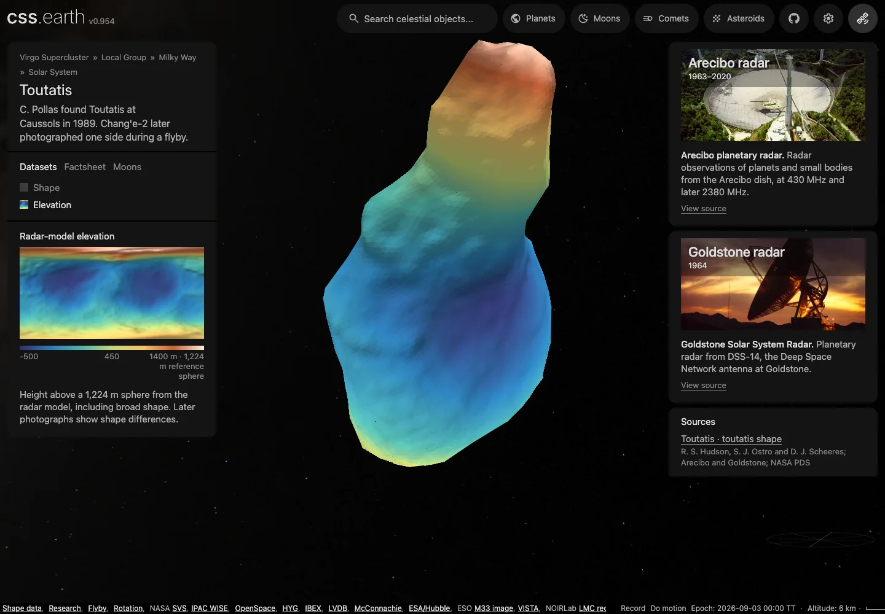

# Toutatis

Shape-only views use the shared neutral gray (#808080 sRGB). This is a display convention, not a measurement of surface color or albedo; gaps within photographic and scientific datasets retain the missing-data grid.

## Sources

The Shape view uses the original high-resolution Hudson, Ostro and Scheeres (2003) radar model archived in NASA PDS as `urn:nasa:pds:compil.ast.radar.shape-models:data:4179toutatis2_tab::1.0`. The PDS4 migration in 2020 did not change the scientific data. Input `source/shape/4179toutatis2.tab` is Wavefront OBJ text despite its extension; its unchanged label is kept beside the recipe under `source/reference/`. The acquisition plan restores the exact pinned bytes from [PDS](https://sbnarchive.psi.edu/pds4/non_mission/compil.ast.radar.shape-models/data/4179toutatis2.tab).

Shape uses the shared neutral-gray material with Shadows disabled by default. Optional prepared directional lighting conveys the source geometry, with no photographic texture, albedo claim, invented craters or compositional colors. The map, thumbnail and navigation context derive from the same mesh and grid.

Elevation colors the same source model by radius minus the **1,224 m reference sphere**. It includes the asteroid’s broad shape; it is not gravitational height or an observation of surface composition. The palette spans −500 to 1,400 m, with cartographic relief from the source normals. The original Shape view remains the default, and Shadows starts off.

## Evidence

The 14 September 2026 qualification at `22530863b602e90684fe778b16136de3d890fe2d` passed both body source/package checks, three focused source-surface regressions, the independent full-source verifier and strict TypeScript. [Headless browser conformance](evidence/source-surface/conformance.json) passed mobile and dataset interactions at DPR 1 and 2. [Additional views](evidence/source-surface/browser.json) cover both sides, a close-up, an extreme angle and Shadows on/off. [Close-up](evidence/source-surface/close.webp): fine triangle boundaries remain visible at close zoom; the fixed 800-face silhouette remains faceted. These are focused checks, not a full-suite pass.

All 5,775,099 triangle-interior texels passed the 50 m transfer limit; the maximum sampled distance, including atlas bleed, was 47.947 m. These are atlas sample counts, not measured surface-area coverage. The [preparation comparison](evidence/source-surface/preparation.json) verifies unchanged geometry, camera, retained leaves and every pre-existing image hash. Elevation adds 747,604 image bytes. The [fresh-install record](evidence/source-surface/delivery.json) verifies published asset hashes in an empty destination.

Meshoptimizer 1.2.0 simplifies the original connectivity to 800 triangles before texture preparation, with `ErrorAbsolute` and `RegularizeLight`, a 50 m error setting, no radial geometry replacement, and no removed opposite faces. The result is closed and consistently wound. The library estimate is 27.55 m, distinct from a geometric bound. Two-way area-stratified surface samples (8,192 per direction) give source-to-display mean 6.12 m, p95 16.57 m, maximum 33.31 m, and display-to-source mean 6.10 m, p95 16.55 m, maximum 40.50 m. These are sampled nearest-triangle distances, not exhaustive Hausdorff bounds or source measurement uncertainties. Native PolyCSS `u` triangles use 128 px raster cells and the established prepared lighting path.

[Source test definitions](https://github.com/layoutit/css.earth/blob/943c34c8bac83509725d55ab91b48832fd65a4e8/tests/objects/unit/toutatis/source.test.mts).

The Elevation recipe uses the existing closest-source-point sampler on the full 39,996-facet mesh, with a 50 m display-to-source distance limit. This assigns values to individual surface patches instead of choosing the first surface on a ray. At the recorded neck regression, the source ray crosses radii of 1,285.607, 1,363.000 and 1,734.557 m: the outer patch is **510.557 m** above the reference sphere, rather than the first-ray value of **61.607 m**. The [independent full-source check](evidence/source-surface/independent.json) verifies both overlapping patches and an offset point against every original triangle. The [regression fixtures](../../../tools/objects/terrestrial-layers/fixtures/source-surface-cases.json) retain their exact coordinates; the existing source-surface test also checks atlas sampling. Flat previews withhold ambiguous rays, while the body atlas samples the corresponding three-dimensional surface.

## Known problems

The source is based on radar observations in 1992 and 1996, with nominal average model resolution around 34 m. Later radar and Chang’e-2 images show mismatches, particularly at the large lobe; it must not be described as a complete spacecraft reconstruction. The [2013 rotation study](https://echo.jpl.nasa.gov/asteroids/takahashi.etal.toutatis.2013.pdf) discusses the residual shape differences. Details below the display mesh’s spacing are not retained.

Toutatis has non-principal-axis tumbling, with characteristic rotation and precession periods around 5.4 and 7.4 days. The existing `cssearth-display-orientation@1` recipe deliberately uses a fixed arbitrary frame, zero propagated spin and illustrative lighting. It does not apply a linear rotation period or claim a present-day attitude. The [2015 rotational analysis](https://arxiv.org/html/1511.04357) gives a measured flyby attitude and dynamics; no current attitude propagation is derived from it here.

The Chang’e-2 photograph route was checked again on 2026-09-13.
[Huang et al. (2013)](https://doi.org/10.1038/srep03411) and its supplement give
camera dimensions and a radar-model attitude comparison, but no complete
per-frame camera registration for this mesh. That article's CC BY-NC-ND terms
also exclude a modified texture derivative. [Jiang et al. (2015)](https://doi.org/10.1038/srep16029)
provides photographs under CC BY 4.0, but its annotated figure is not a released
registered raster. Reuse permission and shape registration are separate gaps;
neither a silhouette match nor a flyby attitude alone resolves the latter.
A trial the same day projected Jiang et al.'s Figure 1c onto this mesh
([method record](https://github.com/layoutit/css.earth/blob/a1570599b69cd007f21af69635a46e60987ebe40/src/planets/toutatis/source/reference/chang-e-2-method.md)).
Its camera direction came from the rotation angles Bu et al. (2015) quote for
Zou et al. (2014), Figure 3, and its scale and position were matched by hand to
Zou's radar rendering. Three check windows agreed within 1.0–2.2 figure pixels,
but they compare two photographs, not photograph pixels with surface points.
With no measured camera or control points, that placement does not register
the photograph, so the photographic lens stays deferred.

[Inputs](source/manifest.json) · [Preparation](source/preparation) · Provenance (`prepared/provenance.json`) · [Delivered files](inventory.json) · [Credits](NOTICE.md)

Methods and source notes

The archive specifies kilometers, center of mass as origin, and principal axes. For Toutatis, +Z is the long axis, not a spin pole. Longitude is eastward around that source axis and latitude is planetocentric; they describe the model frame. The 20,000 vertices and 39,996 facets span 2.281652 × 1.914287 × 4.581037 km. Signed closed volume is 7.681121590 km³, giving a volume-equivalent radius of 1.223992275 km; the common reference radius is rounded to 1.224 km. The mesh is not rescaled to the incompatible radius field in the pinned Horizons physical record.

**Dataset survey**

Every examined source, with its decision and what would reopen it, is in the [investigation ledger](investigations.json).

The font input retains its original license and acquisition pin. Runtime installation uses the generated body-specific asset inventory; source restoration and runtime delivery are separate checks.

