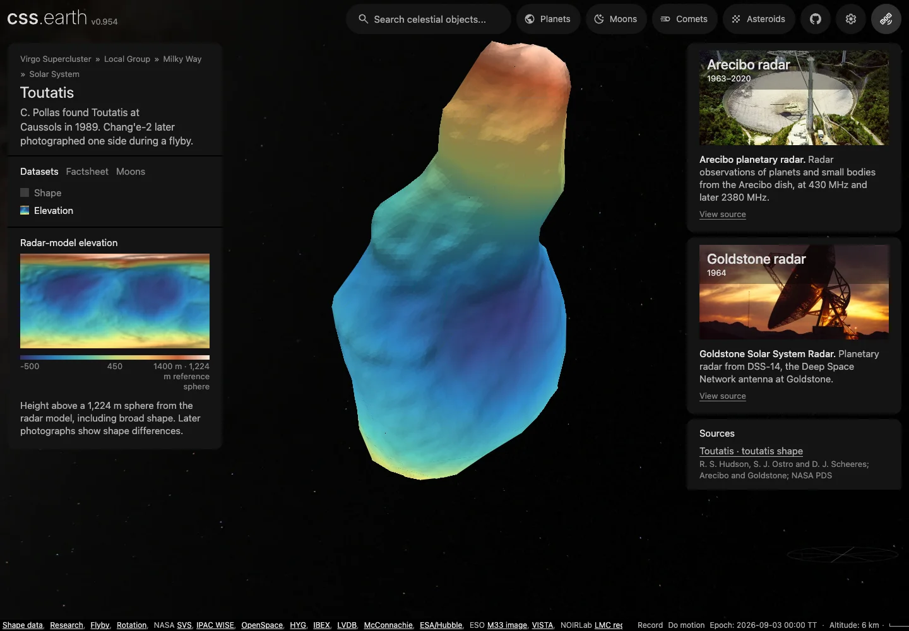

# Toutatis

Toutatis is shown on its radar shape model, in neutral gray (Shape, the default) and colored by Elevation. Shape-only views use the shared neutral gray (#808080 sRGB). This is a display convention, not a measurement of surface color or albedo.

## Sources

The Shape view uses the original high-resolution Hudson, Ostro and Scheeres (2003) radar model archived in NASA PDS as `urn:nasa:pds:compil.ast.radar.shape-models:data:4179toutatis2_tab::1.0`. The PDS4 migration in 2020 did not change the scientific data. Input `source/shape/4179toutatis2.tab` is Wavefront OBJ text despite its extension; its label is kept under `source/reference/`. The acquisition plan restores the exact bytes from [PDS](https://sbnarchive.psi.edu/pds4/non_mission/compil.ast.radar.shape-models/data/4179toutatis2.tab).

Every examined source, with its decision and what would reopen it, is in the [investigation ledger](investigations.json).

## Processing

The archive gives kilometers, the center of mass as origin, and principal axes. For Toutatis, +Z is the long axis, not a spin pole. The 20,000 vertices and 39,996 facets span 2.281652 × 1.914287 × 4.581037 km, with a volume-equivalent radius of 1.223992275 km.

Meshoptimizer 1.2.0 simplifies the original connectivity to 558 closed, consistently wound triangles, with a 50 m error setting and no radial geometry replacement. Native PolyCSS `u` triangles use 128 px raster cells and the prepared lighting path.

Shape has no photographic texture, albedo claim, invented craters or compositional colors. Shadows starts off; optional directional lighting conveys the geometry.

Elevation colors the same model by radius minus the **1,224 m reference sphere**. It includes the asteroid’s broad shape; it is not gravitational height or composition. The palette spans −500 to 1,400 m, with relief from the source normals. The closest-source-point sampler works on the full mesh with a 50 m distance limit, so overlapping patches each get their own value instead of the first surface on a ray. At the neck, the outer patch is **510.557 m** above the reference sphere, rather than the first-ray value of **61.607 m**. The [regression fixtures](../../../packages/bake/src/objects/geometry/fixtures/source-surface-cases.json) keep those coordinates.

## Evidence

Two-way area-stratified samples (8,192 per direction) give source-to-display mean 6.12 m, p95 16.57 m, maximum 33.31 m, and display-to-source mean 6.10 m, p95 16.55 m, maximum 40.50 m. These are sampled distances, not exhaustive bounds or source measurement uncertainties. All 5,775,099 triangle-interior texels passed the 50 m transfer limit; the maximum sampled distance was 47.947 m.

## Known problems

- The source is based on radar observations in 1992 and 1996, with nominal average model resolution around 34 m. Later radar and Chang’e-2 images show mismatches, particularly at the large lobe; it is not a complete spacecraft reconstruction. The [2013 rotation study](https://echo.jpl.nasa.gov/asteroids/takahashi.etal.toutatis.2013.pdf) discusses the differences. Fine triangle boundaries show at close zoom, and the 558-face silhouette is faceted.
- Toutatis tumbles, with rotation and precession periods around 5.4 and 7.4 days. The display uses a fixed arbitrary frame, zero spin and illustrative lighting, and claims no present-day attitude. The [2015 rotational analysis](https://arxiv.org/html/1511.04357) gives a flyby attitude; no attitude is propagated from it here.
- There is no photographic dataset. [Huang et al. (2013)](https://doi.org/10.1038/srep03411) give no per-frame camera registration for this mesh, and its CC BY-NC-ND terms exclude a modified texture. [Jiang et al. (2015)](https://doi.org/10.1038/srep16029) provides photographs under CC BY 4.0, but not a registered raster. A trial projection of their Figure 1c was placed by hand, with no measured camera or control points, so it does not register the photograph.

[Inputs](source/manifest.json) · [Preparation](source/preparation) · [Delivered files](inventory.json) · [Credits](NOTICE.md)
