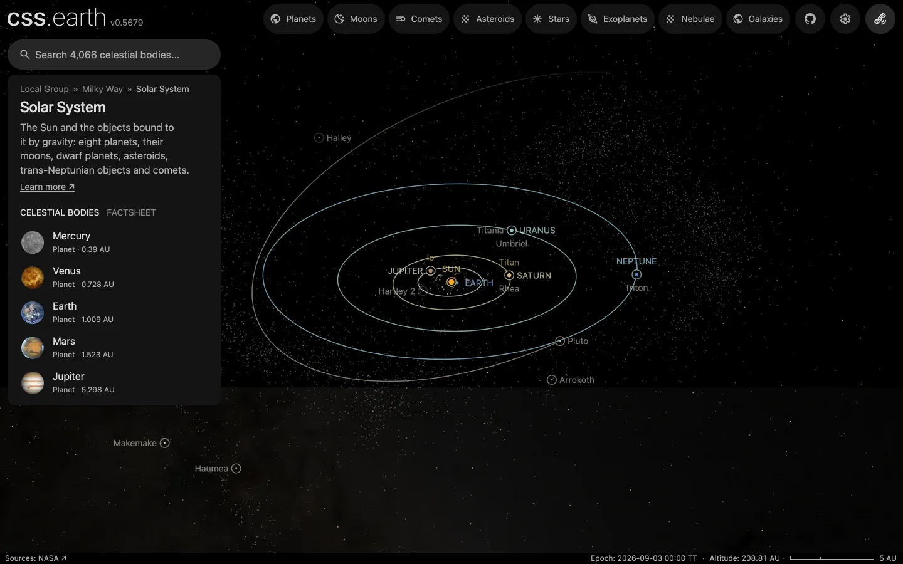

# Trans-Neptunian objects without a page

The 4,167 objects past Neptune that have a well-known orbit and no page of their own, one dot each: the Kuiper belt, the scattered disc and the detached objects beyond them. They draw while the Sun or a body that orbits it is selected. The 29 trans-Neptunian objects with pages keep their own markers.

## Sources

| Source | Measurement used |
| --- | --- |
| [JPL Small-Body Database](https://ssd.jpl.nasa.gov/tools/sbdb_query.html) | The osculating orbital elements of every object in its trans-Neptunian orbit class (semi-major axis past Neptune's): eccentricity, perihelion distance, inclination, node, argument of perihelion, time of perihelion and the solution's condition code. Heliocentric, ecliptic of J2000. Queried 2026-10-01: 7,293 objects. |
| [Minor Planet Center, uncertainty parameter U](https://minorplanetcenter.net/iau/info/UValue.html) | What a condition code means: the drift along the orbit in ten years is under 7,488 arcseconds (2.1°) at code 6, under 33,121 (9.2°) at 7, under 146,502 (40.7°) at 8 and more at 9. |

[Inputs](source/manifest.json) · [Recipe](source/dots/points.json)

## Processing

1. [`positions.mts`](../../../packages/bake/authoring/small-body-dots/positions.mts) asks the database once for the class in [`query.json`](source/dots/query.json). It carries each orbit from its perihelion passage to the world's epoch, JD 2461286.5 TT (2026-09-03), as an unperturbed ellipse about the Sun, and turns the result from ecliptic to ICRF axes. It leaves out every object whose name or designation is an object package's (29), and every orbit with a condition code above 6 or none (449 at code 7, 691 at 8, 1,943 at 9, 14 with none): a dot that can be tens of degrees along its orbit from the object does not mark where it is. It writes the rows in the order of a hash of each name, so the first rows the app draws from afar cover the whole belt, to [`positions.csv.gz`](source/dots/positions.csv.gz).
2. `packages/bake/cli/prepare-body-points.mts` writes the positions as a point bank whose origin is the Sun. The bank is held in gigametres, rounded to 100 km, because a megametre bank reaches only 215 million km.

The dots are the app's catalogue dots: not clickable and not named.

## Test results

The 29 left-out objects have prepared positions of their own, taken from JPL Horizons. The script reports how far each one's ellipse lands from that position. Pluto's differs by 0.037 au, Eris's and Orcus's by 0.0006 au, Makemake's by 0.0003 au, and the other 25 by 0.0001 au or less. Pluto, Eris and Orcus have large moons; a difference of this size would follow from one position being the body's and the other the system's centre of mass, which this check does not separate.

After the left-out objects were removed, no dot lay within 0.05 au of any Solar System body that has a page.

The dots lie 2.5 to 123.9 au from the Sun: 315 inside 30 au, 3,637 between 30 and 50 au, and 215 beyond.

## Evidence

A headless capture of this version's Solar System overview at 211 au.

## Known problems

- The dots are the objects found so far with well-known orbits, not the belt. Leaving out the loose orbits removes most of the deep search fields, such as the one made for New Horizons around Arrokoth. They gather where surveys have looked, and they thin out with distance because fainter objects go unseen.
- The database's trans-Neptunian class is set by semi-major axis alone. 315 of the dots are now inside Neptune's distance, on stretched orbits.
- Each orbit is carried as an unperturbed ellipse, without the planets' pulls. The script checks the result only for the 29 objects with pages.
- No color is taken from the database. Every dot is `#9a9a9a`, the one neutral gray the app gives a body without a measured color (`NEUTRAL_CATALOGUE_COLOR`). The 1.5 px dot size and half opacity are display choices.
- The dots do not draw while a moon is selected: a moon's system is the moon and its planet.
- The positions hold for the world's one epoch; the dots do not move.
