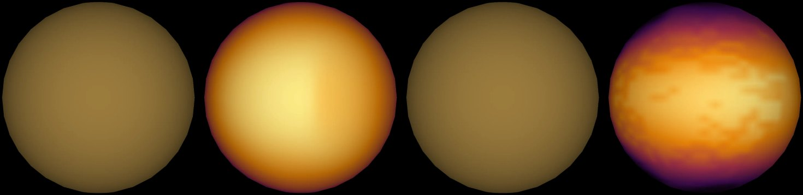
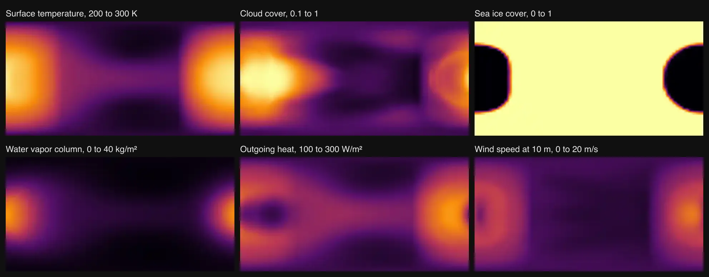
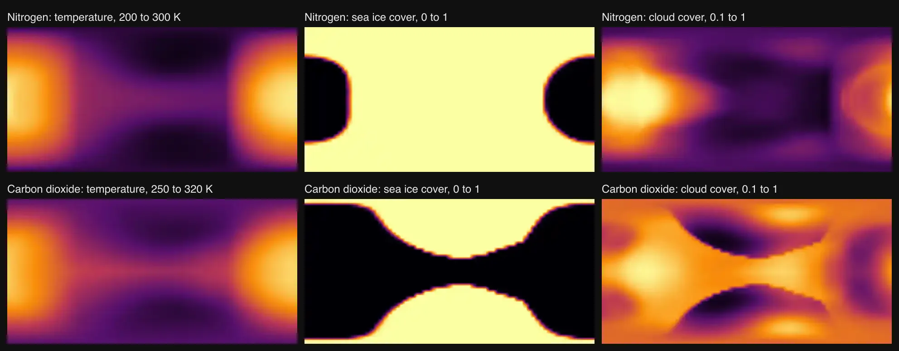
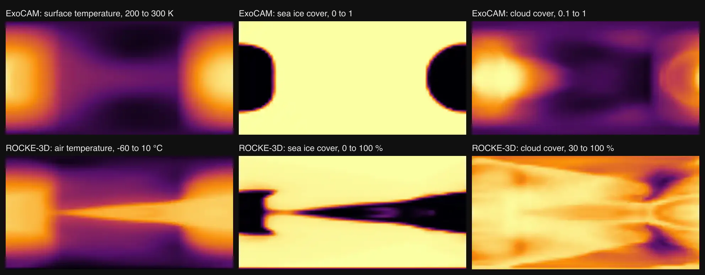

# TRAPPIST-1e

The page opens on a published climate model of the planet, labelled as a model. The [navigation marker](source/preparation/navigation.json) is drawn from that dataset with a prepared curvature cue; the shading is a display convention, not measured limb darkening.

## Sources

TRAPPIST-1e is the fourth of the seven planets of [TRAPPIST-1](../trappist-1/README.md), an ultracool dwarf 12.47 parsecs away. Every number in this
package comes from Agol et al. (2021, PSJ 2, 1), who fitted the seven planets' transit times and the Spitzer and ground-based photometry together: the
planets perturb each other enough for their masses to be read from the timing of their transits.

**Size and mass.** 0.920 Earth radii and 0.692 Earth masses (Agol et al. (2021, PSJ 2, 1), Table 6), a density of 0.889 Earth's and a
surface gravity of 0.817 Earth's. The radius comes from the transit depth against the star's own radius; the mass from the
transit-timing variations, scaled by the stellar mass Mann et al. (2019) give.

**Orbit.** 6.0996 days at 0.02925 au, 0.646 times the starlight Earth receives (Agol et al. (2021, PSJ 2, 1), Tables 2, 5 and 6). The
scene draws a circle: the paper's eccentricity for this planet, 0.00632, moves it by up to 4.7 of its own radii, and is not drawn. The
period and transit time are the ones the Agol et al. (2024, arXiv:2409.11620) forecast gives around the scene epoch
(2026-09-03), which adds JWST timings to the Agol et al. (2021) model; their Table 2 period, 6.101013 d, is an osculating value at
the start of their simulation and drifts hours off by 2026. Transit-timing variations of -11.5 to +45.6 minutes about that
line are not modelled. The orbit's position
angle on the sky is not measured, so the ascending node is drawn at celestial north, a stated convention.

**Rotation.** Assumed synchronous: this close to its star the planet is expected to be tidally locked, and no rotation period of
TRAPPIST-1e is measured. Longitude 0 faces the star.

**What is not here.** No image, color or measured map of this planet exists. The neutral gray shape of an unresolved surface stays one dataset away, and the page says which view is a model.

**Climate model dataset.** The surface temperature of TRAPPIST-1e in ExoCAM, from the model's own paper, Wolf et al. (2022, [arXiv:2201.09797](https://arxiv.org/abs/2201.09797)), released under CC BY 4.0 as [Zenodo record 5532765](https://zenodo.org/records/5532765). The file is `ExoCAM_thai_hab1_L51_n68equiv.cam.h0.avg.nc`: the paper's control run of the THAI "Hab 1" case, one bar of nitrogen with 400 ppm of carbon dioxide over a global ocean, on a planet that keeps one face to its star (protocol: Fauchez et al. 2020, [arXiv:2002.10950](https://arxiv.org/abs/2002.10950)). The variable is `TS` in kelvin on the model's 72 × 46 grid, the time mean the release itself wrote; the model puts the star overhead at 180° east, which is the planet's longitude 0 here. It runs from 204.6 K on the night side to 295.2 K under the star, 244.0 K on area average, and is drawn in false color from 200 to 300 K. Nothing is averaged, smoothed or extrapolated in preparation.

**Five more fields of the same run.** The same file holds the rest of the model's state, and five of its fields are datasets beside the temperature. Each is the time mean the release wrote, on the same 72 × 46 grid, with nothing averaged, smoothed or extrapolated. The numbers are read from the kept bytes ([`loadNetcdfLonLatField`](../../../packages/bake/src/objects/raster/netcdf/netcdf-lonlat-field.ts)); the means are weighted by area.

| Dataset | Variable | In the file | Mean | Day half | Night half | Drawn |
|---|---|---|---|---|---|---|
| Model clouds | `CLDTOT`, cloud cover | 0.13 to 1.00 | 0.47 | 0.63 | 0.31 | 0.1 to 1 |
| Model sea ice | `ICEFRAC`, sea ice cover | 0 to 1 | 0.77 | 0.55 | 1.00 | 0 to 1 |
| Model water vapor | `TMQ`, water vapor column | 0.43 to 30.5 kg/m² | 6.7 | 10.3 | 3.1 | 0 to 40 kg/m² |
| Model heat to space | `FLUT`, outgoing heat at the top of the model | 119 to 255 W/m² | 174 | 192 | 156 | 100 to 300 W/m² |
| Model wind | `U10`, wind speed at 10 m | 1.9 to 13.7 m/s | 5.5 | 8.1 | 2.9 | 0 to 20 m/s |

In this run the sea is free of ice at the point under the star and fully iced over the whole night half. Cloud cover is 0.94 under the star and 0.26 at the opposite point, and the water vapor column peaks within 5° of the point under the star. The heat leaving for space is 171 W/m² under the star, less than its maximum of 255 W/m², which lies 30° west of that point on the equator.

**Carbon-dioxide scenario.** The same release holds the paper's control run of the THAI "Hab 2" case, `ExoCAM_thai_hab2_L51_n68equiv.cam.h0.avg.nc`: the same ocean planet under one bar of carbon dioxide instead of nitrogen (the protocol's pure carbon-dioxide atmosphere; the file's surface pressure averages 1.00 bar). Three of its fields are datasets, read and drawn exactly as the first run's:

| Dataset | Variable | In the file | Mean | Day half | Night half | Drawn |
|---|---|---|---|---|---|---|
| CO₂ model | `TS`, surface temperature | 259.2 to 313.6 K | 282.6 | 293.9 | 271.2 | 250 to 320 K |
| CO₂ model sea ice | `ICEFRAC`, sea ice cover | 0 to 1 | 0.29 | 0.04 | 0.53 | 0 to 1 |
| CO₂ model clouds | `CLDTOT`, cloud cover | 0.14 to 0.98 | 0.65 | 0.68 | 0.62 | 0.1 to 1 |

Under carbon dioxide the run is 38.6 K warmer on average than under nitrogen (282.6 against 244.0 K), and sea ice covers 29 % of the ocean instead of 77 %: the point opposite the star is free of ice. Four models ran this case too, and their global mean surface temperatures differ by 24 K (Sergeev et al. 2022). The two temperature maps do not share a color range: 200 to 300 K for nitrogen, 250 to 320 K for carbon dioxide.

**A second model of the same air.** ROCKE-3D, from Way (2025, ApJL, [arXiv:2502.00132](https://arxiv.org/abs/2502.00132)), released under CC0 1.0 as [Zenodo record 14740675](https://zenodo.org/records/14740675). The paper is about TRAPPIST-1d and runs TRAPPIST-1e for comparison; its simulation 21 is this planet under one bar of nitrogen with 400 ppm of carbon dioxide, the air of the first ExoCAM run, over a global ocean 900 m deep that carries heat. The file is `21_ANN4500-4999.aijTrappist1e_04.nc`, the mean of the run's orbits 4,500 to 4,999 on a 72 × 46 grid; its incident starlight is centered on the grid's longitude 180.000° and latitude 0.000°. The paper's table gives the run a mean surface temperature of 252 K, from 213 to 276 K, and 88 % cloud; the file read here gives 252.2 K, 213.6 to 276.4 K and 88.4 %. The record names only planet d in its title, and the file names this planet: [`fileNamesObject`](../../../packages/telescope-cli/src/new-object/simulation/simulation-dataset.mts) is the check that accepts it.

| Dataset | Variable | In the file | Mean | Day half | Night half | Drawn |
|---|---|---|---|---|---|---|
| ROCKE-3D model | `tsurf`, surface air temperature | -59.5 to 3.2 °C | -20.9 | -12.3 | -29.6 | -60 to 10 °C |
| ROCKE-3D sea ice | `oicefr`, sea ice cover | 0 to 100 % | 70.4 | 60.9 | 79.9 | 0 to 100 % |
| ROCKE-3D clouds | `pcldt`, cloud cover | 38.7 to 99.2 % | 88.4 | 86.0 | 90.9 | 30 to 100 % |

The two models disagree on where the open water is. ExoCAM's sea is open only around the point under the star and fully iced at the opposite point. ROCKE-3D's is free of ice at both (0.00 and 0.06 %), in a belt along the equator, and the air there is as warm on the night side as under the star (-1.8 and 1.8 °C). The paper notes that an ocean with currents does not give the round patch of open water an ocean without them gives. The release is one 1.4 GB ZIP archive that stores this 6.7 MB file compressed: the file is kept whole, outside git, and the source restore takes it out of the archive. The copy read here was fetched from the archive by byte range and matches the checksum (CRC-32) the archive records for it.

The 53 MB file is not kept whole. [`new-object --simulation`](../../../packages/telescope-cli/src/new-object/simulation/simulation-dataset.mts) fetched byte ranges of it, which the [manifest](source/manifest.json) declares and the source restore brings back: its first 460,604 bytes (the header and the coordinate variables), kept once for all six datasets, and the 13,248 bytes of each field, where the header places them. The second file is kept the same way: its first 460,604 bytes and three fields.

This is one scenario. Nobody has detected an atmosphere on TRAPPIST-1e: JWST's first four transit spectra give no strong evidence for or against one, and both a nitrogen-rich atmosphere and bare rock fit them (Glidden et al. 2025, [arXiv:2509.05407](https://arxiv.org/abs/2509.05407)). Four models ran this case for the THAI comparison and their global mean surface temperatures differ by 14 K (Sergeev et al. 2022, [arXiv:2109.11459](https://arxiv.org/abs/2109.11459)). The official THAI runs used an older radiative transfer in ExoCAM than this control run, so its map differs from that paper's figure by a few kelvin.

**Illustration dataset.** NASA's artist's concept of TRAPPIST-1e: the map its [Eyes on Exoplanets](https://eyes.nasa.gov/apps/exo/) app wraps around the planet ([`TRAPPIST-1_e.jpg`](https://eyes.nasa.gov/apps/exo/assets/image/exoplanet/TRAPPIST-1_e.jpg), 2,048 × 1,024, named in the app's texture table), credited NASA/JPL-Caltech. NASA says each planet in the app shows "an artist's concept of what it might look like" ([tutorial](https://science.nasa.gov/tutorials/eyes-on-exoplanets-tutorial/)); the file carries no credit or date of its own, and NASA does not say how it was made. Nobody has resolved this planet's disc, so none of the color, clouds or terrain in the map was observed. Preparation resizes it unchanged onto the sphere with its left edge at 0° longitude ([`equirectangular-illustration`](../../../packages/bake/src/objects/interpretation/interpret.ts)), so its longitudes are arbitrary. It is a second dataset: Shape stays the default. It is listed in the package's illustration datasets, so it never counts as imagery. An earlier TRAPPIST-1 set, NASA/JPL-Caltech maps made for NOAA's [Science On a Sphere](https://sos.noaa.gov/catalog/datasets/exoplanet-trappist-1e/) in March 2017, is different artwork and is not used; this package uses the map NASA's app shows today. NASA content is generally not subject to copyright in the United States and is credited to NASA ([NASA's terms](https://www.nasa.gov/nasa-brand-center/images-and-media/)).

## Evidence

- Third run of 2026-10-10: the three ROCKE-3D datasets were added. The picture shows prepared maps, not the page. The file reproduces the paper's table for simulation 21 (252 K, 213 to 276 K, 88 % cloud).
- Second run of 2026-10-10: the three carbon-dioxide datasets were added. The picture shows prepared maps, not the page. The file's surface pressure (`PS`, read by one range request) averages 100,492 Pa, against 100,190 Pa in the nitrogen run.
- Run of 2026-10-10: five fields of the same run were added as datasets. The picture shows the maps preparation wrote, not the page: the page was not yet driven in a browser for this change. The 20 files the package already delivered are byte-identical to main's, and the surface temperature read through the same route still averages 244.0 K. [`simulation-dataset.test.mts`](../../../packages/telescope-cli/src/new-object/simulation/simulation-dataset.test.mts) checks that a second field of a file shares the file's one header record.
- Run of 2026-10-04: the two kept byte ranges equal the same bytes of the whole 53 MB file, downloaded once for the comparison. The reader gives the values the reference library (libnetcdf 4.9.3) reads from that file on 12 of 12 sampled cells and on the minimum and maximum. [`netcdf-lonlat-field.test.mts`](../../../packages/bake/src/objects/raster/netcdf/netcdf-lonlat-field.test.mts) checks that a release kept as two ranges reads as the whole file does, and that a range which is not the selection is refused.
- Run of 2026-09-24: [`node packages/bake/src/prepare-object/index.ts`](../../../packages/bake/cli/prepare-object.mts) added the Illustration dataset; every image this package already delivered is byte-identical to main's. [`equirectangular-illustration.test.mts`](../../../packages/bake/src/objects/interpretation/equirectangular-illustration.test.mts) checks that the map keeps its left edge at 0° and that an emissive body gets transparent plates. In headless Chrome the dataset opens on the map with no console errors ([all ten planets](../../../docs/images/eyes-on-exoplanets-illustrations.webp)).

- `source.test.mts` checks the pins, and that the planet turns synchronously
  with longitude 0 on its star and orbits it;
  [`hostedOrbits.test.ts`](../../../packages/astronomy/src/hostedOrbits.test.ts) checks that it transits at the published times.
- [`object-systems.test.mts`](../../../site/world/systems/object-systems.test.mts) checks that the TRAPPIST-1 system holds all seven planets.
- Driven in a real browser: the seven orbits and labels draw around the star in the system view, and this planet's page opens on the
  climate model at the measured radius.

## Known problems

**No heat of this planet has been detected.** Cartigny et al. (2026, [arXiv:2608.18626](https://arxiv.org/abs/2608.18626)) searched the archival JWST MIRI data of TRAPPIST-1 for the outer planets' combined emission and could not reach the precision to detect it.

**The climate model is a scenario, not a finding.** It assumes an atmosphere and an ocean nobody has detected. A different atmosphere, or none, would give a different map, and the four models of this very case disagree by 14 K on its mean.

**The carbon-dioxide scenario is no more detected than the nitrogen one.** It is a second answer to the same open question, and ExoCAM is the warmest of the four models that ran it. Its temperature map uses a color range of its own, so the same color is not the same temperature on the two maps.

**The two models are not on one scale.** ExoCAM's temperature is the surface's, in kelvin; ROCKE-3D's is the air's at the surface, in degrees Celsius, and its ice and cloud are in percent where ExoCAM's are fractions. Each is shown as its release gives it.

**The five other model fields share one color ramp.** Clouds, sea ice, water vapor, heat and wind are all drawn from black through red to pale yellow, a display convention: the legend names each quantity and its range. Model wind is a speed, with no direction.

**No observation of the planet itself is shown.** Size, mass and orbit are measured; the surface is not. JWST has measured the
mid-infrared dayside brightness of TRAPPIST-1b and c (shown with those planets); this project has reduced no JWST observation of this planet.

**The orbit is circular here.** The measured eccentricity is small but not zero, and the transit-timing variations the masses come
from are not drawn.

**The Illustration dataset is art, not data.** Its colors, clouds and terrain are the artist's, and its longitudes are arbitrary; it is shown as NASA published it, with no color corrected.

[Investigation ledger](investigations.json) · [Inputs](source/manifest.json) · [Preparation](source/preparation) · [Delivered files](inventory.json) · [Credits](NOTICE.md)
