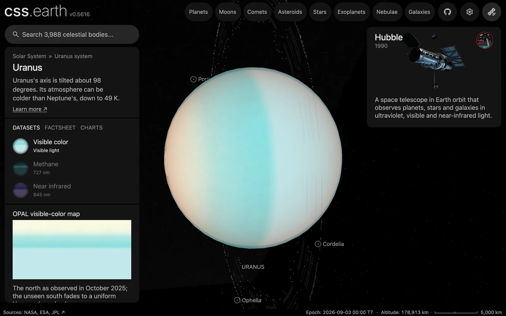

# Uranus's ring particles

600 dots along Uranus's rings, drawn while Uranus or one of its moons is selected. Each ring's share of the dots follows its published width and optical depth. The position of a single dot is not a measurement.

## Sources

| Source | Measurement used |
| --- | --- |
| [PDS Rings Node Uranus ring table](https://pds-rings.seti.org/uranus/uranus_rings_table.html) | Each ring's radius, width and normal optical depth, through [Uranus's ring recipe](../uranus/source/preparation/rings.json): the same values [Uranus's rings](../uranus/README.md) are drawn from. |

[Inputs](source/manifest.json) · [Recipe](source/dots/points.json)

## Processing

1. [`positions.mts uranus 600`](../../../packages/bake/authoring/ring-particles/positions.mts) reads the 13 rings of Uranus's recipe.
2. For each dot it picks a ring in proportion to the ring's opacity, 1 − exp(−τ), times its width times its radius, which is the ring's share of the lit ring area. That gives the ε ring 384 dots, the wide dusty ζ ring 118, the nine narrow rings 94 between them and the faint outer ν and μ rings 2.
3. The dot's place across its ring's width and its longitude come from a seeded generator (mulberry32, seed 20061012). Nothing else is authored.
4. The dots lie in Uranus's equatorial plane, from the IAU pole at the world's epoch, JD 2461286.5 TT. It writes [`positions.csv.gz`](source/dots/positions.csv.gz).
5. `packages/bake/cli/prepare-body-points.mts` writes the positions as a point bank at Uranus's prepared world position.

## Evidence

A headless capture of this version's Uranus default view.

## Known problems

- **No dot is a measured particle.** Only each ring's share of the dots is measured. Their longitudes are drawn from a seed.
- **The count is not comparable with Saturn's.** Uranus's rings have about 800 times less opaque area than Saturn's (21 million against 16,600 million km²). At the density of Saturn's 4,000 dots Uranus would have about 5. The 600 are a display choice for this planet.
- The table gives the ε ring's optical depth as 0.5 to 2.3; Uranus's recipe, and so the dots, use 1.4.
- The dots are uniform across each ring's published width; the real rings have structure the table does not give, and the ε ring's width varies around the planet (the table gives one value).
- The dots are `#9a9a9a`, the neutral grey of the ring lines; no ring color is measured.
- The dot layer sits behind the planet, and the dots do not orbit.
