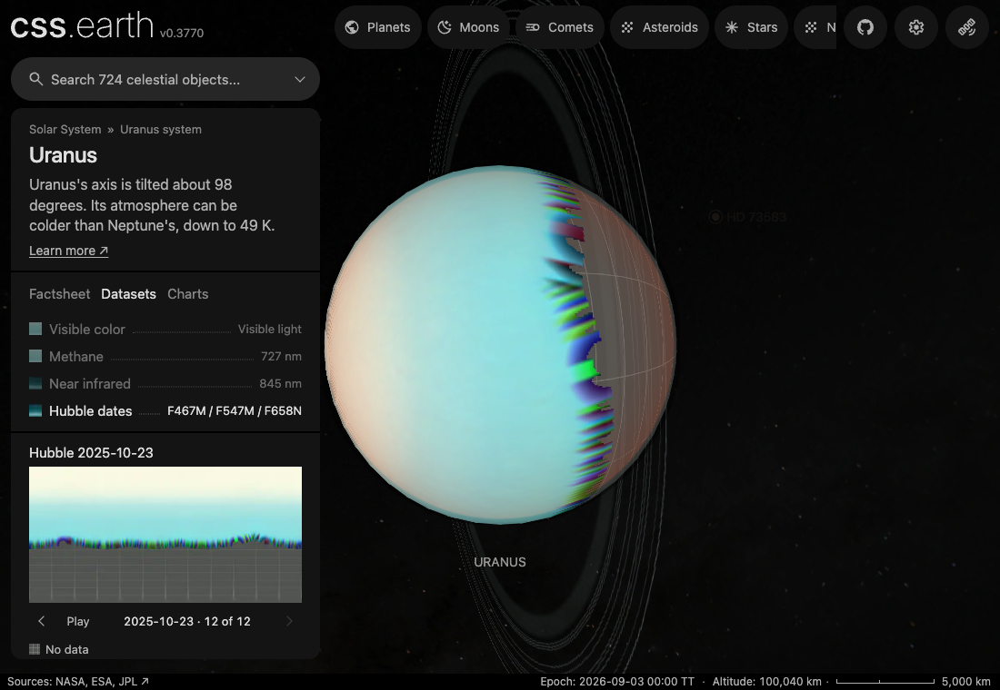

# Uranus

Uranus shows a Hubble OPAL visible-color map, two false-color Hubble observation datasets, its rings, twelve dated OPAL maps and modeled atmosphere charts.

## Sources

Source selections, recorded trials and open questions are in the [investigation ledger](investigations.json).

The visible-color surface is the rotation-A global map from
[Hubble OPAL Uranus Cycle 33](https://archive.stsci.edu/hlsp/opal/opal-uranus-cycle-33),
observed in October 2025. The checked composite combines F467M, F547M, and
F657N; the OPAL readme says its color maps carry "slight contrast
enhancement". FQ727N and F845M FITS maps supply two separately prepared false-color
observation datasets. Their palettes and percentile stretches are declared in
`source/preparation/observations.json`.

Ring radii, widths, and normal optical depths come from the
[PDS Rings Node Uranus table](https://pds-rings.seti.org/uranus/uranus_rings_table.html).
NASA's public Uranus facts supply the gray inner-ring, reddish Nu, and blue Mu
color interpretation. Physical facts are checked against
[NASA Uranus facts](https://science.nasa.gov/uranus/facts/) and the JPL
physical-parameter page.

The NASA/JPL Voyager 2 PIA18182 full-disc observation supplies the navigation
disc and the visible-color baseline for unobserved areas. The source records
also keep the JPL values for the 29-satellite catalog and the NASA/JPL PIA01361
Voyager 2 montage; these are not rendered.

The reflectance and temperature-pressure charts come from a checked NASA GSFC
Planetary Spectrum Generator configuration and its 253-sample I/F response,
modeled for 2026-08-30 over 0.35-1.0 micrometers. A third chart uses the
photometric phase coefficients in `source/photometry/phase.json`.

[Inputs](source/manifest.json) · [Preparation](source/preparation) · [Delivered files](inventory.json) · [Credits](NOTICE.md)

## Processing

The body is drawn on the shared sphere lane. Its orientation is solved from its pole and rotation at the scene epoch, so the face toward the camera is the one Uranus turns to it then. Each lighting frame puts back the limb darkening OPAL removed from the colour map, with the readme's own Minnaert coefficients: k 0.57 in F657N, 0.80 in F547M and 0.85 in F467M ([planet limbs](../../../docs/surface-preparation.md#planet-limbs-from-published-laws)). Red barely darkens toward the limb while green and blue do, so the limb turns grey-red as Hubble saw it. No floor, ambient term or terminator ramp remains.

The rings are drawn from `source/preparation/rings.json` as 16 wedges, each starting outside the planet so the planet hides their far side. The table gives the Epsilon ring's optical depth as "0.5 to 2.3"; the recipe's 1.4 is the midpoint, chosen for display. Extremely narrow rings receive a minimum-pixel width so they stay visible; their radii and ordering are not moved. The planet's shadow on the rings is not drawn: at the scene epoch it reaches 1.05 Uranus radii from the center, short of the innermost ring at 1.48.

## Hubble dates

The dataset stepper selects 12 dated [OPAL](https://archive.stsci.edu/hlsp/opal) visible-colour maps, one rotation per observing cycle.

| Observation starts (UTC) | Rotation | Release |
| --- | --- | --- |
| 2014-11-08 | 2014a | [Cycle 22](https://archive.stsci.edu/hlsp/opal/opal-uranus-cycle-22) |
| 2015-09-12 | 2015a | [Cycle 23](https://archive.stsci.edu/hlsp/opal/opal-uranus-cycle-23) |
| 2016-09-29 | 2016a | [Cycle 24](https://archive.stsci.edu/hlsp/opal/opal-uranus-cycle-24) |
| 2017-10-25 | 2017a | [Cycle 25](https://archive.stsci.edu/hlsp/opal/opal-uranus-cycle-25) |
| 2018-11-16 | 2018a | [Cycle 26](https://archive.stsci.edu/hlsp/opal/opal-uranus-cycle-26) |
| 2019-11-18 | 2019a | [Cycle 27](https://archive.stsci.edu/hlsp/opal/opal-uranus-cycle-27) |
| 2020-10-08 | 2020a | [Cycle 28](https://archive.stsci.edu/hlsp/opal/opal-uranus-cycle-28) |
| 2021-12-08 | 2021a | [Cycle 29](https://archive.stsci.edu/hlsp/opal/opal-uranus-cycle-29) |
| 2022-11-09 | 2022a | [Cycle 30](https://archive.stsci.edu/hlsp/opal/opal-uranus-cycle-30) |
| 2023-09-17 | 2023a | [Cycle 31](https://archive.stsci.edu/hlsp/opal/opal-uranus-cycle-31) |
| 2024-11-09 | 2024a | [Cycle 32](https://archive.stsci.edu/hlsp/opal/opal-uranus-cycle-32) |
| 2025-10-23 | 2025a | [Cycle 33](https://archive.stsci.edu/hlsp/opal/opal-uranus-cycle-33) |

The maps are restored by [the acquisition recipe](source/preparation/acquisition.json). These are publisher mosaics with contrast enhancement and arbitrary channel scaling, not calibrated colour comparisons between years. Cycles 22–28 place 0° east longitude at the left and Cycles 29–33 at the right; preparation reverses the earlier columns into the Cycle 33 frame. [The observation recipe](source/preparation/observations.json) fills no missing coverage: the shared gray graticule marks it. The published Minnaert coefficients are the same across the selected releases, so the dates share the lighting bank.

## Evidence

- The solved orientation differs by 159.9° from the hand-typed rotations it replaced.
- Laid back into the ring plane, the 16 ring wedges match the single ring image they replace to a mean alpha error of 1.20/255 inside a wedge and 2.52/255 within 2 px of a wedge boundary.
- Every dated map correlates more strongly with its component FITS rows in stored order than after a north/south flip. This checks orientation, not absolute colour calibration.

## Known problems

- The OPAL map contains observed northern coverage and an unobserved black southern region. Preparation ends the usable observation six rows north of the map equator and feathers OPAL detail into the uniform Voyager baseline across twelve rows. The single-filter datasets use their own observed-disc mean as the baseline. No local feature is reflected, extended, or invented outside the observed coverage.
- The lighting overlay has one colour and alpha per pixel, so its per-channel limb law is exact for the colour map's mean colour and approximate for colours far from it. The FQ727N and F845M datasets share the colour map's bank; OPAL applied no Minnaert correction to those two maps, so their limb is not their own law.
- The dated maps reuse the scene camera, Sun and rings; they do not reproduce the original observing geometry.
