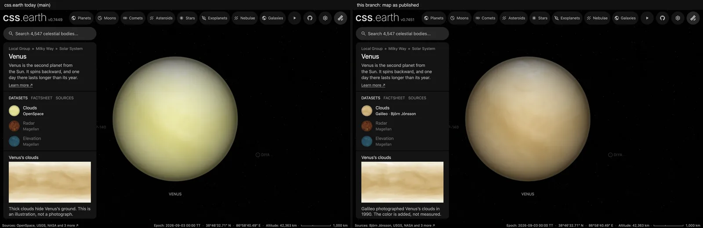

# Venus sources

Venus shows a cloud map, one Akatsuki ultraviolet exposure, Magellan radar, elevation, microwave and gravity displays, and modeled atmosphere charts. The cloud map is the default view. Rotation is accelerated, and the camera is illustrative rather than an observer ephemeris. The [navigation marker](source/preparation/navigation.json) is a stylized identifier, not the scene's illumination.

## Sources

| View or quantity | Source |
| --- | --- |
| Clouds | [A map of Venus](https://bjj.mmedia.is/data/venus/venus.html) by Björn Jónsson, from 21 Galileo images of the February 1990 flyby; free to use with credit ([his terms](https://bjj.mmedia.is/data/planetary_maps.html)) |
| Ultraviolet | Akatsuki UVI Level 3b, [vco_uvi_l3 v1.1](https://doi.org/10.17597/isas.darts/vco-00016), CC BY 4.0 under the [ISAS/JAXA data policy](https://www.isas.jaxa.jp/en/researchers/data-policy/) |
| Cloud-top limb | [Pérez-Hoyos et al. 2018](https://doi.org/10.1002/2017JE005406), Minnaert fit to MESSENGER MASCS spectra |
| Radar | [USGS Magellan C3-MDIR synthetic color mosaic](https://astrogeology.usgs.gov/search/map/venus_magellan_global_c3_mdir_synthetic_color_mosaic_4641m), the 4,641 m GeoTIFF as published |
| Elevation, emissivity, reflectivity, roughness | [USGS numeric Magellan products](source/science/usgs/), at about 4.64 km grid spacing |
| Gravity, Bouguer anomaly, geoid | PDS Geosciences volume [MGN-V-RSS-5-GRAVITY-L2-V1.0](https://pds-geosciences.wustl.edu/mgn/mgn-v-rss-5-gravity-l2-v1/mg_5201/gravity/) |
| Atmosphere charts and limb halo | [NASA Planetary Spectrum Generator](https://psg.gsfc.nasa.gov/) model, the halo run locally ([profile](source/atmosphere/psg-limb.json)) |
| Named features | [IAU/USGS Gazetteer of Planetary Nomenclature](https://planetarynames.wr.usgs.gov/Page/VENUS/target), snapshot 2026-09-11, public domain |
| Feature notes | English Wikipedia lead summaries (CC BY-SA 4.0, retrieved 2026-09-12), in `source/features/notes.json` |
| Landing sites | 13 sites in `source/features/sites.json`, each quoting the NASA NSSDCA, PDS, LROC, agency or paper page it came from |
| Planet facts | NASA Science snapshot in `src/sources/object-information/venus.json` |

The archive asks that the ultraviolet data set be cited as:

> Murakami, S., K. Ogohara, M. Takagi, H. Kashimura, M. Yamada, T. Kouyama,
> T. Horinouchi, T. Imamura, Venus Climate Orbiter Akatsuki UVI
> Longitude-Latitude Map Data v1.1, JAXA Data Archives and Transmission System,
> <https://doi.org/10.17597/isas.darts/vco-00016>, 2025.

The Venera surface photographs from the [NASA PDS Geosciences Node](https://pds-geosciences.wustl.edu/missions/venera/) are no longer shown; their files and `source/venera/RIGHTS.md` remain.

## Processing

**Clouds.** Björn Jónsson projected 21 Galileo images of the February 1990 flyby onto a cylindrical map, cleaned the mosaic and colorized it. The map is 1,800 × 900 pixels and shows features seen in ultraviolet light. It is the default because one Akatsuki exposure leaves most of the globe empty. It is projected without a color transform onto 448 prepared leaves and two polar leaves. Until 7 October 2026 this file was credited to the OpenSpace project, which distributes the same bytes, and was brightened with a per-channel curve (1.4, 2.2, 0.9) that moved the prepared atlas's mean color from (221, 201, 159) to (237, 235, 182): tan to pale yellow.

**Lighting.** The disc uses the Minnaert law Pérez-Hoyos et al. (2018) fitted to the equatorial cloud tops: k 1.35 at 657 nm, 1.36 at 547 nm and 1.32 at 467 nm, read from their published figure because the data file no longer resolves. Relative to the flood-lit disc centre, brightness falls to a third where the clouds are seen at 60° ([planet limbs](../../../docs/surface-preparation.md#planet-limbs-from-published-laws)).

**Limb halo.** [acquire-psg-limb-table.mts](../../../packages/bake/cli/acquire-psg-limb-table.mts) runs PSG's Venus template (VIRA-45 with Vandaele et al. 2020, Bierson et al. 2019 and Ehrenreich et al. 2012, and its sulfuric acid haze). Each value is the radiance along a line of sight grazing the planet, divided by the disc-centre radiance, in red, green and blue bands. The halo starts at the 75 km cloud top, where it is 0.039, 0.068 and 0.110 of the disc centre, and falls below one ten-thousandth above 100 km.

**Ultraviolet.** Product `uvi_20230830_100446_365_l3b_v21` is one 365 nm exposure from orbit 257 at 2023-08-30T10:04:46.033 UTC. JAXA's Level 3b fits the limb to correct pointing and projects radiance onto a longitude-latitude grid for a 70 km cloud top ([Ogohara et al. 2017](https://doi.org/10.1186/s40623-017-0749-5)). Of 34 exposures measured it lights the most of the globe: 48.54 %, at 3.65° phase, where one look can show at most 49.18 %. `packages/bake/src/objects/interpretation/akatsuki-uvi-l3b.ts` reads it with h5wasm and box-integrates it to 2048 × 1024. Brightness is `(radiance × 5 × 10⁻⁹) ^ (1 / 2.2)`, with nothing clipped and no contrast enhancement or sharpening. 48.62 % of cells carry an observation; the rest use the shared gray graticule, and nothing is filled.

**Radar.** USGS's C3-MDIR synthetic color mosaic is read from its published GeoTIFF ([label](source/radar/c3-mdir-colorized-4641m-pds3.lbl)): 8,192 × 4,096 pixels at 4,641 m, three 8-bit bands, from pole to pole. It is packed as published, with no exposure curve, sharpening or resampling. USGS made the color to simulate the surface; it follows radar brightness and is not a measurement, so the panel shows no scale. The gray FMAP left-look mosaic held this dataset from 27 September to 6 October 2026; the [ledger](investigations.json) keeps its route and measurements.

**Elevation and microwave maps.** Elevation is the numeric GTDR v2 in metres above a 6,051 km sphere, on a −3,000 to 12,000 m scale.

| View | Native DN conversion | Meaning |
| --- | --- | --- |
| Emissivity | (DN − 1) / 10,000 | Horizontal-polarization thermal emissivity at 13 cm |
| Reflectivity | (DN − 1) / 200 | Fresnel reflectivity inferred from radar echoes |
| Roughness | (DN − 1) / 10 | Meter-scale RMS slope, in degrees, fitted to radar echoes |

The roughness label's 0.005 multiplier conflicts with the [PDS GSDR specification](https://pds.nasa.gov/ds-view/pds/viewProfile.jsp?dsid=MGN-V-RDRS-5-GDR-SLOPE-V1.0), so we use its factor 0.1 ([calibration record](source/science/usgs/roughness-calibration.json)). [Emissivity](https://astrogeology.usgs.gov/search/map/venus_magellan_global_microwave_emissivity_4641m) spans 0.2926 to 0.9984, shown on a 0.29–1.00 scale with no gap filling ([label](source/emissivity/magellan.lbl), [recipe](source/preparation/raster.json)). See the [numeric acquisition method](../../../docs/usgs-numeric-surfaces.md).

**Gravity.** All four views come from JPL's degree-120 model SHGJ120P, read without resampling from 360 by 180 grids.

| View | Values | Display range | Beyond the range |
| --- | --- | --- | --- |
| Gravity | −100.4 to 386.5 mGal | −200 to 200 mGal | 0.11%, Maxwell Montes and Atla Regio |
| Gravity uncertainty | 1.76 to 21.72 mGal | 0 to 22 mGal | none |
| Bouguer gravity | −975.8 to 198.1 mGal | −600 to 600 mGal | 0.06%, under Maxwell Montes |
| Geoid | −66.1 to 154.5 m | −100 to 100 m | 0.38%, Atla Regio and Beta Regio |

**Charts and labels.** The reflectance chart holds all 253 PSG samples from 0.35 to 1.0 micrometers; the temperature-pressure chart holds all 100 layers. Gazetteer names appear at the closest zoom, and 112 carry a Wikipedia note.

## Evidence

Headless Chrome captures of the default view, each after the page reported ready.

- Cloud map identity: the file OpenSpace distributes as `venus_clouds.jpg` and Björn Jónsson's `venus.jpg` are the same 66,303 bytes (compared on 2026-10-07). The prepared atlas's mean color is (221, 201, 159), the map's own (221, 201, 159); with the removed curve it was (237, 235, 182).
- The Sun direction fitted from the ultraviolet file's incidence grid puts the sub-solar point at 206.1913° E, 2.4897° N; JPL Horizons gives 206.179102° E, 2.490460° N.
- Radar: the published map has no empty cell. Its most common color (183, 78, 39) covers 0.38% of the globe and 31% of the band south of 80° S, a flat tone where the mosaic holds no radar image.
- Gravity: a sum of the model's coefficients reproduces the free-air grid to 0.004 mGal with this cell placement (ledger entry `magellan-gravity-maps`).

## Known problems

- The radar map's orange is synthetic: it follows radar brightness and is not surface color. The product states no brightness scale. A flat tone near the south pole stands in for ground the mosaic does not show.
- The cloud map's color is added by its author, who says Venus in visible light is almost white with little contrast. The clouds move, so the map's longitudes mark no place on the planet. He replaces his maps with improved versions; `acquire venus --refresh` downloads the current file.
- The ultraviolet image is one instant of clouds that move with a four-day super-rotation. It already carries the Sun, so illumination is counted twice near the limb.
- The halo is a PSG single-scattering model ([handbook](https://psg.gsfc.nasa.gov/images/help/handbook.pdf), p. 96) with the Sun one degree above the horizon, so the real halo may be brighter. Its one color per pixel is approximate for the radar and elevation datasets.
- The Minnaert coefficients were fitted at 90° phase; the shadowless view uses them at 0°.
- Emissivity is not corrected for emission angle, roughness or tilt, and is not temperature or evidence of volcanism.
- Gravity degree 120 resolves features about 160 km across at best, less near the poles and in the south. The archive does not state the Bouguer density.
- Feature outlines are not published nomenclature boundaries, and the readout longitude counts from the map's left edge, 180° from the Gazetteer origin.

[Investigation ledger](investigations.json) · [Inputs](source/manifest.json) · [Recipe](object.json) · [Credits](NOTICE.md) · [Contributor guide](../README.md)
