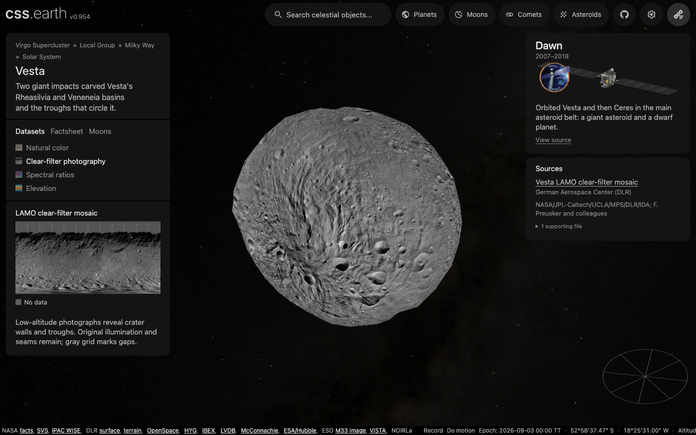
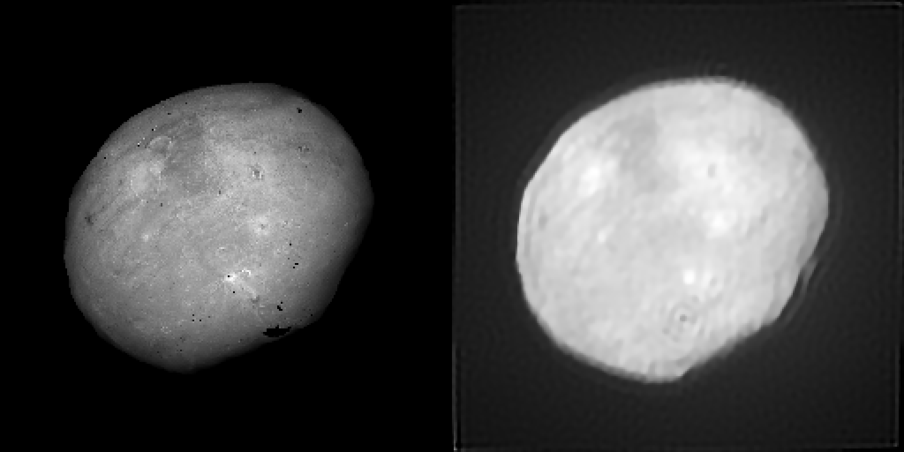

# Vesta sources and interpretation

Vesta uses Dawn framing-camera mosaics, spectral ratios and a terrain model in the Claudia coordinate system.

## Sources

| View or quantity | Source |
| --- | --- |
| Visible color | [DLR Dawn HAMO mosaic](https://dawngis.dlr.de/data/Vesta/mosaic_vesta.php) from 650, 550 and 430 nm bands |
| Clear-filter photography | [DLR Dawn LAMO mosaic](https://dawngis.dlr.de/data/Vesta/mosaics/LAMO/clear/Vesta_mosaic_LAMO_global.png), October 2012, 20 m/pixel source |
| HAMO photography and the north | [DLR Dawn HAMO-1-2 clear mosaic](https://dawngis.dlr.de/data/Vesta/mosaics/HAMO/clear/Vesta_mosaic_HAMO-1-2_global.png), May 2013, 60 m/pixel; HAMO-1 south (2011) joined with HAMO-2 north (June to July 2012) |
| Spectral ratios | [DLR Clementine-style mosaic](https://dawngis.dlr.de/data/Vesta/mosaics/HAMO/clementine/Vesta_clementine_HAMO-1-2_global.jp2), from the original PDS archive |
| Shape and elevation | [DLR HAMO 64-pixel-per-degree terrain model](https://dawngis.dlr.de/data/Vesta/dtm_vesta.php) |
| Physical placement | JPL Horizons solution #36 |
| Named features | [IAU/USGS Gazetteer of Planetary Nomenclature](https://planetarynames.wr.usgs.gov/Page/VESTA/target) Vesta centre-point export, snapshot 2026-09-11, public domain. IAU-adopted names with centre, diameter, extent and name origin; labels appear at the closest zoom only, and a selected feature stays labelled. |

## Evidence

The photographic atlas now samples each pinned original grid directly with a 2 × 2 texel footprint. It retains the source frame, coverage policy and fixed-epoch lighting. [The shared preparation guide](../../../docs/surface-preparation.md#preserve-photographic-detail-through-preparation) explains the sampling and encoding controls.

| View | Original grid | Both lighting images, before → current |
| --- | --- | --- |
| normal | 26704 × 13080 | 3.09 → 5.55 MB |

Each atlas remains 2048 × 6400 pixels, with 800 retained faces. The scene bytes match [the previous main version](https://github.com/layoutit/css.earth/tree/3efdf2c9ed9047c72409b2730e879123f8c3b9d2/src/planets/vesta/prepared). WebP quality is 95; decoded texture size is unchanged. Sampling details and output hashes are recorded in the prepared surface metadata (`prepared/surfaces.json`). Source resolution, gaps and existing registration limitations still apply.

The [LAMO qualification record](evidence/lamo-2026-09-14.json) tests
`86364a47f5ab7261a3716897b5e421e81abf5458`: three Vesta source/package checks,
six image-reader checks and strict preparation types pass. Headless desktop
checks at DPR 1 and 2 retain one scene and all 800 faces during drag, using
the same photographic atlas. Shadows default off; the optional lighting bank
was also exercised. All 39 previous runtime image hashes, drawing faces and
picking triangles match the main baseline; the three added images total
4,122,234 bytes. Their published content-addressed downloads were independently
fetched and hash-verified. This is focused qualification, not a full build or
repository-wide browser pass.

**HAMO-1-2 fills the north (run of 2026-09-22, this version).** Dawn's low orbit and its
color mapping both ended before northern spring reached Vesta's pole, so the LAMO
clear mosaic and the natural-color mosaic leave the north dark. HAMO-2, flown in
June and July 2012 after the color campaign, photographed the northern hemisphere
under low sun, and DLR's May 2013 clear mosaic joins it with HAMO-1. Measured on
the released PNGs at 2880 × 1440: the LAMO mosaic covers 84 % of the map and
nothing above 75° N; the natural-color mosaic 91 %, thinning above 60° N; the
HAMO-1-2 clear mosaic every cell, with the 90–75° N band dim (mean 7 of 255,
94 % of pixels below 32) but showing craters and shadows rather than fill. The
mosaic is pinned as the HAMO photography lens and declared the fallback base of
the natural-color and LAMO lenses, so their gaps take HAMO texels in gray and the
prepared report counts them (`monochromePixels`). Before-and-after minimaps are in
[`evidence/hamo/`](evidence/hamo/); [the HAMO test](../../../tests/objects/unit/vesta/hamo.test.mts)
pins the label grid, the fallback order and the prepared coverage.

**Ground-based frames as a test of the observer-camera route.** Thirty deconvolved VLT/SPHERE/ZIMPOL frames of Vesta from 2018 are pinned under `source/observations/`, with Horizons rows for Paranal at each exposure, not as a texture source but because Vesta is the one body with both such frames and a mapped surface. [The registration test](../../../tests/objects/unit/vesta/sphere-registration.test.mts) casts each frame through the shipped HAMO terrain with the camera the route derives from the pinned Dawn pole model and the exposure midpoint, and sweeps its correlation with the Dawn colour mosaic over a turn about the pole and over both mirrors. Over 30 frames the peak sits at +0.5° (median), 28 within 3° and all within 5°, and the model beats the better mirror 2.5 times over; one pixel of disc centre is about one degree of longitude here, so that is the level of the centre measurement. With the IAU 2015 pole model instead of Dawn's the same frames peak 210° away, the stated distance between the two prime meridians. The image below is the prediction from the Dawn mosaic beside the SPHERE frame of 2018-06-08 05:27 UT.

## Known problems

Named features: the IAU/USGS Gazetteer of Planetary Nomenclature centre-point shapefile for Vesta (retrieved 2026-09-11, public domain per its FGDC metadata) is pinned under `source/features/`. Preparation verifies the archive, reads the attribute table (this export ships no projection file, so the metadata datum is recorded and the authored radius scales outline sizes), drops the albedo-feature type code, folds repeated rows, and converts each positive-east centre into the body-fixed frame the radial terrain sampler uses for this mesh (longitude 0 toward the mesh +y axis, 90° E toward +x, north +z), then casts that direction through the prepared hit mesh so every anchor and outline point sits on the shape model rather than on a reference sphere. Craters and faculae trace a rim circle, other types their published extent box. Outlines are not published nomenclature boundaries. The frame was confirmed on Mimas and Phobos, where Herschel and Stickney fall at local minima of the shape radius.

Feature notes: 9 of the labelled names carry a caption note, the lead summary of their English Wikipedia article (CC BY-SA 4.0, retrieved 2026-09-12), joined through Wikidata's Gazetteer id property and pinned with the article link and revision in `source/features/notes.json`; the caption credits Wikipedia beside the IAU naming year.

- The visible mosaic has clipped bright terrain and registration artifacts. The black-pixel mask is a heuristic that can hide valid dark pixels.
- Clear-filter photography retains the illumination and seams of the original low-altitude mosaic. Its 20 m/pixel source is downsampled for this display; it does not change the 800-face mesh or supply 20 m terrain geometry. North of the LAMO coverage the 60 m/pixel HAMO mosaic shows instead, so resolution and sun angle change across that boundary, and the last few degrees around the north pole are very dark in the source.
- Spectral ratios are not mineral-abundance measurements.
- Terrain values are radii, despite contradictory generic label wording. Polar interpolation is not independent stereo coverage.
- The 8 km simplification allowance is an approximation, not an error bound or source uncertainty. Placement uses osculating elements with limited temporal validity.

[Investigation ledger](investigations.json) · [Inputs](source/manifest.json) · [Recipe](object.json) · [Credits](NOTICE.md) · [Contributor guide](../README.md)

The [investigation ledger](investigations.json) records selected products, alternatives and reopening conditions.

Coordinates, coverage and spectral interpretation

## Coordinates and coverage

The DLR products retain Dawn Claudia east-positive, planetocentric coordinates.
They must not be silently mixed with USGS maps shifted into Claudia Double Prime.
`reference/true-color.lbl` is the verbatim attached PDS label extracted from
the corresponding DLR PDS ZIP. The PNG has the same dimensions. Its projection
offsets and 74.176493209759 pixels/degree locate the cropped rows; stretching
the entire PNG from pole to pole would misregister the map.

The natural-color PNG carries no alpha or validity mask. Exact RGB black is
treated as likely fill before resampling, and out-of-crop coordinates are
missing. This heuristic cannot distinguish every photographed black shadow
from missing data. Uncertain nonzero colors and channel fringes remain intact.
The shared gray grid marks only the declared missing samples.
The published image's border also leaves a narrow missing strip at longitude
zero. It is retained rather than filled with invented surface detail.

### Low-altitude photographs

The clear-filter view adds Dawn's low-altitude photography alongside the color
composite. It is the publisher's grayscale mosaic, not a desaturated color map
or synthetic relief. The original PNG has 80,112 × 40,056 one-byte samples.
Its companion [PDS label](source/reference/lamo-clear.lbl) gives the same
dimensions, a 255 km projection radius, 222.529479629277 pixels/degree and
sample/line offsets 40055.3 / 20027. These locate the image in the same
planetocentric, east-positive Claudia frame as the existing DLR terrain.

Preparation keeps those offsets and the published brightness values. Exact
black is withheld before interpolation, using the existing fill heuristic;
the release supplies no separate mask that distinguishes gaps from every
photographed shadow. A temporary lossless grayscale mask keeps that operation
at native resolution without allocating a 3.2 GB mask in memory. The mask file
is removed after resampling. The normalized map is 8,192 × 4,096; the final
atlas uses the unchanged 800 faces and 128-pixel cells. This view does not
claim to retain the source's full 20 m resolution. Shadows in the photographs
are observations; the optional prepared lighting setting remains off by default.

The terrain ZIP contains `Vesta_HAMO_dtm_global_64.pds`. Its generic attached
label describes heights above a reference surface, but the actual values
are about 200–300 km and the DLR release explicitly says **radii in meters**.
The package follows the release and actual numeric range, preserving the
original archive and conflicting label. Missing code is −32768. Published
polar interpolation has no separate validity mask; model-derived views must
disclose that those regions are not independent stereo observations.

## Spectral ratios

The Clementine-style display uses the DLR composite unchanged: red is 749/438 nm,
green is 749/917 nm, and blue is 438/749 nm. These are ratios of photometrically
corrected Dawn FC images, not true colors or calibrated mineral fractions.
No ratios, contrast stretches or color balancing are recomputed by cssEarth.

The 446,346,023-byte archive misleadingly names its member
`Ceres_clementine_HAMO-1-2_global.pds`; the attached label explicitly identifies
**VESTA**, DLR, the 255 km projection radius and the expected Claudia grid.
`source/reference/clementine.lbl` preserves that label unmodified. The byte
image begins at record 4 (80,109 bytes), with three band-sequential RGB planes.
The complete member is 1,069,615,368 bytes. The decoder checks target, encoding,
dimensions, exact projection offsets and complete extraction before rendering.

As in the existing natural-color view, exact all-channel black is treated as
likely fill before interpolation; the source supplies no independent validity
mask. This can also withhold photographed black. Single-channel zero is valid.
Original mosaic seams, color fringes and dark nonzero samples are retained.
The same 74.176493209759 pixels/degree and offsets 13351 / 6675 place this view
on the existing terrain. Missing coverage uses the common gray grid.

Physical registration and prepared display

## Physical registration

JPL Horizons solution JPL#36 supplies mean radius 261.385 km, GM 17.28828
km³/s², and the asteroid's heliocentric elements. `generate-asteroids.mjs`
records reproducible Horizons queries and independent vector fixtures.
The geometry epoch is the shared 2026-09-03T00:00:00 TT. The osculating ellipse
does not claim accurate long-term perturbed motion. Horizons TDB epochs are
approximated as TT, differing by less than 2 ms.

DLR's mapping rotation uses pole RA 309.03312°, declination 42.22623°,
W = 74.66250° + 1617.3331237° × days since J2000. These coefficients belong to
the body package and are evaluated only during shared preparation.

The pinned Inter title font keeps its original source credits. Required binaries are
restored through `source/preparation/acquisition.json`.

## Prepared presentation

The original radial model is sampled on a 64 × 128 grid into 16,128 source
triangles. Meshoptimizer 1.2.0 welds and compacts equal positions, then simplifies
that mesh to 800 retained triangles before texture and lighting preparation.
The `ErrorAbsolute` and `RegularizeLight` flags bound the estimated error and
discourage thin triangles; the source profile records the 8 km error limit.
This is the simplifier's approximate metric, not a guaranteed maximum surface
distance. The selected vertices retain their sampled source positions, with
one canonical vertex at each pole. Normals are recomputed for the final mesh.
See the [upstream simplifier documentation](https://github.com/zeux/meshoptimizer/blob/v1.2/js/README.md#simplifier).
Lighting leaves those positions unchanged; area-weighted vertex normals provide continuous
directional shading. The 8,192 × 4,096 normalized maps are sampled into fixed
2,048 × 6,400 atlases. PolyCSS prepares native `u` triangles in raster mode:
each leaf matches its 128 × 128 texel cell, with the inverse matrix scale
preserving the measured geometry. The cells are opaque; the native triangle
primitive supplies their boundary. Runtime mounts the prepared leaves and
does not construct geometry or lighting.

Natural color, spectral ratios and elevation each have an unlit and a fixed-epoch directional
lighting bank. This approximates diffuse illumination, without cast shadows
or reflected light. Elevation also has northwest cartographic relief, so its
brightness is not a second physical measurement. Orientation stays fixed at
the shared date; the package does not supply automatic body rotation. Drag,
zoom, surface fly-to, and world navigation use the shared camera. Surface hit
eligibility uses the actual prepared mesh; the shared fly-to trajectory remains
a trackball approximation.

The checked-in navigation image is reproduced from the same source map and
mesh by `radial-snapshot.mjs`, using the recipe in `source/manifest.json`.
Full preparation verifies its bytes before publishing scene assets.

