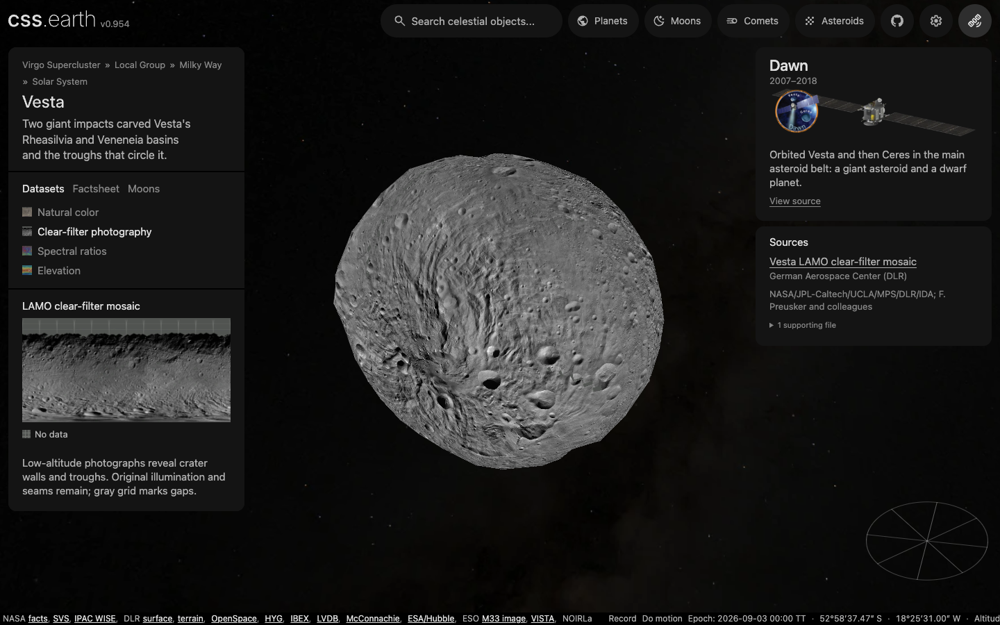
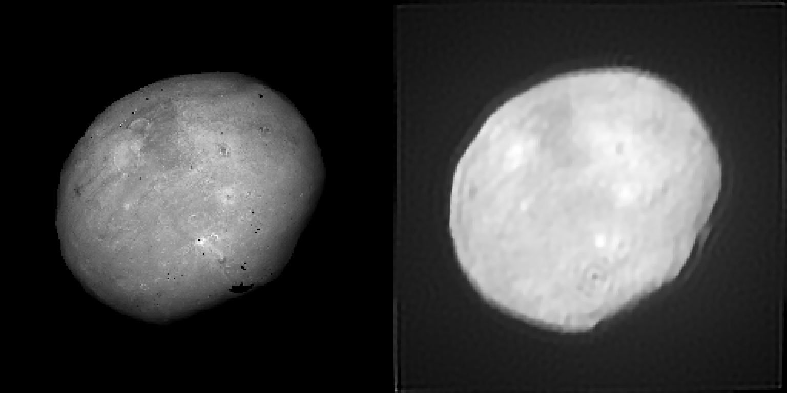

# Vesta sources and interpretation

Vesta uses Dawn framing-camera mosaics, spectral ratios and a terrain model in the Claudia coordinate system.

## Sources

| View or quantity | Source |
| --- | --- |
| Visible color | [DLR Dawn HAMO mosaic](https://dawngis.dlr.de/data/Vesta/mosaic_vesta.php) from 650, 550 and 430 nm bands |
| Clear-filter photography | [DLR Dawn LAMO mosaic](https://dawngis.dlr.de/data/Vesta/mosaics/LAMO/clear/Vesta_mosaic_LAMO_global.png), October 2012, 20 m/pixel source |
| HAMO photography and the north | [DLR Dawn HAMO-1-2 clear mosaic](https://dawngis.dlr.de/data/Vesta/mosaics/HAMO/clear/Vesta_mosaic_HAMO-1-2_global.png), May 2013, 60 m/pixel; HAMO-1 south (2011) joined with HAMO-2 north (June to July 2012) |
| Spectral ratios | [DLR Clementine-style mosaic](https://dawngis.dlr.de/data/Vesta/mosaics/HAMO/clementine/Vesta_clementine_HAMO-1-2_global.jp2), from the original PDS archive |
| Shape and elevation | [DLR HAMO 64-pixel-per-degree terrain model](https://dawngis.dlr.de/data/Vesta/dtm_vesta.php) |
| Hydrogen | [Dawn GRaND hydrogen map](https://sbnarchive.psi.edu/pds4/dawn/grand/dawn-grand-vesta_1.0/data_derived/), PDS4 `GRD_HYDROGEN_MAP`; Prettyman et al. 2012, [Science 338, 242](https://doi.org/10.1126/science.1225354) |
| Iron gamma rays | [Dawn GRaND corrected iron counting rate](https://sbnarchive.psi.edu/pds4/dawn/grand/dawn-grand-vesta_1.0/data_derived/), PDS4 `GRD_IRON_CORRECTED_COUNTS_MAP`; Yamashita et al. 2013, [MAPS 48, 2237](https://doi.org/10.1111/maps.12139) |
| Fast neutrons | [Dawn GRaND fast neutron residual map](https://sbnarchive.psi.edu/pds4/dawn/grand/dawn-grand-vesta_1.0/data_derived/), PDS4 `GRD_FAST_NEUTRON_RESIDUAL_MAP`; Lawrence et al. 2013, [MAPS 48, 2271](https://doi.org/10.1111/maps.12187) |
| High-energy gamma rays | [Dawn GRaND high-energy gamma-ray counts](https://sbnarchive.psi.edu/pds4/dawn/grand/dawn-grand-vesta_1.0/data_derived/), PDS4 `GRD_HEGR_COUNTS_MAP`; Peplowski et al. 2013, [MAPS 48, 2252](https://doi.org/10.1111/maps.12176) |
| Neutron absorption | [Dawn GRaND neutron absorption map](https://sbnarchive.psi.edu/pds4/dawn/grand/dawn-grand-vesta_1.0/data_derived/), PDS4 `GRD_NEUTRON_ABSORPTION_MAP`; Prettyman et al. 2013, [MAPS 48, 2211](https://doi.org/10.1111/maps.12244) |
| Gravity | [Dawn Vesta Gravity Science Derived Data Bundle](https://doi.org/10.17189/av2q-ka20) 1.0, maps of JPL model VESTA20H (PDS3 `DAWN-A-RSS-5-VEGR-V2.0`); Konopliv et al. 2014, [Icarus 240, 103](https://doi.org/10.1016/j.icarus.2013.09.005) |
| Geology | [Yingst et al. 2023 global geologic map linework](https://doi.org/10.5281/zenodo.19475473), Zenodo, CC BY 4.0; [PSJ 4:157](https://doi.org/10.3847/PSJ/acebe9) |
| Physical placement | JPL Horizons solution #36 |
| Named features | [IAU/USGS Gazetteer of Planetary Nomenclature](https://planetarynames.wr.usgs.gov/Page/VESTA/target) Vesta centre-point export, snapshot 2026-09-11, public domain. IAU-adopted names with centre, diameter, extent and name origin; labels appear at the closest zoom only, and a selected feature stays labelled. |

## Evidence

The photographic atlas now samples each pinned original grid directly with a 2 × 2 texel footprint. It retains the source frame, coverage policy and fixed-epoch lighting. [The shared preparation guide](../../../docs/surface-preparation.md#preserve-photographic-detail-through-preparation) explains the sampling and encoding controls.

| View | Original grid | Both lighting images, before → current |
| --- | --- | --- |
| normal | 26704 × 13080 | 3.09 → 5.55 MB |

Each atlas remains 2048 × 6400 pixels, with 800 retained faces. The scene bytes match the previous main version. WebP quality is 95; decoded texture size is unchanged. Sampling details and output hashes are recorded in the prepared surface metadata (`prepared/surfaces.json`). Source resolution, gaps and existing registration limitations still apply.

The [LAMO qualification record](evidence/lamo-2026-09-14.json), prepared with
[`node tools/objects/dist/prepare-authored.js vesta --write`](https://github.com/layoutit/css.earth/blob/a3137c9e10/tools/objects/prepare-authored.ts)
(now [`site/build/prepare/prepare-authored.ts`](../../../site/build/prepare/prepare-authored.ts)), tests:
three Vesta source/package checks,
six image-reader checks and strict preparation types pass. Headless desktop
checks at DPR 1 and 2 retain one scene and all 800 faces during drag, using
the same photographic atlas. Shadows default off; the optional lighting bank
was also exercised. All 39 previous runtime image hashes, drawing faces and
picking triangles match the main baseline; the three added images total
4,122,234 bytes. Their published content-addressed downloads were independently
fetched and hash-verified. This is focused qualification, not a full build or
repository-wide browser pass.

**HAMO-1-2 fills the north (run of 2026-09-22, this version).** Dawn's low orbit and its
color mapping both ended before northern spring reached Vesta's pole, so the LAMO
clear mosaic and the natural-color mosaic leave the north dark. HAMO-2, flown in
June and July 2012 after the color campaign, photographed the northern hemisphere
under low sun, and DLR's May 2013 clear mosaic joins it with HAMO-1. Measured on
the released PNGs at 2880 × 1440: the LAMO mosaic covers 84 % of the map and
nothing above 75° N; the natural-color mosaic 91 %, thinning above 60° N; the
HAMO-1-2 clear mosaic every cell, with the 90–75° N band dim (mean 7 of 255,
94 % of pixels below 32) but showing craters and shadows rather than fill. The
mosaic is pinned as the HAMO photography dataset and declared the fallback base of
the natural-color and LAMO datasets, so their gaps take HAMO texels in gray and the
prepared report counts them (`monochromePixels`). Before-and-after minimaps are in
[`evidence/hamo/`](evidence/hamo/); the HAMO test
pins the label grid, the fallback order and the prepared coverage.

**Ground-based frames as a test of the observer-camera route.** Thirty deconvolved VLT/SPHERE/ZIMPOL frames of Vesta from 2018 are pinned under `source/observations/`, with Horizons rows for Paranal at each exposure, not as a texture source but because Vesta is the one body with both such frames and a mapped surface. The registration test casts each frame through the shipped HAMO terrain with the camera the route derives from the pinned Dawn pole model and the exposure midpoint, and sweeps its correlation with the Dawn colour mosaic over a turn about the pole and over both mirrors. Over 30 frames the peak sits at +0.5° (median), 28 within 3° and all within 5°, and the model beats the better mirror 2.5 times over; one pixel of disc centre is about one degree of longitude here, so that is the level of the centre measurement. With the IAU 2015 pole model instead of Dawn's the same frames peak 210° away, the stated distance between the two prime meridians. The image below is the prediction from the Dawn mosaic beside the SPHERE frame of 2018-06-08 05:27 UT.

## Surface elements from GRaND

Dawn's gamma-ray and neutron detector (GRaND) measured the top few decimetres
of regolith from low orbit, about 210 km up. Five archived numeric maps are
shown, read from the PDS4 bundle `urn:nasa:pds:dawn-grand-vesta` 1.0, not from
the colour renders in NASA Vesta Trek.

| Dataset | Archived quantity | Pixels | Values | Dates |
| --- | --- | --- | --- | --- |
| Hydrogen | Hydrogen abundance, µg/g | 16,200, 2° × 2° | 0.0 to 391.1 | 2011-12-08 to 2012-01-14 |
| Iron gamma rays | Fe 7.6 MeV counting rate corrected for neutron density, counts/s | 178,698 equal-area, 0.5° tall | 0.0687 to 0.07746 | 2011-12-08 to 2012-04-27 |
| Fast neutrons | Residual fast neutron counting rate, counts/s | 114 quasi-equal-area, 20° tall (10° polar caps) | 1.170 to 1.237 | 2011-12-09 to 2012-01-14 and 2012-04-03 to 2012-05-01 |
| High-energy gamma rays | Corrected high-energy gamma-ray counting rate, counts/s, with 1σ uncertainty | 210 quasi-equal-area, 15° tall (7.5° polar caps) | 12.516 to 13.143 (1σ 0.117 to 0.311) | 2011-12-12 to 2012-05-01 |
| Neutron absorption | DCP, unitless, with 1σ uncertainty | 204 quasi-equal-area, 15° tall (7.5° polar caps) | −0.0364 to 0.031 (1σ 0.0014 to 0.0075) | 2011-12-08 to 2012-01-14 |

**Resolution.** The archive and papers give about 300 km full width at half
maximum on the surface; the neutron absorption catalogue and Prettyman et al.
(2013) state the same ~300 km scale. The pixels are a sampling grid, not detail: features
smaller than a few hundred kilometres are blurred together.

**Frame.** The archive uses Claudia Double Prime; the other Vesta maps use
Claudia. The [GRaND catalogue](https://sbnarchive.psi.edu/pds3/dawn/grand/DWNVGRD_2/CATALOG/GRAND_VESTA_IRON_CORR_CNTS_MAP_DS.CAT)
states the two share a pole and differ by 210° of longitude (Marcia at 190° E
in Claudia). [`packages/bake/authoring/vesta-grand/prepare-grids.mts`](../../../packages/bake/authoring/vesta-grand/prepare-grids.mts)
places every archived pixel by its own latitude and longitude bounds, adds 210°,
and writes the `.npy` grids the shared reader takes. It checks each table
against its label's checksum, record count and units, and refuses overlaps,
gaps and pixels that straddle a cell, so no value is resampled. The hydrogen
label says rows start at −180° E; the longitude columns start each row at −30° E,
and the columns are used. The three coarse maps use rectangular cells that
divide their pixel bounds (10° × 1.5° for fast neutrons, 7.5° × 1° for the other
two); a polar cap is one pixel 360° wide and fills its whole row.

**What the values mean.** Hydrogen is richest where dark, carbonaceous material
fell on Vesta and poorest in the Rheasilvia basin (minimum at 303° E, 63° S in
Claudia). A higher iron counting rate means more iron: basaltic eucrite terrain
against the diogenite that Rheasilvia excavated. The iron map is a counting
rate. The catalogue's preliminary conversion (wt% = 189.2 × counts/s, scaled to
the 13.8 wt% mean of howardites) comes with a caution and is not applied.
Neither table carries a per-pixel uncertainty.

Fast neutrons are the +Z sensor counts after the part that follows hydrogen
(the epithermal-neutron trend) is removed. [Lawrence et al. (2013)](https://pmc.ncbi.nlm.nih.gov/articles/PMC4461122/)
show that what remains follows the regolith's average atomic mass, from about
21.7 (diogenite) to 23 (basaltic eucrite) atomic mass units in HED meteorites.
Their offset is arbitrary, so only differences count; the whole map spans about
5%. The counts were smoothed (the paper gives a 5° binning, a Gaussian of 600 km
sigma width and 20° pixels), so the catalogue reports no uncertainties.

High-energy gamma rays are counts corrected for background, solid angle,
orientation and cosmic-ray changes. The catalogue says they are proportional
to the heavy major-element content and sample a few tens of decimetres.
[Peplowski et al. (2013)](https://doi.org/10.1111/maps.12176) find eucrite-like
regions and a diogenite-like Rheasilvia floor. The 1σ uncertainty per pixel is
a large share of the range, so single-pixel differences can be noise.

Neutron absorption is DCP, a unitless distance in a plot of epithermal against
thermal-plus-epithermal counts that rises linearly with the thermal neutron
absorption cross section. [Prettyman et al. (2013)](https://doi.org/10.1111/maps.12244)
tie it to Fe, Ca, Al, Mg and other rock-forming elements and to the share of
eucrite in howardite: Rheasilvia reads low, the dark hemisphere high. The
catalogue's conversion, Σ = 216.4 × DCP + 66.3 in 10⁻⁴ cm²/g, assumes Vesta's
mean regolith is howardite, which the catalogue says is not known; it is not
applied. The PDS4 label's history names the iron dataset as its PDS3 source;
the PDS3 catalogue gives `DAWN-A-GRAND-5-VESTA-ABSORPTION-V1.0`, which is used here.

**Checks (2026-09-27).** 4,000 random points read through the
shared `.npy` reader equal a direct lookup in the raw tables at Claudia minus
210°. The hydrogen table's longitudes correlate best with the Trek hydrogen
render at zero shift (r = 0.75 in its red channel, 10° steps), which confirms
the archive columns are Claudia Double Prime.

**Checks for the coarse maps (2026-09-27, on ccbf483de8).** For fast neutrons,
high-energy gamma rays and neutron absorption, 4,000 random points each through
the shared `.npy` reader equal a raw-table lookup at Claudia minus 210°. Lawrence
et al. (2013) place the eucrite-rich band at 90° to 225° E (Claudia) near the
equator, high in all three maps. With the shift, that band (latitudes within 30°)
averages above each map's global mean: fast neutrons 1.221 against 1.206, gamma
rays 12.885 against 12.776, DCP 0.0059 against −0.0072. Without the shift the
contrast shrinks or reverses (1.208, 12.815, −0.0137). South of 60° S all three are
below the mean, and the lowest gamma-ray pixel (67.5° to 82.5° S, 270° to 315° E)
lies in Rheasilvia.

**Geologic map.** The geology dataset shows the global map of Yingst et al. (2023), [PSJ 4:157](https://doi.org/10.3847/PSJ/acebe9), from the authors' ArcGIS linework on [Zenodo](https://doi.org/10.5281/zenodo.19475473) (CC BY 4.0): 136 polygons in 18 hybrid units that pair landforms with Dawn colour-ratio classes. The unit colours are the authors' own: the layer file stores them as CIE L*a*b*, and ArcMap's conversion (Apple RGB primaries, gamma 1.8, D65 white) lands every one within 1e-6 of an integer RGB value.

The linework is in Claudia Double Prime. `geology-grid.py` rasterizes it at 2048 x 1024 in its own coordinates and writes the Claudia central meridian (-150) into the GeoTIFF, so no pixel moves. **Checks (2026-09-27, on ccbf483de8).** The committed grid is read through the shared scientific GeoTIFF reader. At this placement crater-floor units average 1,120 m below a 10-degree high-pass of the HAMO terrain, against -146 to +217 m at every other 10-degree offset; 19 of 38 Gazetteer craters 20 to 150 km across fall in crater units, against 10 unshifted. 2,753 cells (0.13%) are unmapped in the source: the two south-pole rows and a thin line at 30 E south of 25 S. Contacts and linear features are not drawn. Evidence: [terrain anomaly by offset](evidence/geology/placement-dtm.json) and [the units over the HAMO mosaic](evidence/geology/units-over-hamo.png). The rasterization plan and receipt are [`source/geology/prepare-grid.json`](source/geology/prepare-grid.json) and [`vesta-geologic-units.json`](source/geology/vesta-geologic-units.json).

## Gravity from Dawn radio science

Four datasets, grouped as **Gravity**, show the gridded maps JPL archived for VESTA20H, a degree-20 fit to Dawn's Deep Space Network tracking and optical landmarks from July 2011 to July 2012 ([Konopliv et al. 2014](https://doi.org/10.1016/j.icarus.2013.09.005)). The bundle keeps the later degree-26 model VESTA26J only as coefficients, so it is not shown; we do not sum coefficients ourselves.

| Dataset | Archived product | Values | Scale |
| --- | --- | --- | --- |
| Radial gravity | `JGDWN_VES20H_ACCEL_0020`: radial gravity without J2 on a 290 × 265 km ellipsoid | −1233.6 to 2045.8 mGal | ±2000 mGal; 0.16% of the area, in Vestalia Terra |
| Uncertainty | `ACCERR_0020`: one-sigma error from the model covariance | 19.3 to 169.2 mGal | 0 to 170 |
| Bouguer anomaly | `BOU_0015`: radial gravity minus the pull of the shape at uniform density, degrees 2 to 15 | −156.4 to 238.2 mGal | ±250 mGal |
| Geoid | `GEOID_0020`: metres above an ellipsoid of a = 281.0 km, flattening 0.1957, within 60° of the equator | −9196.9 to 6912.9 m | ±9000 m; 0.26% of the shown area |

**What the values mean.** The archive maps radial gravity, not a gravity anomaly: Vesta is so far from a sphere that the series does not converge on the geoid, so JPL evaluates it on an ellipsoid close to the surface and leaves out J2, the overall flattening. For scale, Vesta's mean surface gravity is about 25,300 mGal (VESTA20H's GM, 17.288 km³/s², over the 261.385 km mean radius squared). The Bouguer map stops at degree 15, where JPL finds the Bouguer signal meets the model's error (the archive cites Konopliv et al. 2014, Section 4, Figure 5).

**Resolution.** Degree 20 corresponds to features about 42 km across at the 265 km reference radius (π × 265 km / 20), degree 15 to about 55 km. [Raymond et al. (2013)](https://meetingorganizer.copernicus.org/EGU2013/EGU2013-12408.pdf) call the field accurate to about degree 20. The 1° cells, 4.6 km at the reference radius, are sampling, not detail. No degree-strength map is archived.

**Frame.** The archive rotated the field 210° from the published Claudia frame to near Claudia Double Prime (prime meridian 284.59521°, Claudia crater at 146° E), the frame of the Gazetteer and GRaND. The datasets read each grid at Claudia longitude + 150° (`outputLongitudeOrigin` 150, the surface map's left edge in the Gazetteer frame), so no cell is resampled. Each map is 181 lines of 360 little-endian 64-bit values with cell centres at whole degrees from −180° E and from 90° N, as the producer's PDS3 labels (volume `DWNVGRS_2`) and the bundle description state; the PDS4 labels' added corner coordinates put the first column's edge there instead, half a cell away. The bytes are the same file in both archives.

**Checks (28 September 2026)** ([results](evidence/gravity/registration.json)):

- Against the DLR HAMO terrain, which is in Claudia: row by row within 60° of the equator, radial gravity correlates with the terrain radius at r = 0.896 when read at Claudia + 150°, the best of all 360 one-degree shifts; the next best peak away from it is 0.753, and without the shift r is −0.13. The geoid peaks one degree away, at +149° (r = 0.71). The Bouguer map is built to remove the shape's pull, so it is not used for this check.
- Against [Raymond et al. (2013)](https://meetingorganizer.copernicus.org/EGU2013/EGU2013-12408.pdf): the Bouguer maximum, 238 mGal at 11° E 32° S (Claudia Double Prime), lies inside Vestalia Terra's Gazetteer extent where the Rheasilvia and Veneneia rims approach, the large positive anomaly they describe; the Rheasilvia centre reads +87 mGal and Divalia Fossae, the equatorial troughs, +53, both positive as they describe. The Veneneia centre reads −1 mGal, not the negative they describe for most of that basin.
- The geoid reaches −2.4 × 10⁷ m near the poles, where the errata say it is not valid; the dataset withholds every cell poleward of 60° and the gray grid shows there. The geoid error map (40 to 89 m) is decoded but not shown ([ledger](investigations.json)).
- Flat maps painted by the shared scientific painter from these grids were inspected before the bake; the painted pixels match the dataset recipe exactly.

## Known problems

Named features: the IAU/USGS Gazetteer of Planetary Nomenclature centre-point shapefile for Vesta (retrieved 2026-09-11, public domain per its FGDC metadata) is pinned under `source/features/`. Preparation verifies the archive, reads the attribute table (this export ships no projection file, so the metadata datum is recorded and the authored radius scales outline sizes), drops the albedo-feature type code, folds repeated rows, and converts each positive-east centre into the body-fixed frame the radial terrain sampler uses for this mesh (longitude 0 toward the mesh +y axis, 90° E toward +x, north +z), then casts that direction through the prepared hit mesh so every anchor and outline point sits on the shape model rather than on a reference sphere. Craters and faculae trace a rim circle, other types their published extent box. Outlines are not published nomenclature boundaries. The frame was confirmed on Mimas and Phobos, where Herschel and Stickney fall at local minima of the shape radius. On Vesta the Gazetteer uses the IAU Claudia Double Prime meridian, 210° from the Claudia frame of the maps and mesh, so `presentation/surface-map.json` puts the map's left edge (Claudia 0°) at 150° in the Gazetteer frame. Before this, every Vesta label sat 210° from its feature. Tested against the HAMO terrain model: with the shift, all 33 Gazetteer craters 15–80 km across and within 40° of the equator have centres below the ring one diameter out (median 3.7 km deep); without it, 11 do ([`evidence/gazetteer-frame/crater-depressions.json`](evidence/gazetteer-frame/crater-depressions.json)). The app now draws the Marcia label on its 68 km crater ([`evidence/gazetteer-frame/marcia-label.jpg`](evidence/gazetteer-frame/marcia-label.jpg), headless Chromium at 1280 × 800, 2026-09-27).

Feature notes: 9 of the labelled names carry a caption note, the lead summary of their English Wikipedia article (CC BY-SA 4.0, retrieved 2026-09-12), joined through Wikidata's Gazetteer id property and pinned with the article link and revision in `source/features/notes.json`; the caption credits Wikipedia beside the IAU naming year.

- The visible mosaic has clipped bright terrain and registration artifacts. The black-pixel mask is a heuristic that can hide valid dark pixels.
- Clear-filter photography retains the illumination and seams of the original low-altitude mosaic. Its 20 m/pixel source is downsampled for this display; it does not change the 800-face mesh or supply 20 m terrain geometry. North of the LAMO coverage the 60 m/pixel HAMO mosaic shows instead, so resolution and sun angle change across that boundary, and the last few degrees around the north pole are very dark in the source.
- Spectral ratios are not mineral-abundance measurements.
- GRaND maps resolve about 300 km; their 2° and 0.5° pixels are sampling, not detail. The iron dataset is a counting rate, not a weight percent.
- The geology dataset leaves 2,753 cells (0.13%) grey where the source has no polygon: the two south-pole rows and a thin line at 30° E south of 25° S. Unit names describe Dawn colour-ratio classes, not the map colours.
- The fast neutron, high-energy gamma-ray and neutron absorption maps have 114 to 210 pixels each and show blocks 15° to 20° tall. The fast neutron level has an arbitrary offset; DCP is not converted to a cross section; the gamma-ray and DCP uncertainties are archived but not drawn.
- Gravity datasets resolve about 42 km at best (55 km for Bouguer); the 1° cells are sampling. Radial gravity leaves out J2 and is not a gravity anomaly. The geoid is withheld poleward of 60°. The frame is close to, not exactly, Claudia Double Prime: the pole and spin were fitted with the field.
- Terrain values are radii, despite contradictory generic label wording. Polar interpolation is not independent stereo coverage.
- The 8 km simplification allowance is an approximation, not an error bound or source uncertainty. Placement uses osculating elements with limited temporal validity.

[Investigation ledger](investigations.json) · [Inputs](source/manifest.json) · [Recipe](object.json) · [Credits](NOTICE.md) · [Contributor guide](../README.md)

The [investigation ledger](investigations.json) records selected products, alternatives and reopening conditions.

Coordinates, coverage and spectral interpretation

## Coordinates and coverage

The DLR products retain Dawn Claudia east-positive, planetocentric coordinates.
They must not be silently mixed with USGS maps shifted into Claudia Double Prime.
`reference/true-color.lbl` is the verbatim attached PDS label extracted from
the corresponding DLR PDS ZIP. The PNG has the same dimensions. Its projection
offsets and 74.176493209759 pixels/degree locate the cropped rows; stretching
the entire PNG from pole to pole would misregister the map.

The natural-color PNG carries no alpha or validity mask. Exact RGB black is
treated as likely fill before resampling, and out-of-crop coordinates are
missing. This heuristic cannot distinguish every photographed black shadow
from missing data. Uncertain nonzero colors and channel fringes remain intact.
The shared gray grid marks only the declared missing samples.
The published image's border also leaves a narrow missing strip at longitude
zero. It is retained rather than filled with invented surface detail.

### Low-altitude photographs

The clear-filter view adds Dawn's low-altitude photography alongside the color
composite. It is the publisher's grayscale mosaic, not a desaturated color map
or synthetic relief. The original PNG has 80,112 × 40,056 one-byte samples.
Its companion [PDS label](source/reference/lamo-clear.lbl) gives the same
dimensions, a 255 km projection radius, 222.529479629277 pixels/degree and
sample/line offsets 40055.3 / 20027. These locate the image in the same
planetocentric, east-positive Claudia frame as the existing DLR terrain.

Preparation keeps those offsets and the published brightness values. Exact
black is withheld before interpolation, using the existing fill heuristic;
the release supplies no separate mask that distinguishes gaps from every
photographed shadow. A temporary lossless grayscale mask keeps that operation
at native resolution without allocating a 3.2 GB mask in memory. The mask file
is removed after resampling. The normalized map is 8,192 × 4,096; the final
atlas uses the unchanged 800 faces and 128-pixel cells. This view does not
claim to retain the source's full 20 m resolution. Shadows in the photographs
are observations; the optional prepared lighting setting remains off by default.

The terrain ZIP contains `Vesta_HAMO_dtm_global_64.pds`. Its generic attached
label describes heights above a reference surface, but the actual values
are about 200–300 km and the DLR release explicitly says **radii in meters**.
The package follows the release and actual numeric range, preserving the
original archive and conflicting label. Missing code is −32768. Published
polar interpolation has no separate validity mask; model-derived views must
disclose that those regions are not independent stereo observations.

## Spectral ratios

The Clementine-style display uses the DLR composite unchanged: red is 749/438 nm,
green is 749/917 nm, and blue is 438/749 nm. These are ratios of photometrically
corrected Dawn FC images, not true colors or calibrated mineral fractions.
No ratios, contrast stretches or color balancing are recomputed by cssEarth.

The 446,346,023-byte archive misleadingly names its member
`Ceres_clementine_HAMO-1-2_global.pds`; the attached label explicitly identifies
**VESTA**, DLR, the 255 km projection radius and the expected Claudia grid.
`source/reference/clementine.lbl` preserves that label unmodified. The byte
image begins at record 4 (80,109 bytes), with three band-sequential RGB planes.
The complete member is 1,069,615,368 bytes. The decoder checks target, encoding,
dimensions, exact projection offsets and complete extraction before rendering.

As in the existing natural-color view, exact all-channel black is treated as
likely fill before interpolation; the source supplies no independent validity
mask. This can also withhold photographed black. Single-channel zero is valid.
Original mosaic seams, color fringes and dark nonzero samples are retained.
The same 74.176493209759 pixels/degree and offsets 13351 / 6675 place this view
on the existing terrain. Missing coverage uses the common gray grid.

Physical registration and prepared display

## Physical registration

JPL Horizons solution JPL#36 supplies mean radius 261.385 km, GM 17.28828
km³/s², and the asteroid's heliocentric elements. `generate-asteroids.mjs`
records reproducible Horizons queries and independent vector fixtures.
The geometry epoch is the shared 2026-09-03T00:00:00 TT. The osculating ellipse
does not claim accurate long-term perturbed motion. Horizons TDB epochs are
approximated as TT, differing by less than 2 ms.

DLR's mapping rotation uses pole RA 309.03312°, declination 42.22623°,
W = 74.66250° + 1617.3331237° × days since J2000. These coefficients belong to
the body package and are evaluated only during shared preparation.

Required binaries are restored through `source/preparation/acquisition.json`.

## Prepared presentation

The original radial model is sampled on a 64 × 128 grid into 16,128 source
triangles. Meshoptimizer 1.2.0 welds and compacts equal positions, then simplifies
that mesh to 800 retained triangles before texture and lighting preparation.
The `ErrorAbsolute` and `RegularizeLight` flags bound the estimated error and
discourage thin triangles; the source profile records the 8 km error limit.
This is the simplifier's approximate metric, not a guaranteed maximum surface
distance. The selected vertices retain their sampled source positions, with
one canonical vertex at each pole. Normals are recomputed for the final mesh.
See the [upstream simplifier documentation](https://github.com/zeux/meshoptimizer/blob/v1.2/js/README.md#simplifier).
Lighting leaves those positions unchanged; area-weighted vertex normals provide continuous
directional shading. The 8,192 × 4,096 normalized maps are sampled into fixed
2,048 × 6,400 atlases. PolyCSS prepares native `u` triangles in raster mode:
each leaf matches its 128 × 128 texel cell, with the inverse matrix scale
preserving the measured geometry. The cells are opaque; the native triangle
primitive supplies their boundary. Runtime mounts the prepared leaves and
does not construct geometry or lighting.

Natural color, spectral ratios and elevation each have an unlit and a fixed-epoch directional
lighting bank. This approximates diffuse illumination, without cast shadows
or reflected light. Elevation also has northwest cartographic relief, so its
brightness is not a second physical measurement. Orientation stays fixed at
the shared date; the package does not supply automatic body rotation. Drag,
zoom, surface fly-to, and world navigation use the shared camera. Surface hit
eligibility uses the actual prepared mesh; the shared fly-to trajectory remains
a trackball approximation.

The checked-in navigation image is reproduced from the same source map and
mesh by `radial-snapshot.mjs`, using the recipe in `source/manifest.json`.
Full preparation verifies its bytes before publishing scene assets.

