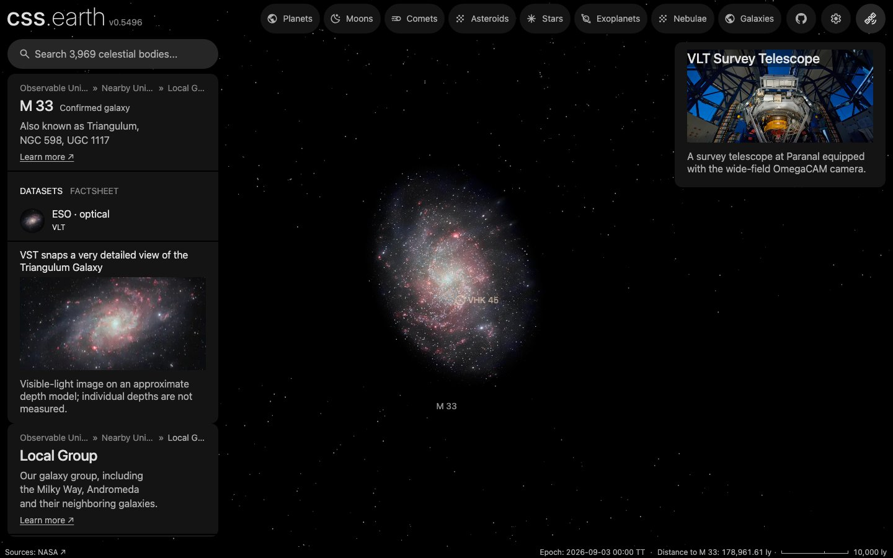
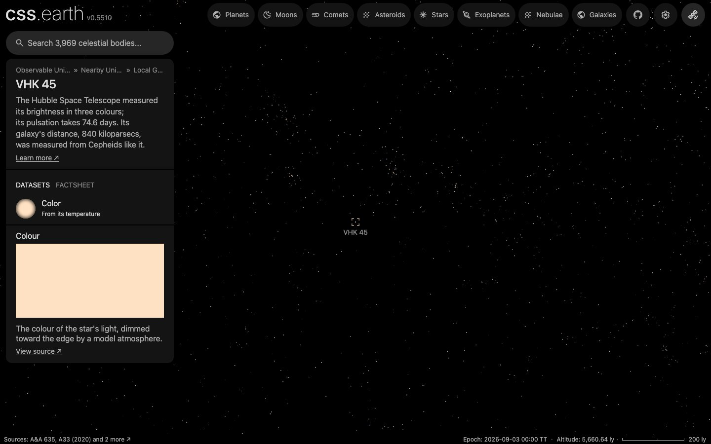

# VHK 45

## Sources

The Hubble Space Telescope measured its brightness in three colors; its pulsation takes 74.6 days. Its galaxy's distance, 840 kiloparsecs, was measured from Cepheids like it. The introduction is generated from Breuval et al. (2023), ApJ 951, 118's published values; the sections below are the data's own.

**Star.** Placement: Breuval et al. (2023), ApJ 951, 118, table 9, VizieR J/ApJ/951/118/table9 row ID = 01334390+3032452 (SIMBAD M33SSS J013343.90+303245.2); placed by that row, not by a Gaia source, distance 858,592 pc from Placed in M33 as the app draws it, where the star's sight line crosses the disc's midplane: 858,592 pc (src/objects/m33-layers/source/recipe.json: centre 859,014 pc from the Local Volume Database v1.1.1 (Pace 2025), inclination 54 deg, line of nodes 22.5 deg). The galaxy's Cepheid distance, Breuval et al. (2023), ApJ 951, 118, abstract: modulus 24.622 +/- 0.03 mag, 840 kpc; it places the galaxy, not a star within it. Radius 271.3 +/- 45.3 solar radii from Groenewegen (2020), A&A 635, A33, period relations for Galactic fundamental-mode Cepheids applied to this star's period, 74.64 d in Breuval et al. (2023), ApJ 951, 118, table 9 (log P 1.873); not a measurement of this star: eq. 2, log R = 0.721 log P + 1.083; the uncertainty is the relation's scatter, 0.067 dex (https://arxiv.org/abs/2002.02186). No mass is measured, so GM is 0, the records' unpublished value. Temperature 4,670 K from Groenewegen (2020), A&A 635, A33, period relations for Galactic fundamental-mode Cepheids applied to this star's period, 74.64 d in Breuval et al. (2023), ApJ 951, 118, table 9 (log P 1.873); not a measurement of this star: the luminosity of eq. 1 (M_bol = -2.95 log P - 0.98, with the nominal solar M_bol 4.74) over the radius of eq. 2, through L = 4 pi R^2 sigma T^4 with the nominal solar 5772 K (IAU 2015 Resolutions B2 (Mamajek et al. 2015, arXiv:1510.06262) and B3 (Prsa et al. 2016, arXiv:1605.09788)); the uncertainty is the 317 K by which the two relations miss the paper's own Cepheid temperatures. No surface gravity of this star is published.

**Color.** A Planck spectrum at 4,670 K, because no archive holds a spectrum of this star (stis-ngsl: no HD number in SIMBAD; gaia-xp: the star is placed by a catalogue row, so no Gaia DR3 source is read for it; pulkovo: no HR number; kiehling: no HR number; kharitonov: no HR number; burnashev: no HR (BS) number), through the CIE 1931 2° observer: #ffe1c3. Routes tried in order: stis-ngsl: no HD number in SIMBAD; gaia-xp: the star is placed by a catalogue row, so no Gaia DR3 source is read for it; pulkovo: no HR number; kiehling: no HR number; kharitonov: no HR number; burnashev: no HR (BS) number; planck: used.

**Limb.** The disc is dimmed toward the limb by the quadratic law Claret & Bloemen (2011), A&A 529, A75 compute from ATLAS model atmospheres for the Johnson V band at 4,670 K and log g 0.6 (u1 0.721, u2 0.066): a model, because no fit of this star's limb is used. Gravity: no gravity of this star is published (none in SIMBAD); Luck (2018), AJ 156, 171, table 3 (the spectroscopic gravities of its Cepheid spectra) gives the class's range, log g -1.33 to 2.86. Across log g 0 to 2.85, the part the grid covers, the limb laws differ by at most 1.4% of the centre brightness from the one drawn, at log g 0.6, the gravity closest to all of them; log g 0.6 is a display choice, not a measurement.

**Pulsation.** The 10 steps of the Pulsation dataset are the model Gaia DR3 publishes of the star's G-band light (vari_cepheid, source 303365600387618688: 2 harmonics of a 74.44-day period; the same row as [the source record](../../sources/gaia-dr3-vari-cepheid-vhk-45.json)), evaluated in this project a tenth of a period apart, from maximum light ([method note](../../../docs/pulsating-stars-light-through-a-cycle.md)). Tied to the star by its place: the one Gaia DR3 Cepheid within 1 arcsecond of it (0.03 arcseconds away), whose period, 74.444 d, is within 1% of the 74.64 d the star's own catalogue row prints. Each step draws the star's color dimmed to that phase's share of its light at maximum: 100, 97, 91, 85, 76, 67, 63, 69, 82, 95%.

## Evidence

Generated 2026-10-01 by [new-object-cli.mts](../../../packages/telescope-cli/src/new-object/new-object-cli.mts) from VizieR J/ApJ/951/118/table9 and the archives named above; each choice was read with the dataset's own reader.

A headless capture of the M 33 page after orbiting the view: VHK 45 stays on the disc, placed where its sight line crosses the disc the app draws. The other 153 Cepheids Hubble measured for the galaxy's distance ([Breuval et al. 2023](https://arxiv.org/abs/2304.00037)) are plain dots on it, reached through search.

A headless capture 5,660 light-years from the star, inside M33: the galaxy's catalogue dots draw around it, and its photograph, which is the galaxy seen from outside, does not.

## Known problems

- **Assumptions of the frame.** The axis's position angle and the rotation phase are conventions.
- **Model limb.** The limb darkening is a model atmosphere at the catalogued temperature and a display gravity inside its class's published range (see Limb), not a measurement of this star.
- **Not shown.** The star pulsates; it is drawn at its mean radius.
- **Not shown.** Its radius and temperature are what Groenewegen (2020), A&A 635, A33's relations for Galactic Cepheids give at its period; no measurement of this star's size or temperature exists.
- **Not shown.** Its period, 74.64 d, is longer than any in the relations' sample (68.464 d), so they are extrapolated.
- **Not shown.** Its radial velocity is its galaxy's; its own motion within M33 is not measured.

- **Pulsation.** The steps show the light alone. The star's color and its size change through the cycle and are not drawn: no published calibration found turns Gaia's two colors into a Cepheid's temperature, and nothing here measures this star's size through the cycle. 10 steps a tenth of a period apart are a display choice; the model between them is continuous.

[Investigation ledger](investigations.json) · [Inputs](source/manifest.json) · [Preparation](source/preparation) · [Delivered files](inventory.json) · [Credits](NOTICE.md)
