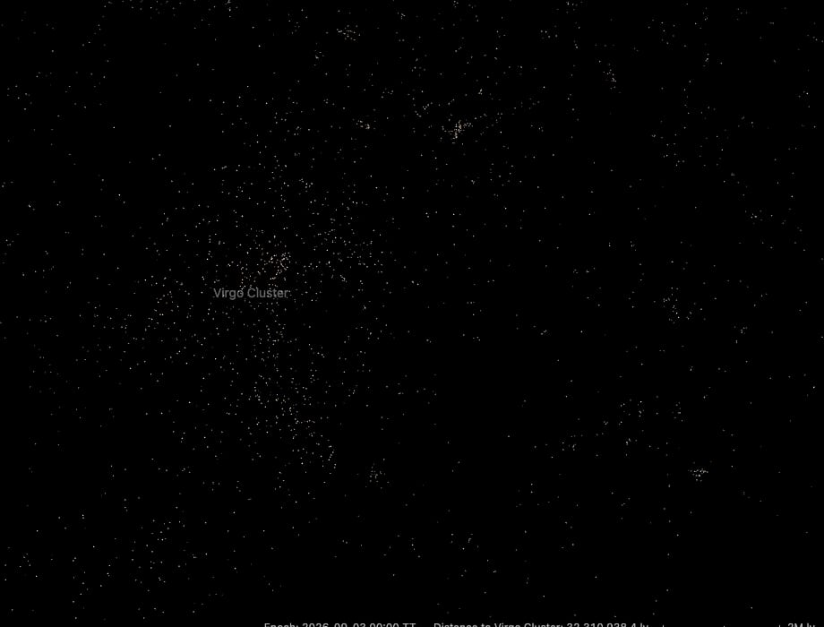
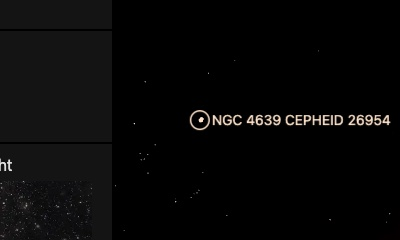

# Virgo Cluster members

The Virgo Cluster's member galaxies that the [Nearby Universe](../nearby-universe/README.md) field does not draw, one dot each, drawn while the cluster is selected. With the field's own 164 Virgo galaxies, about 960 of the cluster's galaxies show when you fly there. The cluster's centre, aperture and card come from the [galaxy cluster catalogue](../galaxy-clusters/README.md), whose Virgo row links here.

## Sources

| Source | Measurement used |
| --- | --- |
| [Extended Virgo Cluster Catalog, Kim et al. (2014)](https://cdsarc.cds.unistra.fr/viz-bin/cat/J/ApJS/215/22) | Table 2: J2000 position, membership from the Virgo infall model (MmI), morphology (TT1) and SDSS g and r magnitudes of the 1,028 certain members. |
| [Cosmicflows-4, Tully et al. (2023)](https://cdsarc.cds.unistra.fr/viz-bin/cat/J/ApJ/944/94) | Virgo's group distance (table 3, DMzp of group 41220: 31.048 mag, 16.2 Mpc), through the Nearby Universe's tracked table. |
| [Kinney et al. (1996)](https://doi.org/10.1086/177583) | The type templates the Nearby Universe colours its galaxies with. |

## Processing

1. [`members.mts`](../../../packages/bake/authoring/virgo-cluster/members.mts) keeps the 797 certain members more than 10 arcsec from every Cosmicflows-4 galaxy; the other 231 are in the field already. It reads each one's RC3 stage from its EVCC morphology (E and dE −5, S0 and dS0 −2, Sa 1, Sb 3, Sc 5, Sd 7, Sm 9, Irr 10) and its B magnitude from g and r ([Jester et al. 2005](https://doi.org/10.1086/432466): B = g + 0.39 (g − r) + 0.21).
2. `packages/bake/cli/prepare-catalogue-points.mts` places every member at Virgo's group distance, spread in depth as widely as the members spread across the sky, and colours and tones it as the field does ([recipe](source/dots/points.json)): 797 dots, 8 KB.

## Evidence

A browser capture of this version, after picking Virgo in the Nearby Universe list: 797 member dots load with the field's 164. The Nearby Universe places the field's own Virgo galaxies the same way; there the cluster comes out 0.64 Mpc deep (rms), where [Mei et al. (2007)](https://arxiv.org/abs/astro-ph/0702510) measured 0.6 ± 0.1 Mpc. The EVCC reaches 3.5 times Virgo's virial radius, so these members spread wider, about as deep as their 725 deg² footprint is wide.

A headless capture of M87's page, 1.2 Mpc out: the 32 Cepheids Hubble resolved in NGC 4639 ([Hoffmann et al. 2016](https://arxiv.org/abs/1607.08658)) sit together as one dot, which names one of them on hover and opens its page on a click. They are stars of their own packages, placed at their galaxy's Cepheid distance; a star beyond the Local Group keeps its marker within 8 Mpc of the camera.

## Known problems

- A member's depth is assumed, not measured. Mei et al. found Virgo slightly elongated, 20 to 40° from the line of sight; the dots are not.
- The EVCC's certain members include Virgo's infall region, not only its core.
- The B magnitudes are not corrected for Galactic extinction (about 0.1 mag toward Virgo); an unsubdivided spiral or edge-on disk has no type and is white.
