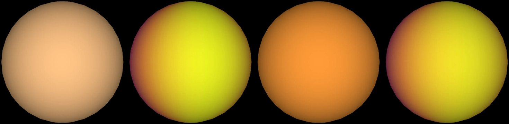

# WASP-33 b

## Sources

It is the only planet known around WASP-33. Its orbit and size follow Chakrabarty & Sengupta 2019's fit, the archive's default. The introduction is generated from Chakrabarty & Sengupta 2019's published values; the sections below are the data's own.

**Size and mass.** Radius 1.593 Jupiter radii from Chakrabarty & Sengupta 2019 (2019AJ....158...39C), via the NASA Exoplanet Archive (https://ui.adsabs.harvard.edu/abs/2019AJ....158...39C/abstract): 113,886.8 km at 71,492 km per Jupiter radius. GM from the mass 2.093 Jupiter masses (Chakrabarty & Sengupta 2019, the mass the NASA Exoplanet Archive's composite table adopts (2019AJ....158...39C), via the NASA Exoplanet Archive, https://ui.adsabs.harvard.edu/abs/2019AJ....158...39C/abstract) times JPL's Jupiter GM. A sphere: no oblateness is measured.

**Orbit.** Zhang et al. 2018 (2018AJ....155...83Z), via the NASA Exoplanet Archive ps table (pl_refname ZHANG_ET_AL__2018): P 1.21987089 d Chakrabarty & Sengupta 2019 (2019AJ....158...39C), via the NASA Exoplanet Archive ps table (pl_refname CHAKRABARTY__AMP__SENGUPTA_2019): a/R* 3.571; Chakrabarty & Sengupta 2019 (2019AJ....158...39C), via the NASA Exoplanet Archive ps table (pl_refname CHAKRABARTY__AMP__SENGUPTA_2019): inclination 86.63 degrees Stassun et al. 2017 (2017AJ....153..136S), via the NASA Exoplanet Archive ps table (pl_refname STASSUN_ET_AL__2017): e 0 Zhang et al. 2018 (2018AJ....155...83Z), via the NASA Exoplanet Archive ps table (pl_refname ZHANG_ET_AL__2018): transit mid-time 2454163.22367 BJD, taken as BJD_TDB; with its period, the row that predicts 2026-01-01 best (1 sigma 1 min) Display convention: transit photometry does not measure the orbit's position angle on the sky, so the ascending node is set at position angle 0 (celestial north).

**Color.** A black body at the 3,398 K dayside brightness temperature measured in secondary eclipse at 1.05 µm (von Essen et al. 2015, dayside brightness temperature at 1.05 µm (NASA Exoplanet Archive emission table)): #ffc486. Chosen from the archive's emission rows by rule: 1 measured of 111 rows; the smallest relative uncertainty, then the longest wavelength. Reflected starlight is not included.

**Heat map.** The page opens on a brightness-temperature map at 4.5 µm from Zhang et al. (2018, AJ 155, 83, [arXiv:1710.07642](https://arxiv.org/abs/1710.07642)): their fit to a Spitzer IRAC 4.5 µm phase curve of 11 April 2012. The [record](source/science/zhang-2018/phase-curve.json) holds the paper's column cell by cell: the eclipse depth 4250 +/- 160 ppm, "the planetary flux at the center of eclipse divided by the stellar flux", the radius ratio 0.103 +/- 0.0011, and a first-order sinusoid, printed as its amplitude, 1792 +/- 94 ppm, and its phase offset, -19.8 +/- 3.0 degrees: negative, so the maximum comes before the centre of the eclipse and the hot spot lies 19.8 degrees east. Nothing is refitted. The series becomes a map of longitude through the Cowan & Agol (2008) inversion ([published fits](../../../docs/eclipse-mapping.md#a-published-fit-drawn-as-the-paper-made-it)), so it has no north-south information and every latitude is drawn alike. Temperatures use the star's brightness temperature that the paper's own day side, 3209 +89/-87 K, implies with its eclipse depth and radius ratio (6,132 K). The false color runs from 950 to 3,500 K. The one thermal color the page opened on before stays as a dataset.

**Charts.** The orbits of WASP-33's planets from above, from their hosted-orbit records, and its transit in 3 TESS sectors (18, 58, 85), folded onto its orbit. Upper limits and rows without an error are left out.

## Evidence

- Run of 2026-10-04: [`new-object --phase-curve`](../../../packages/telescope-cli/src/new-object/planets/phase-curve-dataset.mts) wrote the dataset from the record. The paper's night side was not an input: the map gives 1,436 K at mid-transit against the printed 1498 +114/-118 K, and its maximum falls 19.8° before eclipse, as printed. [`published-phase-curve-map.test.mts`](../../../packages/bake/src/objects/raster/eclipse-map/published-phase-curve-map.test.mts) holds the printed amplitude-and-offset form to the eclipse-normalised one term for term.

Generated 2026-09-29 by [new-object-cli.mts](../../../packages/telescope-cli/src/new-object/new-object-cli.mts); the orbit is the one recorded in [its astronomy record](../../../packages/astronomy/data/bodies/wasp-33b.json).

## Known problems

- **The map is a fit, not an image.** One Fourier series in orbital phase fixes one number per longitude; nothing is known north to south.
- **The star pulsates.** WASP-33 is a δ Scuti variable; the paper models its pulsations with a Gaussian process, and the phase curve is what is left.
- **A later reanalysis prefers a second-order curve.** Bell et al. (2021, [arXiv:2010.00687](https://arxiv.org/abs/2010.00687)) fit the same data with a second harmonic and put the maximum 11.7° east with a night side of 1,559 ± 39 K; their table prints an amplitude and an offset, which do not determine a second-order curve, so the first-order fit of the original paper is the one drawn.
- **One band of two.** The paper's 3.6 µm curve peaks 12.8 ± 5.8° east with a night side of 1,952 +125/−134 K; only the 4.5 µm fit is drawn.
- **Quoted text.** The introduction quotes sentences of the Wikipedia article "WASP-33b" (revision 1374243508) verbatim, CC BY-SA 4.0.

[Investigation ledger](investigations.json) · [Inputs](source/manifest.json) · [Preparation](source/preparation) · [Delivered files](inventory.json) · [Credits](NOTICE.md)
