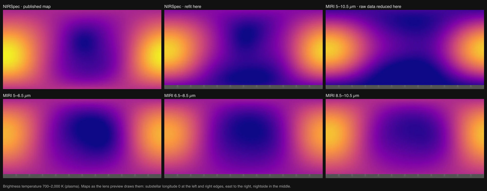

# WASP-43b

## Sources

WASP-43b is a hot Jupiter that orbits the K dwarf [WASP-43](../wasp-43/README.md) every 19.5 hours. It is the first planet of another star in cssEarth. Its six lenses are whole-planet maps of brightness temperature from JWST. **NIRSpec** is the map Challener et al. (2024) published. **NIRSpec refit** is this project's fit of their light curve. **MIRI** and the three **MIRI** slices are maps this project fitted to a MIRI phase curve it reduced itself from the raw exposures.

**The map.** Challener et al. (2024, [ApJL 969, L32](https://doi.org/10.3847/2041-8213/ad5958); [arXiv:2406.10207](https://arxiv.org/abs/2406.10207)) fitted two-dimensional maps to a JWST NIRSpec/G395H phase curve of WASP-43b: 28.6 hours from 14 May 2023, two eclipses and one transit, program 1224 (PI S. Birkmann; [MAST DOI 10.17909/n3ac-1s50](https://doi.org/10.17909/n3ac-1s50)). They used ThERESA's eigenmapping: third-degree spherical harmonics combined into six "eigenmaps", fitted to how the planet's light changed as it turned and passed behind its star. They converted flux to brightness temperature with a PHOENIX stellar spectrum and a blackbody planet. Their data deposit, [Zenodo 10.5281/zenodo.12627524](https://zenodo.org/records/12627524) (CC BY 4.0), holds the best-fitting maps and the light curves.

| Quantity | Value | Source |
| --- | --- | --- |
| Map | white-light brightness temperature, 48 × 96 cells of 3.75° | `whitelight.tmap` in `maps.npy`, Zenodo deposit |
| Hottest cell | 1,975.7 K at longitude +5.6°, latitude −13.1° | computed here from the deposited map |
| Paper's hotspot | 6.9 ± 0.5° east, 13.4 +3.2/−1.7° south, peak near 2,000 K | Challener et al. (2024), abstract and section 5; the latitude depends on the model, see Known problems |
| Area-weighted dayside and nightside means | 1,561 K and 1,003 K | computed here from the deposited map |
| Radius | 0.15883 host radii = 73,481 km (1.03 Jupiter radii) | Table 1 ratio × the host's 0.665 solar radii |
| Orbit | P 0.8134741 d, a 4.8767 host radii, i 82.155°, transit 55934.2922503 BMJD_TDB | Table 1 |

**Processing.** The deposit is pinned as its published tar, unchanged ([manifest](source/manifest.json)). Preparation reads `wasp-43b/maps.npy` in place with a restricted reader ([npy-pickle.mts](../../../tools/objects/terrestrial-layers/npy-pickle.mts)): the file is a pickled Python dictionary, and the reader interprets only the few instructions numpy uses to store float arrays, never running code a file names. [npy-dictionary-map.mts](../../../tools/objects/terrestrial-layers/npy-dictionary-map.mts) checks that the grid is regular pixel centres, south to north and west to east, and samples it bilinearly. The shared `terrestrial-scientific` science kind paints 700 to 2,000 K with the plasma palette, which is false colour. The body is drawn emissive, like the stars: the map is the planet's own heat glow, so it is not shaded by its star.

**Our fits.** The other five lenses are fitted during preparation, not read from a map file. The `eclipse-map-fit` format ([eclipse-map-fit.mts](../../../tools/objects/terrestrial-layers/eclipse-map-fit.mts), [light-curve-map.mts](../../../tools/objects/eclipse-map/light-curve-map.mts)) reads a light curve, fits it with this repository's eigencurve code ([eclipse mapping](../../../docs/eclipse-mapping.md)) on this package's orbit, and converts the map to brightness temperature. The recipes are in [raster.json](source/preparation/raster.json).

- **Model choice.** Each MIRI recipe lists candidate models: degree 2 or 3, with 4 to 8 eigencurves. Preparation takes the lowest BIC. When models are within 2 of it, the data cannot tell them apart, so it takes the one with fewest parameters. The NIRSpec refit is fixed to the paper's model, degree 3 with six eigencurves, so that the model choice is not what separates it from the published map.
- **Systematics.** The MIRI fits drop the first 780 integrations, as Bell et al. (2024) did. They fit a linear trend, an exponential ramp, and the spatial position and width of the trace. The ramp's time constant is profiled over 0.005 to 0.16 days on the most flexible candidate, refined between grid values, and kept while the model is chosen. The chosen model then refines its own time constant. The NIRSpec curve is already detrended.
- **Temperature.** A light curve adds up the star's counts over its band, so the conversion does the same: it finds the planet temperature whose count-weighted brightness matches the map. For MIRI, the weights are WASP-43's own extracted counts in each detector column. For NIRSpec, they are the G395H/F290LP transmission from the [SVO Filter Profile Service](https://svo2.cab.inta-csic.es/theory/fps/index.php?id=JWST/NIRSpec.G395H_F290LP), weighted by wavelength for photon counting. The star is a BT-Settl CIFIST model spectrum (Allard et al. 2012) at 4,500 K, log g 4.5 and solar metallicity, the parameters Challener et al. give, from the [SVO theoretical spectra service](https://svo2.cab.inta-csic.es/theory/newov2/index.php?models=bt-settl-cifist). BT-Settl is used because it covers both instruments. PHOENIX HiRes stops at 5.5 µm.
- **The MIRI light curves.** JWST program 1366 observed a full MIRI/LRS phase curve of WASP-43b on 1–2 December 2022. [`reduce-tso.mts`](../../../tools/objects/jwst/reduce-tso.mts) reduces the 30 raw segments (44 GB) from MAST with Eureka! 1.4, using Bell et al. (2024)'s settings ([program](../../../tools/objects/jwst/programs/wasp-43b-miri-1366)). The white light covers 5.0–10.5 µm, like theirs, and the three slices cover 5.0–6.5, 6.5–8.5 and 8.5–10.5 µm. The fit breaks down beyond 10.5 µm. The curves and the star's median count spectrum are pinned in [source/science/jwst-1366-miri](source/science/jwst-1366-miri). A run on 2026-09-17 wrote all five files byte for byte.

| Lens | Model | Dayside | Nightside | Offset | Hottest point | Published |
| --- | --- | --- | --- | --- | --- | --- |
| NIRSpec refit | degree 3, 6 eigencurves | 1,580 K | 875 K | 7.75° E | −2.3°, 7.1° E | map: −13.1°, 5.6° E |
| MIRI 5–10.5 µm | degree 2, 6 eigencurves, ramp 0.103 d | 1,527 K | 840 K | 6.05° E | 0.7°, 5.7° E | 1,524 ± 35 K and 863 ± 23 K (Bell et al. 2024, 5–12 µm); offset 7.5 ± 0.5° E (Hammond et al. 2024) |
| MIRI 5–6.5 µm | degree 2, 4 eigencurves, ramp 0.088 d | 1,539 K | 835 K | 3.4° E | 3.0° E | — |
| MIRI 6.5–8.5 µm | degree 2, 4 eigencurves, ramp 0.112 d | 1,493 K | 837 K | 7.75° E | 7.6° E | — |
| MIRI 8.5–10.5 µm | degree 2, 4 eigencurves, ramp 0.077 d | 1,565 K | 913 K | 8.3° E | 8.1° E | — |

Dayside and nightside are brightness temperatures of the flux each hemisphere shows. The offset is Hammond et al. (2024)'s longitudinal offset: the longitude where the map, averaged over latitude with weight cos(latitude), peaks. It is the quantity that compares with a phase curve's peak. The hottest point is the map's own maximum. All values measured on 2026-09-17.

[`lens-comparison.png`](source/reference/lens-comparison.png) shows the six prepared lens previews on the same 700–2,000 K scale. The refit puts the hot spot nearer the equator than the published map. The MIRI white-light map is about 50 K cooler than the NIRSpec refit on both the dayside and the nightside.

**Orbit and rotation.** The planet orbits its placed host star on a circular orbit built from the transit fit ([hostedOrbits.ts](../../../packages/astronomy/src/hostedOrbits.ts)). The rotation record, `cssearth-synchronous-rotation@1`, assumes the planet is tidally locked, as the paper does. The pole is the orbit normal and longitude 0 faces the star at every instant; east is the direction of rotation. The default camera looks at the substellar point with the pole up.

## Evidence

Run of 2026-09-16 (this version): `node tools/prepare-object.mts wasp-43b` prepared the package.

- [`eclipse-map.test.mts`](../../../tests/objects/unit/wasp-43b/eclipse-map.test.mts) turns the deposited map with this package's orbit and rotation ([phase-curve.mts](../../../tools/objects/eclipse-map/phase-curve.mts)) and fits the deposited white-light light curve, with a free scale and offset, over the 4,202 samples outside transit:

  | Map | Reduced chi-squared | Flux scale |
  | --- | --- | --- |
  | As deposited | 2.120 | 0.977 |
  | Mirrored north–south | 2.128 | 0.953 |
  | Mirrored east–west | 16.34 | 0.926 |
  | Uniform planet | 92.75 | — |

  The deposited map needs almost no rescaling, and only its east–west mirror fails, so the lens's longitudes, the orbit's phase and the spin direction agree with the observation. The same check in Python gave the same four numbers. The paper's own fit reaches 0.993 with its eigenmap model and error treatment; this check uses the deposited best-fitting map and the deposited uncertainties.
- The same test finds the hottest cell at +5.6°, −13.1°, next to the paper's 6.9° E, 13.4° S.
- [`default-view.test.mts`](../../../tests/objects/unit/wasp-43b/default-view.test.mts) derives the default camera from the runtime's camera math: 0.2° from the substellar point, pole up. In Chrome at 1440 × 900 the leaf under the screen centre covers atlas longitudes 0° to 11.25°, with −39° to its left and +39° to its right.
- [`source.test.mts`](../../../tests/objects/unit/wasp-43b/source.test.mts) verifies the pins, the lens recipe, the radius ratio and that the prepared body frame's +X points at the host star at the scene epoch.
- [`npy-pickle.test.mts`](../../../tools/objects/terrestrial-layers/npy-pickle.test.mts) reads a dictionary written the way numpy writes one, refuses a pickle that names `os.system`, and refuses an irregular grid. Reading the deposit gives the same minimum and maximum as numpy (709.78 and 1,975.68 K).
- [`hostedOrbits.test.ts`](../../../packages/astronomy/src/hostedOrbits.test.ts) checks the orbit: the planet in front of the star at mid-transit, 0.6655 stellar radii off centre, the Keplerian speed and the inclination. [`authored-rotation.test.mts`](../../../tools/objects/authored-rotation.test.mts) checks that a synchronous rotation faces +X at its centre with +Z on the orbit normal.
- [`eigenmap-fit.test.mts`](../../../tests/objects/unit/wasp-43b/eigenmap-fit.test.mts) fits the same light curve with this repository's own eigencurve code ([eclipse mapping](../../../docs/eclipse-mapping.md)), which shares nothing with starry and spins the planet about the orbit normal. Degree 3 with 6 eigencurves gives χ² 8,809.6, a hot spot at −2.3°, +7.1°, and a posterior of −2.9° (−4.0 to −1.6) and +7.3° (6.9 to 7.5). These match ThERESA run with the axis corrected, below.
- [`lens-fits.test.mts`](../../../tests/objects/unit/wasp-43b/lens-fits.test.mts) runs the five fitted recipes as shipped:
  - The NIRSpec refit repeats the eigencurve result above: χ² 8,809.56, hot spot −2.31°, +7.09°.
  - The MIRI white-light map puts the dayside at 1,527 K, within Bell et al. (2024)'s 1,524 ± 35 K. The nightside is 840 K, one standard deviation below their 863 ± 23 K. Their values cover 5–12 µm, ours 5–10.5 µm.
  - Each MIRI lens's chosen model, ramp time constant, dayside, nightside and offset are held to the table above.
- [`hammond-offset.test.mts`](../../../tests/objects/unit/wasp-43b/hammond-offset.test.mts) reproduces Hammond et al.'s systematics and offset from their time constant and measures their transit timing against both light curves, as the known problem below describes. [`transit-timing.mts`](../../../tools/objects/eclipse-map/transit-timing.mts) fits a limb-darkened transit on the package orbit. On the same window it agrees with batman-package 2.5.3, the reduction toolchain's pin, to 0.5 s and to 0.1 in χ².
- The same test checks how the deposit converted its maps. The NRS1 and NRS2 maps are single-wavelength conversions, at 3.155 and 4.466 µm, against a 4,520 K blackbody star scaled by 1.035. In every cell they agree with that formula to about one part in a million. The white-light map fits no single wavelength: the best leaves a 1.2% spread. Its flux map, converted with this package's band and BT-Settl, is 80 K cooler on the dayside than its temperatures.
- [`light-curve-map.test.mts`](../../../tools/objects/eclipse-map/light-curve-map.test.mts) checks the conversion:
  - A one-sample band reduces to the single-wavelength formula.
  - A band with an uneven star and uneven counts solves its own equation to 0.01 K.
  - An injected map under a ramp and a drift comes back with the injected degree and ramp time constant.
- [ThERESA reruns](source/reference/theresa-reruns.md): the authors' public code (commit 74a8fec) on the deposited light curve, transit excluded, reproduces the paper's hot spot, +7.0° and −12.1°, and a map correlated 0.97 with the deposited one. The same file records the spin-axis finding and the model tests behind the known problem below.
- The orbital phase at the scene epoch agrees with two independent transit ephemerides from the NASA Exoplanet Archive: 21 s (0.1° of orbit) from Kokori et al. (2023) and 39 s from Ivshina & Winn (2022).
- In Chrome at DPR 1 and 2 the page renders with no console errors, and searching "WASP-43" from another page lists and opens WASP-43b and WASP-43.
- [`source/reference/rendered-default-view.png`](source/reference/rendered-default-view.png) is the branch's dev server at `/wasp-43b/` with the default camera.

## Known problems

- **How far south the hot spot sits is not settled.** Rerunning the authors' public mapping code on their light curve ([ThERESA reruns](source/reference/theresa-reruns.md)) keeps the day–night contrast, the shift of about 7° east and a southward offset in every run, but the latitude moves between −4° and −16° among fits of nearly equal quality. The public code leaves the planet's spin axis 7.8° off its orbit normal; with the axis corrected, the paper's own model choice (degree 3, six eigencurves) puts the hot spot at −4.1°, not −13°. The paper says its unpublished 2024 code includes the tilt, which these files cannot confirm. The deposited map is shown unchanged; its −13° is one of the fits the data allow.
- **North and south cannot be told apart.** An eclipse light curve cannot tell whether the planet crosses north or south of the star's centre. Challener et al. assume one side (their footnote 1), which fixes the map's north, and this package's orbit follows the same construction.
- **Only large patterns are real.** The map is built from third-degree harmonics and six eigenmaps; the paper warns that features at the scale of its quoted uncertainties cannot be measured. The 3.75° cells and the bilinear sampling are display resolution, not detail.
- **Brightness temperature, not temperature.** Each value is the temperature of a blackbody that would give the observed flux in its band. It depends on the model of the star and on the depth the light comes from.
- **The published map's conversion is not the one the paper describes.** The paper describes a PHOENIX stellar spectrum. The deposited NRS1 and NRS2 maps match a blackbody star at one wavelength instead (see Evidence). The white-light map matches neither recipe, so the NIRSpec lens is shown as deposited. This package's own conversion puts the same flux about 80 K cooler on the dayside. BT-Settl is fainter than a blackbody near 4.5 µm, where carbon monoxide absorbs.
- **The MIRI offset is 1.45° west of Hammond et al.'s, because the light curve admits two systematics solutions and they took the other one.** Hammond et al. (2024) report 7.5 ± 0.5° for the same observation; this map gives 6.05° ([`hammond-offset.test.mts`](../../../tests/objects/unit/wasp-43b/hammond-offset.test.mts)).
  - *Two solutions.* The start of the curve is a detector ramp on top of a slow drift. A fast ramp (0.10 d) with a steep trend and a slow ramp (0.27 d) with a gentle trend both fit, and they put the offset about 2° apart. Hammond et al.'s Table 1 (ramp 3.7 ± 0.3 per day, 1,319 ± 66 ppm; trend −240 ± 60 ppm/day) is the slow solution. On the curve they mapped, Bell et al.'s Eureka! v1 white light (pinned as [`science/bell-2024`](source/science/bell-2024)), this fit with their time constant returns their ramp amplitude (1,275 ppm), trend (−279 ppm/day), position and width coefficients, and an offset of 7.45°. With the fast ramp, the same curve gives 5.45° and a trend of −926 ppm/day. The data prefer the fast ramp by χ² 14.2, about 9.5 after their error scaling. This project's reduction shows the same pair: 6.1° and 7.95°, 14.1 apart. Why their fit settled on the slow ramp cannot be recovered from the paper. Neither a more flexible map nor a stand-in for their pixel prior moves it here: every degree 2 and 3 eigencurve model prefers the fast ramp, and a Gaussian 6,000 ± 3,000 ppm prior on 16 pixels moves the time constant only from 0.098 to 0.105 d. Their starry pixel map itself was not run.
  - *Timing is not the cause.* Their t0, 55934.292283 BMJD_TDB, uses the period Bell et al. fitted, 0.81347406 d; the paper prints it rounded. Their model applies starry's light delay, which is measured from the barycentre, so their transit is seen 7.4 s before t0. That puts it 20.6 s before the package ephemeris, and both curves show it at 20.5 s (Bell et al.) and 19.5 s (this reduction). The rounded period would put it at −47 s, which the curve rules out.
  - *The ramp grid.* The first release of these lenses stopped the time constant at its 0.08 d grid value and showed 5.7°. It also compared the map's hottest point (5.3°) with Hammond et al.'s offset, which is a different quantity.
- **The MIRI slices do not locate latitude.** BIC picks four eigencurves for each slice, and at that count the hottest point sits near +10° latitude in all three, which reflects the basis more than the planet. The six-eigencurve white-light map puts it at +0.8°. Read the slices for day–night contrast and east–west shift.
- **The far south was never seen.** At this orbit's 82° inclination, cells south of about 81°S never faced JWST, so the fitted lenses leave them as missing data. The published map fills them from its model.
- **The nightside is weakly measured.** Below about 700 K the palette saturates. Some nightside cells come out far colder than the hemisphere average, because few eigencurves constrain them.
- **Assumptions of the frame.** Tidal locking and a pole on the orbit normal are assumed. The direction of the orbit's ascending node on the sky is not measured by transits; it is set at position angle 0 as a display convention. The orbit is circular, and the orbit's phase ignores the up to 8.3 minutes of barycentric light-time (0.7 percent of an orbit), as the star placement does.
- **The planet is a sphere.** Its tidal and rotational flattening are not modelled.
- **Other maps of the same planet are not shown.** See the [investigation ledger](investigations.json) for the MIRI map of Hammond et al. (2024), the Bell et al. (2024) products and the two single-detector NIRSpec maps.

[Investigation ledger](investigations.json) · [Inputs](source/manifest.json) · [Preparation](source/preparation) · [Provenance](prepared/provenance.json) · [Delivered files](runtime-assets.json) · [Credits](NOTICE.md)
