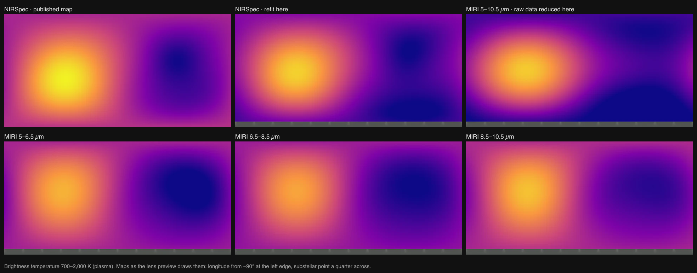

# WASP-43b

WASP-43b is a hot Jupiter that orbits the K dwarf [WASP-43](../wasp-43/README.md)
every 19.5 hours. Its two datasets are whole-planet maps of brightness
temperature from JWST, one per instrument. **NIRSpec** is the map Challener et
al. (2024) published. **MIRI** is a map this project fitted to a MIRI phase curve
it reduced itself from the raw exposures; no MIRI map has been published as data.

## Sources

- **NIRSpec map:** Challener et al. (2024, [ApJL 969, L32](https://doi.org/10.3847/2041-8213/ad5958); [arXiv:2406.10207](https://arxiv.org/abs/2406.10207)) fitted two-dimensional maps to a JWST NIRSpec/G395H phase curve, program 1224 (PI S. Birkmann; [MAST DOI 10.17909/n3ac-1s50](https://doi.org/10.17909/n3ac-1s50)), with ThERESA's eigenmapping. Their data deposit, [Zenodo 10.5281/zenodo.12627524](https://zenodo.org/records/12627524) (CC BY 4.0), holds the best-fitting maps and the light curves. The radius and orbit come from their Table 1.
- **MIRI phase curve:** JWST program 1366 observed a full MIRI/LRS phase curve on 1–2 December 2022. [`reduce-tso.mts`](../../../packages/telescope-cli/src/archives/jwst/reduce-tso.mts) reduces the 30 raw segments (44 GB) from MAST with Eureka! 1.4, using Bell et al. (2024)'s settings ([program](../../../packages/telescope-cli/src/archives/jwst/programs/wasp-43b-miri-1366)). The curve and the star's median count spectrum are pinned in [source/science/jwst-1366-miri](source/science/jwst-1366-miri). Bell et al.'s Eureka! v1 white light is pinned as [`science/bell-2024`](source/science/bell-2024).
- **Stellar spectrum:** a BT-Settl CIFIST model (Allard et al. 2012) at 4,500 K, log g 4.5 and solar metallicity, from the [SVO theoretical spectra service](https://svo2.cab.inta-csic.es/theory/newov2/index.php?models=bt-settl-cifist).

| Quantity | Value | Source |
| --- | --- | --- |
| Map | white-light brightness temperature, 48 × 96 cells of 3.75° | `whitelight.tmap` in `maps.npy`, Zenodo deposit |
| Hottest cell | 1,975.7 K at longitude +5.6°, latitude −13.1° | computed here from the deposited map |
| Paper's hotspot | 6.9 ± 0.5° east, 13.4 +3.2/−1.7° south, peak near 2,000 K | Challener et al. (2024); the latitude depends on the model, see Known problems |
| Area-weighted dayside and nightside means | 1,561 K and 1,003 K | computed here from the deposited map |
| Radius | 0.15883 host radii = 73,481 km (1.03 Jupiter radii) | Table 1 ratio × the host's 0.665 solar radii |
| Orbit | P 0.8134741 d, a 4.8767 host radii, i 82.155°, transit 55934.2922503 BMJD_TDB | Table 1 |

## Processing

The deposit is pinned as its published tar, unchanged ([manifest](source/manifest.json)).
Preparation reads `maps.npy` with a restricted reader
([npy-pickle.ts](../../../packages/bake/src/objects/raster/numpy/npy-pickle.ts))
that interprets only the instructions numpy uses to store float arrays, never
running code a file names.
[npy-dictionary-map.ts](../../../packages/bake/src/objects/raster/numpy/npy-dictionary-map.ts)
checks the grid and samples it bilinearly. Both datasets paint 700 to 2,000 K
with the plasma palette, which is false color. The body is drawn emissive: the
map is the planet's own heat glow.

The MIRI dataset is fitted during preparation by the `eclipse-map-fit` format
([eclipse-map-fit.ts](../../../packages/bake/src/objects/raster/eclipse-map/eclipse-map-fit.ts)),
with this repository's eigencurve code ([eclipse mapping](../../../docs/eclipse-mapping.md))
on this package's orbit. The recipe is in [raster.json](source/preparation/raster.json).
Preparation takes the lowest-BIC model among degree 2 or 3 with 4 to 8
eigencurves. The fit takes the transit time from its own light curve with
[`transit-timing.ts`](../../../packages/bake/src/objects/raster/eclipse-map/transit-timing.ts)
and fits a trend, an exponential ramp and the trace position and width.

The planet orbits its host on a circular orbit built from the transit fit
([hostedOrbits.ts](../../../packages/astronomy/src/hostedOrbits.ts)) and is
assumed tidally locked, as the paper does. The default camera looks at the
substellar point with the pole up. From a distance the planet is drawn as its
NIRSpec dayside seen from the star, rendered by
[author.mts](../../../packages/telescope-cli/authoring/wasp-43/author.mts).

## Evidence

The two prepared dataset previews on the same 700–2,000 K scale.

| Quantity | MIRI 5–10.5 µm | Published |
| --- | --- | --- |
| Model | degree 2, 6 eigencurves; ramp 0.105 d; transit −19.5 s | — |
| Dayside, nightside | 1,527 K, 840 K | 1,524 ± 35 K, 863 ± 23 K (Bell et al. 2024, 5–12 µm) |
| Offset | 6.2° E | 7.75 ± 0.36° E (Hammond et al. 2024; 7.5 ± 0.5° in their eigenmap fit) |
| Hottest point | 0.6°, 5.8° E | — |

The offset is Hammond et al. (2024)'s longitudinal offset: the longitude where
the map, averaged over latitude with weight cos(latitude), peaks.

- Turning the deposited map with this package's orbit and fitting the deposited white-light curve gives reduced chi-squared 2.120, against 2.128 mirrored north–south, 16.34 mirrored east–west and 92.75 for a uniform planet. Only the east–west mirror fails, so the longitudes, orbit phase and spin direction agree with the observation.
- [ThERESA reruns](source/reference/theresa-reruns.md) with the authors' public code reproduce the paper's hot spot, +7.0° and −12.1°, and a map correlated 0.97 with the deposited one.
- The orbital phase at the scene epoch agrees with two independent transit ephemerides to 21 s (Kokori et al. 2023) and 39 s (Ivshina & Winn 2022).
- [`source/reference/rendered-default-view.png`](source/reference/rendered-default-view.png) shows the default camera.

## Known problems

- **How far south the hot spot sits is not settled.** Rerunning the authors' public code keeps the shift of about 7° east and a southward offset in every run, but the latitude moves between −4° and −16° among fits of nearly equal quality. The public code leaves the spin axis 7.8° off the orbit normal; with it corrected, the paper's model choice puts the hot spot at −4.1°. The deposited map is shown unchanged.
- **North and south cannot be told apart.** An eclipse light curve cannot tell whether the planet crosses north or south of the star's centre. Challener et al. assume one side, and this package follows them.
- **Only large patterns are real.** The map is built from third-degree harmonics; the 3.75° cells and the bilinear sampling are display resolution, not detail.
- **Brightness temperature, not temperature.** It depends on the model of the star and on the depth the light comes from.
- **The published map's conversion is not the one the paper describes.** The deposited NRS1 and NRS2 maps match a blackbody star at one wavelength, not a PHOENIX spectrum, and the white-light map matches neither, so the NIRSpec dataset is shown as deposited.
- **The MIRI offset is 1.55° west of Hammond et al.'s.** The curve admits a fast ramp (0.10 d) and a slow ramp (0.27 d) that put the offset about 2° apart. The data prefer the fast ramp; Hammond et al.'s eclipse-map fit took the slow one. Transit timing is not the cause.
- **The far south was never seen.** Cells south of about 81°S never faced JWST, so the MIRI dataset leaves them missing. The NIRSpec map fills them from its model.
- **The nightside is weakly measured.** Below about 700 K the palette saturates.
- **Assumptions of the frame.** Tidal locking, a circular orbit and a pole on the orbit normal are assumed. The ascending node is set at position angle 0 as a display convention. The planet is a sphere.
- **Other maps of the same planet are not shown.** See the [investigation ledger](investigations.json).

[Investigation ledger](investigations.json) · [Inputs](source/manifest.json) · [Preparation](source/preparation) · [Delivered files](inventory.json) · [Credits](NOTICE.md)
