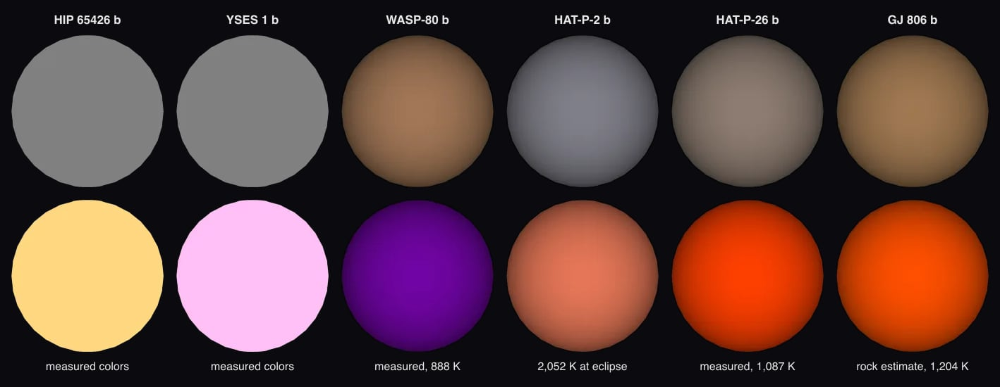

# WASP-80 b

## Sources

It is the only planet known around Petra. Its orbit and size follow Triaud et al. 2015's fit, the archive's default. The introduction is generated from Triaud et al. 2015's published values; the sections below are the data's own.

**Size and mass.** Radius 0.999 Jupiter radii from Triaud et al. 2015 (2015MNRAS.450.2279T), via the NASA Exoplanet Archive (https://ui.adsabs.harvard.edu/abs/2015MNRAS.450.2279T/abstract): 71,420.5 km at 71,492 km per Jupiter radius. GM from the mass 0.538 Jupiter masses (Triaud et al. 2015, the mass the NASA Exoplanet Archive's composite table adopts (2015MNRAS.450.2279T), via the NASA Exoplanet Archive, https://ui.adsabs.harvard.edu/abs/2015MNRAS.450.2279T/abstract) times JPL's Jupiter GM. A sphere: no oblateness is measured.

**Orbit.** Kokori et al. 2023 (2023ApJS..265....4K), via the NASA Exoplanet Archive ps table (pl_refname KOKORI_ET_AL__2023): P 3.06785251 d Triaud et al. 2015 (2015MNRAS.450.2279T), via the NASA Exoplanet Archive ps table (pl_refname TRIAUD_ET_AL__2015): a/R* 12.63; Triaud et al. 2015 (2015MNRAS.450.2279T), via the NASA Exoplanet Archive ps table (pl_refname TRIAUD_ET_AL__2015): inclination 89.02 degrees Triaud et al. 2015 (2015MNRAS.450.2279T), via the NASA Exoplanet Archive ps table (pl_refname TRIAUD_ET_AL__2015): e 0.002 Triaud et al. 2015 (2015MNRAS.450.2279T), via the NASA Exoplanet Archive ps table (pl_refname TRIAUD_ET_AL__2015): omega 94 degrees Kokori et al. 2023 (2023ApJS..265....4K), via the NASA Exoplanet Archive ps table (pl_refname KOKORI_ET_AL__2023): transit mid-time 2456726.717483 BJD, taken as BJD_TDB; with its period, the row that predicts 2026-01-01 best (1 sigma 1 min) Display convention: transit photometry does not measure the orbit's position angle on the sky, so the ascending node is set at position angle 0 (celestial north).

**Color.** No image or measured color exists. The neutral gray is lit by wasp-80's measured color (#ffbe8d, the color dataset of wasp-80 (src/objects/wasp-80/source/photometry/stellar-color.json)) at the gray's own brightness.

**Measured day side.** The page opens on the one thing measured of its surface: a dayside brightness temperature of 888 K at 4.5 µm (Triaud et al. 2015, dayside brightness temperature at 4.5 µm (NASA Exoplanet Archive emission table); [record](source/photometry/dayside-temperature.json)). Chosen by rule: 2 measured of 2 rows; the smallest relative uncertainty, then the longest wavelength. The `measured-dayside` format paints the hemisphere under the star in false color at that temperature, on the 300 to 3,000 K scale every measured day side shares, and leaves the night hemisphere blank. It is too cool for a visible glow, so no black-body color is shown.

**Charts.** The orbits of Petra's planets from above, from their hosted-orbit records, and its transit in 1 TESS sector (54), folded onto its orbit. Upper limits and rows without an error are left out.

## Evidence

Generated 2026-10-03 by [new-object-cli.mts](../../../packages/telescope-cli/src/new-object/new-object-cli.mts); the orbit is the one recorded in [its astronomy record](../../../packages/astronomy/data/bodies/wasp-80b.json).

- Run of 2026-10-04: [`new-object --thermal`](../../../packages/telescope-cli/src/new-object/planet-datasets.mts) wrote the measured day side as a dataset of its own, as it did for ten other planets too cool to glow or on an eccentric orbit. Six planets of that run as their pages open, before and after:

## Known problems

- **Orbit convention.** omega 94 degrees is taken as Triaud et al. 2015 gives it through the archive (pl_orblper); papers differ on whether that is the star's or the planet's argument of periastron. The epoch is the transit, so a swapped convention would only mirror the ellipse (e 0.002) about the line of sight.

[Investigation ledger](investigations.json) · [Inputs](source/manifest.json) · [Preparation](source/preparation) · [Delivered files](inventory.json) · [Credits](NOTICE.md)
