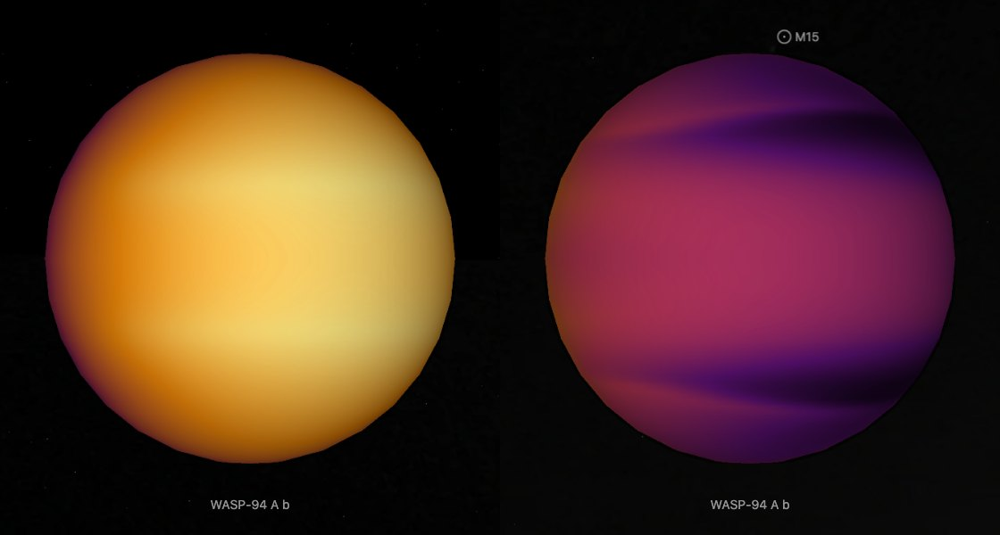

# WASP-94 A b

## Sources

It is the only planet known around WASP-94 A. Its orbit and size follow Stassun et al. 2017's fit, the archive's default. The introduction is generated from Stassun et al. 2017's published values; the sections below are the data's own.

**Size and mass.** Radius 1.58 Jupiter radii from Stassun et al. 2017 (2017AJ....153..136S), via the NASA Exoplanet Archive (https://ui.adsabs.harvard.edu/abs/2017AJ....153..136S/abstract): 112,957.4 km at 71,492 km per Jupiter radius. GM from the mass 0.5 Jupiter masses (Stassun et al. 2017, the mass the NASA Exoplanet Archive's composite table adopts (2017AJ....153..136S), via the NASA Exoplanet Archive, https://ui.adsabs.harvard.edu/abs/2017AJ....153..136S/abstract) times JPL's Jupiter GM. A sphere: no oblateness is measured.

**Orbit.** Kokori et al. 2023 (2023ApJS..265....4K), via the NASA Exoplanet Archive ps table (pl_refname KOKORI_ET_AL__2023): P 3.9502001 d Stassun et al. 2017 (2017AJ....153..136S), via the NASA Exoplanet Archive ps table (pl_refname STASSUN_ET_AL__2017): a/R* 8.44; Stassun et al. 2017 (2017AJ....153..136S), via the NASA Exoplanet Archive ps table (pl_refname STASSUN_ET_AL__2017): inclination 88.7 degrees Stassun et al. 2017 (2017AJ....153..136S), via the NASA Exoplanet Archive ps table (pl_refname STASSUN_ET_AL__2017): e 0 Kokori et al. 2023 (2023ApJS..265....4K), via the NASA Exoplanet Archive ps table (pl_refname KOKORI_ET_AL__2023): transit mid-time 2458300.64763 BJD, taken as BJD_TDB; with its period, the row that predicts 2026-01-01 best (1 sigma 1 min) Display convention: transit photometry does not measure the orbit's position angle on the sky, so the ascending node is set at position angle 0 (celestial north).

**Color.** A black body at the 1,535 K dayside brightness temperature measured in secondary eclipse at 3.6 µm (Deming et al. 2023, dayside brightness temperature at 3.6 µm (uniform reanalysis of Spitzer's eclipses, CDS J/AJ/165/104 table 2)): #ff6f00. Chosen from the archive's emission rows by rule: 2 measured of 2 rows; the smallest relative uncertainty, then the longest wavelength. Reflected starlight is not included.

**Charts.** The orbits of WASP-94 A's planets from above, from their hosted-orbit records, and its transit in 3 TESS sectors (68, 95, 105), folded onto its orbit. Upper limits and rows without an error are left out.

**Climate model dataset.** The page opens on the temperature of WASP-94 A b in the Met Office Unified Model run of Mukherjee et al. (2025, [arXiv:2505.10910](https://arxiv.org/abs/2505.10910)), released under CC BY 4.0 as [Zenodo record 15085825](https://zenodo.org/records/15085825). It is a model, labelled as one: a hydrogen and helium atmosphere at the Sun's share of heavier elements, without clouds, on a planet that turns once for each orbit. The file is `GCM_products/WASP-94Ab_GCM.nc` inside `GCM_products.zip`, the variable `air_temperature` in kelvin on the model's 144 × 90 grid and 87 levels, at the later of the two saved states (42,000 hours of model time; the earlier one, 240 hours before, differs by under 0.1 K).

The model's levels are heights, and the paper notes that the pressure at one height differs by orders of magnitude between the day side and the night side, so it draws its own temperature map on a surface of one pressure (its Figure S18 D). The dataset does the same at 1 millibar, where the paper states the model's difference between the two edges: in each column the temperature is taken between the two levels whose `air_pressure` lies either side of 100 Pa, linearly in the logarithm of pressure ([netcdf-isobar.ts](../../../packages/bake/src/objects/raster/netcdf/netcdf-isobar.ts)). The reader refuses 0.01 millibar, the pressure of the paper's figure: near the model's top the released pressure passes it three times in some columns. The star is overhead at grid longitude 180°: the release's own `toa_incoming_shortwave_flux` peaks equally at 178.75° and 181.25°.

The 632 MB file is NetCDF-4, which spreads its structure through the file, so it is kept whole, outside git, and [`new-object --simulation`](../../../packages/telescope-cli/src/new-object/simulation/simulation-dataset.mts) and the source restore take it out of the 546 MB archive.

## Evidence

Generated 2026-10-05 by [new-object-cli.mts](../../../packages/telescope-cli/src/new-object/new-object-cli.mts); the orbit is the one recorded in [its astronomy record](../../../packages/astronomy/data/bodies/wasp-94-a-b.json).

**The model file is read as its own library reads it.** The NetCDF-4 reader ([hdf5-netcdf.ts](../../../packages/bake/src/objects/raster/netcdf/hdf5-netcdf.ts)) was compared with h5py 3.16 on the released file on 5 October 2026: both find 53 variables, and `air_temperature` and `air_pressure` at the later state and level 40 agree to the last digit (first value 1490.0345103484158 K, minimum 1265.2697968491468 K, maximum 1925.2773438740744 K). Its tests read two small files the reference libraries wrote ([fixtures](../../../packages/bake/src/objects/raster/netcdf/fixtures/README.md)).

**The map reproduces the paper's numbers.** At 1 millibar the map runs from 955.9 to 1,650.8 K with no column missing. The evening edge is 289 K hotter than the morning edge at the equator (1,472.7 against 1,183.4 K) and 263 K hotter averaged over all latitudes; the paper states about 300 K and about 265 K.

## Known problems

- **The model has no clouds; the measurement says there are some.** The paper measures the planet's two edges in one JWST transit and finds a cloudy morning edge and a clear evening edge. It maps clouds by a second model run on this one's output; that cloud map is not in the release, so the page shows the model's temperature, not its clouds. The measured edges themselves, two spectra, are not drawn.
- **One face to the star is assumed.** The model and the rotation record both assume the planet turns once for each orbit; no rotation period is measured.
- **Gray caps.** The model's grid has no samples within 1° of either pole, and nothing is extrapolated there.

[Investigation ledger](investigations.json) · [Inputs](source/manifest.json) · [Preparation](source/preparation) · [Delivered files](inventory.json) · [Credits](NOTICE.md)
