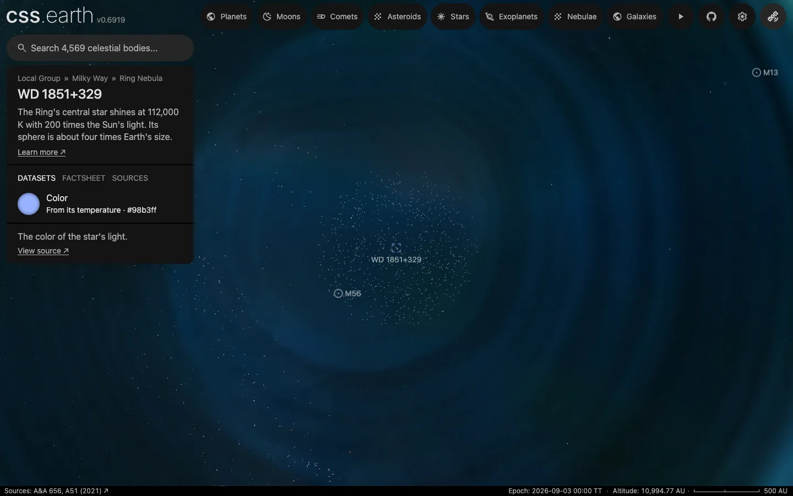

# The dust cloud around the Ring Nebula's central star

800 dots through the cloud of dust that Webb found around [WD 1851+329](../wd-1851-329/README.md), the Ring Nebula's central star, drawn while the star is selected. The cloud is far too thin to see in visible light, so the dots stand for dust an eye would not see. The position of a single dot is not a measurement.

## Sources

| Source | Measurement used |
| --- | --- |
| [Sahai et al. (2025), arXiv:2504.01188](https://arxiv.org/abs/2504.01188), Table 4 | The shell the paper fits to the star's mid-infrared light: inner radius 10.5 au, outer radius 1,310 au, and a density that rises outward as r^0.8 (the table's exponent n = −0.8 for a density going as r^−n). |

[Inputs](source/manifest.json) · [Recipe](source/dots/points.json)

## Processing

1. [`positions.mts wd-1851-329-dust-cloud 10.5 1310 0.8 800`](../../../packages/bake/authoring/dust-shell/positions.mts) draws each dot's distance from the star so that the share of dots inside a radius grows as r^3.8 between the two radii: the paper's density, r^0.8, times the r² of each thin shell's volume. Half of the 800 dots lie beyond 1,073 au and the nearest is 159 au from the star.
2. Each dot's direction is uniform over the sphere, because the paper's model is one-dimensional.
3. Distances and directions come from a seeded generator (mulberry32, seed 20250401). Nothing else is authored.
4. It writes [`positions.csv.gz`](source/dots/positions.csv.gz), kilometres from the star along the ICRF axes, and `packages/bake/cli/prepare-body-points.mts` writes the point bank at the world's epoch, JD 2461286.5 TT.

## Evidence

A headless capture of this version: the Ring Nebula's page after four wheel steps in on the star, 10,995 au from it.

## Known problems

- **The dots overstate the cloud enormously.** Its optical depth at 0.55 µm is 1.3 × 10⁻⁸ and its dust weighs 1.86 × 10⁻⁶ Earth masses (Table 4). Webb sees it as extra light beyond about 5 µm and as extended emission in its 7.7, 10 and 11.3 µm images; an eye would see nothing. The 800 dots are a display choice.
- **No dot is a measured grain.** Only the shell's inner radius, outer radius and density law are the paper's.
- **The dots are round; the cloud may be a disk.** The paper's model is one-dimensional, its title calls the cloud a dusty disk, and it does not exclude one.
- **From inside the cloud almost nothing shows.** The density rises outward, so no dot lies within 159 au of the star, and a camera nearer than that sees only the sparse dots of the far side.
- The dots are `#9a9a9a`, the neutral gray; no grain color is measured. Against black they look like background stars in a still image.
- The dots do not move.
