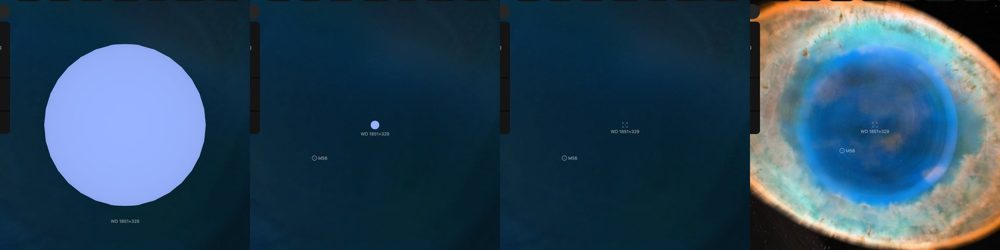

# WD 1851+329

## Sources

WD 1851+329 (HD 175353) is the central star of the [Ring Nebula](../m57/README.md), 790 parsecs away: the hot star whose light makes the nebula glow. It is an object of its own, inside the nebula: a zoom in on the nebula goes on into the star, and the star's page keeps the nebula's walls drawn around it. **What is drawn is a sphere of the size that radiates the star's published luminosity at its published temperature (González-Santamaría et al. 2021, Table 8), in the color of a black body at that temperature. No paper prints its radius.**

**Star.** Placement: Gaia DR3 source 2090486618786534784, distance 790 pc from Chornay & Walton (2021), A&A 656, A110; CDS J/A+A/656/A110, Table A.1, PN G063.1+13.9: distance 790 pc (764 to 818) from the Gaia EDR3 parallax of this star, the distance its nebula's page stands at; Gaia DR3's parallax, 1.270 ± 0.044 mas (29.0 standard errors), is not used. Radius 0.0374 solar radii from González-Santamaría et al. (2021), A&A 656, A51, Table 8: log(L/Lsun) = 2.3 from the star's V magnitude at its Gaia EDR3 distance, and log(Teff) = 5.05; the paper prints no radius, and 0.0374 solar radii is the sphere that radiates that luminosity at that temperature (Stefan-Boltzmann law) (https://arxiv.org/abs/2109.12114). No mass is measured, so GM is 0, the records' unpublished value. Temperature 112,200 K from González-Santamaría et al. (2021), A&A 656, A51, Table 8: log(Teff) = 5.05, a temperature from the literature the paper compiles; spectral type hgO(H). log g 6.88 from Napiwotzki (1999), arXiv:astro-ph/9908181, Table 2: log g from a fit of the star's spectrum.

**Color.** A Planck spectrum at 112,200 K, because no archive holds a spectrum of this star (stis-ngsl: HD 175353 is not in the library; gaia-xp: Gaia DR3 published no sampled BP/RP spectrum of it; pulkovo: no HR number; kiehling: no HR number; kharitonov: no HR number; burnashev: no HR (BS) number), through the CIE 1931 2° observer: #98b3ff. Routes tried in order: stis-ngsl: HD 175353 is not in the library; gaia-xp: Gaia DR3 published no sampled BP/RP spectrum of it; pulkovo: no HR number; kiehling: no HR number; kharitonov: no HR number; burnashev: no HR (BS) number; planck: used.

**Limb.** The disc is dimmed toward the limb by the quadratic law (u1 0.0593, u2 0.0996) of the nearest model Claret et al. (2020), A&A 634, A93 tabulate: a pure-hydrogen white dwarf at 100,000 K and log g 7.0, the grid's hottest (Johnson V).

**Dust cloud.** [The dust cloud's dots](../wd-1851-329-dust-cloud/README.md) draw the cloud Webb found around the star, about 2,600 au across (Sahai et al. 2025, https://arxiv.org/abs/2504.01188); the position of a single dot is drawn from a seed.

## Evidence

Generated 2026-10-05 by [new-object-cli.mts](../../../packages/telescope-cli/src/new-object/new-object-cli.mts) from Gaia DR3, SIMBAD and the archives named above; each choice was read with the dataset's own reader.

Headless Chromium at 1440 × 900, device pixel ratio 2, on 2026-10-05, no page errors. The star's own page as it opens, 182,134 km from the star; 6 and 12 wheel steps out, at 3,877,692 km and 73,236,356 km, with the walls of the nebula's picture ([its image layers](../m57-layers/README.md)) drawn around it; and the Ring Nebula's page after 3 wheel steps in, no click, where the view has handed over to the star, 1.26 ly from it.

## Known problems

- **Assumptions of the frame.** The axis's position angle and the rotation phase are conventions.
- **A derived radius.** No paper prints this star's radius. It is the sphere that radiates the published luminosity at the published temperature (Stefan-Boltzmann law), so it carries the errors of both.
- **Not shown.** The star's mass is not measured. Evolutionary tracks give 0.56 solar masses from its spectrum (Napiwotzki (1999), arXiv:astro-ph/9908181, Table 2, https://arxiv.org/abs/astro-ph/9908181) and 0.58 from its luminosity (Sahai et al. 2025, https://arxiv.org/abs/2504.01188).
- **Not shown.** Other analyses differ: a fit of its spectrum gives 101,200 K (Napiwotzki (1999), arXiv:astro-ph/9908181, Table 2), and a fit of its light from the ultraviolet to the infrared takes 135,000 K and finds 310 solar luminosities (Sahai et al. 2025, https://arxiv.org/abs/2504.01188).
- **Not shown.** Webb found that the star's brightness varies, which a companion under 0.1 solar masses could cause (Sahai et al. 2025, https://arxiv.org/abs/2504.01188). Neither is drawn.
- **Model limb.** The limb darkening is the nearest tabulated model atmosphere's, not a measurement of this star.

[Investigation ledger](investigations.json) · [Inputs](source/manifest.json) · [Preparation](source/preparation) · [Delivered files](inventory.json) · [Credits](NOTICE.md)
