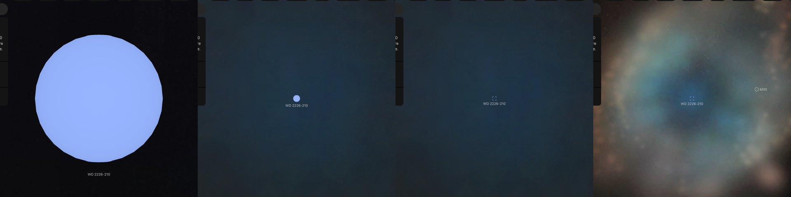

# WD 2226-210

## Sources

WD 2226-210 is the central star of the [Helix Nebula](../helix/README.md), 216 parsecs away: the hot star whose light makes the nebula glow. It is an object of its own, inside the nebula: a zoom in on the nebula goes on into the star, and the star's page keeps the nebula's walls drawn around it. **What is drawn is a sphere of the size that radiates the star's published luminosity at its published temperature (González-Santamaría et al. 2021, Table 8), in the color of its own Gaia spectrum. No paper prints its radius.**

**Star.** Placement: Gaia DR3 source 6628874205642084224, distance 216 pc from Benedict et al. (2009), HST parallaxes of planetary nebula nuclei: 216 pc (-12/+14) from the trigonometric parallax of this star, the distance its nebula's page stands at; Gaia DR3's parallax, 5.012 ± 0.044 mas (114.8 standard errors), is not used. Radius 0.0228 solar radii from González-Santamaría et al. (2021), A&A 656, A51, Table 8: log(L/Lsun) = 1.79 from the star's V magnitude at its Gaia EDR3 distance, and log(Teff) = 5.03; the paper prints no radius, and 0.0228 solar radii is the sphere that radiates that luminosity at that temperature (Stefan-Boltzmann law) (https://arxiv.org/abs/2109.12114). No mass is measured, so GM is 0, the records' unpublished value. Temperature 107,200 K from González-Santamaría et al. (2021), A&A 656, A51, Table 8: log(Teff) = 5.03, a temperature from the literature the paper compiles; spectral type DAO.5. log g 7 from Napiwotzki (1999), arXiv:astro-ph/9908181, Table 2: log g from a fit of the star's spectrum.

**Color.** Gaia DR3 XP spectrum, source 6628874205642084224, through the CIE 1931 2° observer: #96b4ff. Routes tried in order: stis-ngsl: no HD number in SIMBAD; pulkovo: no HR number; kiehling: no HR number; kharitonov: no HR number; burnashev: no HR (BS) number; gaia-xp: used.

**Limb.** The disc is dimmed toward the limb by the quadratic law (u1 0.0593, u2 0.0996) of the nearest model Claret et al. (2020), A&A 634, A93 tabulate: a pure-hydrogen white dwarf at 100,000 K and log g 7.0, the grid's hottest (Johnson V).

## Evidence

Generated 2026-10-05 by [new-object-cli.mts](../../../packages/telescope-cli/src/new-object/new-object-cli.mts) from Gaia DR3, SIMBAD and the archives named above; each choice was read with the dataset's own reader.

Headless Chromium at 1440 × 900, device pixel ratio 2, on 2026-10-05, no page errors. The star's own page as it opens, 111,034 km from the star; 6 and 12 wheel steps out, at 2,364,507 km and 44,655,430 km, with the walls of the nebula's picture ([its image layers](../helix-layers/README.md)) drawn around it; and the Helix Nebula's page after 4 wheel steps in, no click, where the view has handed over to the star, 4.23 ly from it.

## Known problems

- **Assumptions of the frame.** The axis's position angle and the rotation phase are conventions.
- **A derived radius.** No paper prints this star's radius. It is the sphere that radiates the published luminosity at the published temperature (Stefan-Boltzmann law), so it carries the errors of both.
- **Not shown.** The star's mass is not measured. Evolutionary tracks give 0.57 solar masses from its spectrum (Napiwotzki (1999), arXiv:astro-ph/9908181, Table 2, https://arxiv.org/abs/astro-ph/9908181).
- **Not shown.** A fit of its spectrum gives 103,600 K (Napiwotzki (1999), arXiv:astro-ph/9908181, Table 2, https://arxiv.org/abs/astro-ph/9908181).
- **Not shown.** The luminosity behind the radius was computed at the star's Gaia EDR3 distance, about 200 pc. The page stands at 216 pc, where the same light needs a radius 8% larger.
- **Model limb.** The limb darkening is the nearest tabulated model atmosphere's, not a measurement of this star.

[Investigation ledger](investigations.json) · [Inputs](source/manifest.json) · [Preparation](source/preparation) · [Delivered files](inventory.json) · [Credits](NOTICE.md)
