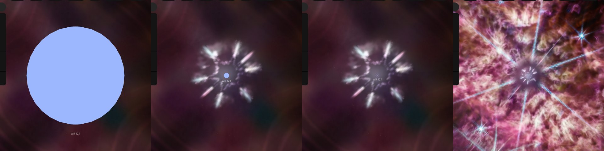

# WR 124

## Sources

A star of 44,700 K with about 560,000 times the Sun's light, losing its mass in a wind of 710 km/s. The sphere drawn is the star under that wind. It is also HIP 94289. The introduction is generated from Hamann et al. (2019), A&A 625, A57's published values; the sections below are the data's own.

**Star.** Placement: Gaia DR3 source 4513494205567536512, distance 6,400 pc from Zavala et al. (2022), MNRAS 513, 3317, Sect. 1: an estimated distance of 6.4 (+2.5, −0.8) kpc, from Jiménez-Hernández et al. (2020), the distance its nebula's page stands at; Gaia DR3's parallax, 0.157 ± 0.014 mas (11.2 standard errors), is not used. Radius 11.93 solar radii from Hamann et al. (2019), A&A 625, A57, Table 1, WR 124: R* = 11.93 solar radii, the radius where the continuum's Rosseland optical depth is 20 (Sect. 2), under the wind (https://arxiv.org/abs/1904.04687). No mass is measured, so GM is 0, the records' unpublished value. Temperature 44,700 K from Hamann et al. (2019), A&A 625, A57, Table 1, WR 124: T* = 44.7 kK, the temperature at that radius; spectral subtype WN8h. No surface gravity of this star is published.

**Color.** A Planck spectrum at 44,700 K, because the star's measured light is reddened by dust between it and the Sun, a color excess E(b−v) of 1.08 mag (Hamann et al. 2019, Table 1): Gaia's spectrum shows that dust, not the star; and no other archive holds a spectrum of this star (stis-ngsl: no HD number in SIMBAD; pulkovo: no HR number; kiehling: no HR number; kharitonov: no HR number; burnashev: no HR (BS) number), through the CIE 1931 2° observer: #9db7ff. Routes tried in order: stis-ngsl: no HD number in SIMBAD; gaia-xp: skipped; pulkovo: no HR number; kiehling: no HR number; kharitonov: no HR number; burnashev: no HR (BS) number; planck: used.

**Limb.** No limb darkening is drawn: no limb-darkening grid describes a Wolf-Rayet star, whose light leaves an expanding wind, not a still atmosphere.

## Evidence

Generated 2026-10-05 by [new-object-cli.mts](../../../packages/telescope-cli/src/new-object/new-object-cli.mts) from Gaia DR3, SIMBAD and the archives named above; each choice was read with the dataset's own reader.

Headless Chromium at 1440 × 900, device pixel ratio 2, on 2026-10-05, no page errors. The star's own page as it opens, 32,485,772 km from the star; 6 and 12 wheel steps out, at 5.04 AU and 95.55 AU, with the walls of the nebula's picture ([its image layers](../m1-67-layers/README.md)) drawn around it; and M1-67's page after 4 wheel steps in, no click, where the view has handed over to the star, 10.46 ly from it.

## Known problems

- **Assumptions of the frame.** The axis's position angle and the rotation phase are conventions.
- **Not shown.** What is drawn is the star under its wind: the radius where the continuum's optical depth is 20 (Hamann et al. (2019), A&A 625, A57, Sect. 2, https://arxiv.org/abs/1904.04687). The wind above it is still opaque, and the paper prints no radius for where it turns clear.
- **Not shown.** The star's mass is not measured. Table 1 of the same paper gives 22 solar masses from a mass-luminosity relation for helium-burning stars and 20 from one built on evolutionary tracks (https://arxiv.org/abs/1904.04687).
- **Not shown.** Its wind: 710 km/s, carrying off 10^-4.3 solar masses a year (Table 1, https://arxiv.org/abs/1904.04687). The wind is not drawn.
- **Not shown.** The radius and luminosity are for the paper's own distance, a modulus of 14.0 (+0.5, −0.4) from Gaia DR2, 6.3 kpc (Table 1, https://arxiv.org/abs/1904.04687); the star stands here at its nebula's 6.4 kpc.
- **Not shown.** A compact companion hidden deep in the wind has been proposed; the paper keeps the star as single (Hamann et al. (2019), A&A 625, A57, comments on WR 124, https://arxiv.org/abs/1904.04687). It is drawn as one star.
- **Not shown.** Its light reaches us reddened by dust: a color excess E(b−v) of 1.08 mag (Table 1, https://arxiv.org/abs/1904.04687).

[Investigation ledger](investigations.json) · [Inputs](source/manifest.json) · [Preparation](source/preparation) · [Delivered files](inventory.json) · [Credits](NOTICE.md)
