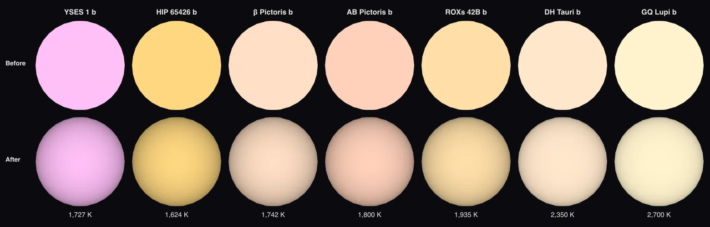

# YSES 1 b

The [navigation marker](source/preparation/navigation.json) adds a prepared curvature cue to the existing neutral gray placeholder. It remains a schematic identifier without resolved surface imagery; the shading is a display convention, not measured limb darkening or surface detail.

YSES 1 b orbits its young Sun-like star about 160 au out. GRAVITY positions and a radial velocity against the star gave it its first full orbit in 2025. Its star is [YSES 1](../yses-1/README.md).

## Sources

**Orbit.** Roberts et al. ([2025](https://arxiv.org/abs/2509.14321)) fit four VLTI/GRAVITY positions (their Table 2), six SPHERE and NaCo positions (Table 3) and the CRIRES+ velocity of the planet relative to the star, −1.87 ± 0.04 km/s (Zhang et al. [2024](https://arxiv.org/abs/2409.16660), section 5.5), with orbitize!, and publish medians only (a 146 au, e 0.44, i 90.6°). [`orbitize-fit.py`](../../../packages/telescope-cli/src/new-object/hosted-orbits/orbitize-fit.py) reruns that fit on the same inputs ([fit.json](source/orbits/fit.json), [measurements](source/orbits/roberts-2025-astrometry.csv)) with fewer walkers and steps than the paper, and keeps the maximum of the posterior, refined from many starts including the paper's medians. Their mass and parallax priors are centred on catalogue values without stated widths: 1.00 ± 0.02 solar masses (Bohn et al. 2020) and the Gaia DR3 parallax 10.612 ± 0.012 mas are used. The velocity's epoch, MJD 60002.5, is the midpoint of the two CRIRES+ nights, 2023 February 27 and 28 (Zhang et al. 2024, section 5.5). The recorded orbit: a = 187 au, e = 0.05, i = 90.7°, period about 2,566 years; it passes the four GRAVITY positions within 0.32 mas and matches the relative velocity to 0.001 km/s. Its eccentricity is lower than the paper's median of 0.44 ± 0.20: the single best orbit is nearly circular, while most orbits their posterior holds are more eccentric. The path drawn is this orbit. Every element and its derivation is in [`yses-1-b.json`](../../../packages/astronomy/data/bodies/yses-1-b.json).

**Radius, temperature and mass.** Radius 3.0 +0.2/−0.7 Jupiter radii, 1,727 K and 14 ± 3 Jupiter masses from Bohn et al. ([2020](https://arxiv.org/abs/2007.10991), ApJL 898, L16), as the ESO SupJup survey tabulates them (Zhang et al. 2024, Table 1). Model values: the planet is unresolved. A sphere: no oblateness is measured.

**Its disc.** JWST found silicate emission from a disc of dust around the planet (Hoch et al. [2025](https://arxiv.org/abs/2507.18861), Nature 643, 938). The disc is not drawn: no paper gives its size or orientation.

**Its own light.** The planet is drawn self-luminous, as the other imaged planets are: its glow is its own heat.

**Infrared color dataset.** The default dataset paints the sphere one false color from its measured flux in three infrared bands: red 2MASS Ks 2.159 µm (879 ± 110 µJy), green 2MASS H 1.662 µm (459.5 ± 160 µJy), blue 2MASS J 1.235 µm (813.7 ± 280 µJy) (Bohn et al. (2020a), as compiled in Best, Liu, Magnier & Dupuy (2024), The UltracoolSheet v2.1 (Zenodo); zero points from the SVO Filter Profile Service; [record](source/photometry/band-color.json)). Display range: this planet alone, from zero to its brightest band (2MASS Ks), so the color shows its band ratios; brightness is not compared across planets at different distances. Not a natural color; nobody has resolved its disc.

**Limb.** The disc is dimmed toward the limb by the quadratic law Claret, Hauschildt & Witte (2012), A&A 546, A14 compute from PHOENIX model atmospheres for the H band at 1,727 K and log g 3.59 (u1 0.791, u2 -0.029): a model, not a measurement of this planet ([nodes](source/photometry/claret-2012-h-quadratic.tsv)). Its temperature is the 1,727 K of its measurements record; log g 3.59 follows from the mass and radius of its astronomy record (packages/astronomy/data/bodies/yses-1-b.json).

**Rotation.** No rotation period or spin axis of YSES 1 b on the sky is measured; the papers cited in the README were checked. The display axis is the orbit normal ([rotation.json](source/preparation/rotation.json)).

## Evidence

Run of 2026-09-23:

- [`hostedOrbits.test.ts`](../../../packages/astronomy/src/hostedOrbits.test.ts) places the planet, at its star's Gaia distance, against the measured positions (see the test for each miss).

Run of 2026-10-04, when the limb law was added. The orbit test above still applies: the orbit record did not change.

- The app's arrival pictures of the seven imaged planets hot enough for the published table, before and after their limb law:

- [`imaged-limb.test.mts`](../../../packages/telescope-cli/src/new-object/imaged/imaged-limb.test.mts) reads the published table's rows and checks the law between its nodes; [`stellar-photometric-color.test.mts`](../../../packages/bake/src/objects/stellar/stellar-photometric-color.test.mts) reads this planet's nodes and checks the plate darkens toward the limb.

## Known problems

- The orbit misses the GRAVITY positions by up to 0.32 mas; on a 1.7-arcsecond separation that is invisible.
- The best orbit's eccentricity, 0.05, sits about two standard deviations below the paper's median; a longer run of the fit could still move it.
- The radius and mass are model values; the planet is a point in every image.
- The dusty disc JWST found around the planet is not drawn.
- The second planet, YSES 1 c, is not built (see the star's ledger).
- **Model limb.** The limb darkening is a model atmosphere at the planet's temperature and gravity, in the middle band of its color, not a measurement of this planet.

[Investigation ledger](investigations.json) · [Inputs](source/manifest.json) · [Preparation](source/preparation) · [Delivered files](inventory.json) · [Credits](NOTICE.md)
