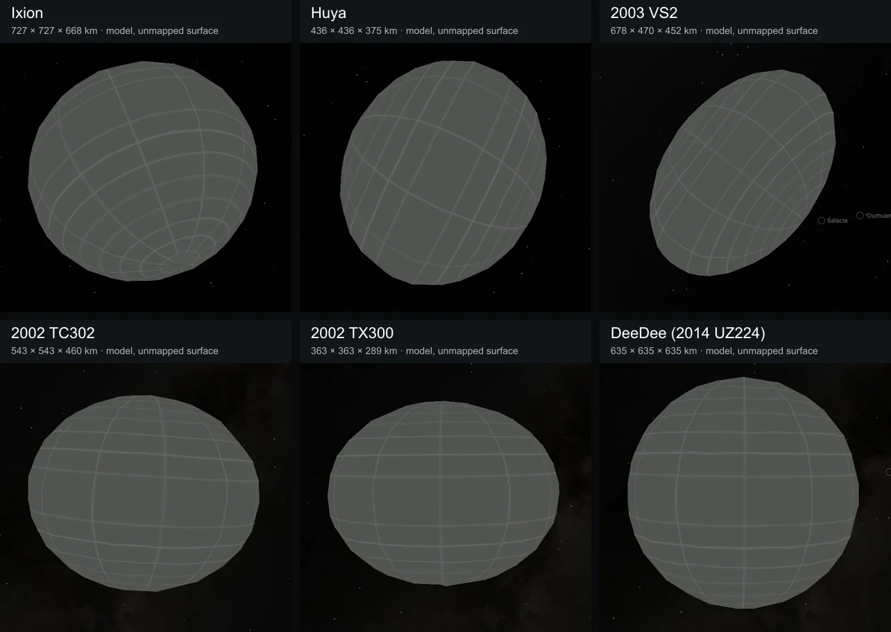

# Distant-world qualification evidence

**The helpers that produced this evidence were retired in
[#505](https://github.com/layoutit/css.earth/pull/505)** along with the Playwright
harness they depended on. What remains here is the record, not a runnable check:
the reports below are tied to the revisions they tested and are cited by the
affected body READMEs. Rendering is now proved from built HTML by
`site/test/rendered-page.test.mts`, which needs no browser.

The batch covered the nine models listed in the
[source-authoring inputs](../../objects/source-authoring/distant-worlds/inputs.json).

Two drag captures kept `before.png`/`after.png` and a 6 MB gzipped Chrome trace
each. Nothing cites them and no tool reads them any more, so they were not
restored; they remain in history at
[`6e32bc459^`](https://github.com/layoutit/css.earth/tree/6e32bc459%5E/tools/audits/distant-worlds/evidence/outer-worlds).
Their measured results stay in the `report.json` files linked below.

The evidence came from these helpers, all now removed:

| Helper | Check or artifact |
| --- | --- |
| `qualify.mjs` | Package contracts, prepared budgets and default controls |
| `fresh-sources.mjs` | Standard acquisition into empty source roots; original byte pins |
| `fresh-install.mjs` | Standard runtime installation into an empty destination; byte pins |
| `surface-fit.py` | Radial deviations at prepared vertices, edge midpoints and centroids |
| `browser-check.mjs` | Default views at DPR 1/2, retained drag and navigation; records server build type |
| `final-interactions.mjs` | World-marker selection, designation searches, lighting and mobile layout |
| `drag-trace.mjs` | Headless interaction trace using the shared browser launch and trace parser |
| `contact-sheet.mjs` | Overview from the selected actual DPR 1 default captures |

They were selected over another authored batch with these variables:

```sh
export CSSEARTH_AUDIT_INPUTS=tools/objects/source-authoring/outer-worlds/inputs.json
export CSSEARTH_AUDIT_OUTPUT=output/outer-worlds
export CSSEARTH_AUDIT_CAPTURES=output/playwright/outer-worlds
```

These variables apply to `qualify`, `fresh-sources`, `fresh-install`,
`surface-fit`, `browser-check` and `contact-sheet`. `final-interactions`
retains its original named scenarios. `contact-sheet` writes `worlds.webp`.

Historical commands at [revision `d68eab6c31^`](https://github.com/layoutit/css.earth/tree/d68eab6c31%5E/tools/audits/distant-worlds):
`node tools/audits/distant-worlds/qualify.mjs` read the prepared packages, and
`python3 tools/audits/distant-worlds/surface-fit.py` compared them with the
adopted ellipsoids. These helpers are absent from the current checkout. Their
finite samples were not a Hausdorff bound or a scientific measurement uncertainty.

Fresh-source and fresh-runtime checks require empty destinations beneath
the selected report directory (by default `output/distant-worlds/`). To avoid a
second asset copy, set `CSSEARTH_AUDIT_RUNTIME_ROOT=public/scenes` when the selected
bodies' asset directories are empty; installation still verifies every hash.
Both the installer and browser checker use this same destination.

The browser checks use the existing preview on port 4278. Set
`CSSEARTH_AUDIT_BUILD=development` when using Astro dev; the browser and drag
reports record that distinction. Production is the default. These helpers do
not start a server. Run only one acquisition, build, preparation or browser
capture at a time. `drag-trace.mjs` accepts origin, DPR, output directory and
body id as positional arguments.

The original reports and inspected screenshots are preserved at
[5ccf1eafa](https://github.com/layoutit/cssEarth/tree/5ccf1eafa396d7cbe91e62b28fe81db8c0626a35/docs/distant-worlds).
The [browser report](https://github.com/layoutit/cssEarth/blob/5ccf1eafa396d7cbe91e62b28fe81db8c0626a35/docs/distant-worlds/browser-validation.json)
records actual bytes, viewport and browser settings. The
[drag comparison](https://github.com/layoutit/cssEarth/blob/5ccf1eafa396d7cbe91e62b28fe81db8c0626a35/docs/distant-worlds/drag-comparison.json)
compares ʻOumuamua with an equal-face-count existing reference; their projected
areas differ, so it does not claim identical GPU work or performance on every
device. Keep new measurements separate from those original results.

## Six outer worlds

Ixion, Huya, 2003 VS2, 2002 TC302, 2002 TX300 and DeeDee use the existing
480-triangle model preparation and unmapped grid. Their body READMEs explain
which dimensions are measured and which depths or orientations are assumed.



The [browser check](evidence/outer-worlds/browser-validation.json) passed on
2026-09-10 with headless Chrome 152, a 1440 × 900 viewport at DPR 1 and 2,
and a 390 × 844 mobile viewport. It checks native raster leaves, retained
identity during drag, default controls, opt-in shadows and orbit, the
trans-Neptunian category, designation search and single-scene handoffs.
The [DPR 2 views](evidence/outer-worlds/dpr2.webp) and
[rotated views with Shadows on](evidence/outer-worlds/shadows-on.webp) were
inspected. Images are individually framed, not shown at a common physical scale.
The [image record](evidence/outer-worlds/images.json) identifies retained WebP
captures; they do not establish pixel parity with observed surface imagery.

The [run context](evidence/outer-worlds/run-context.json) records code revision
`fc0c05a80`, prepared-data revision `9666f9dcc`, and the relevant byte pins.
These captures and traces use the development server. The earlier 942-page
production build completed, but its output was removed during workstation
cleanup; no new full-site build or complete-catalogue asset installation is
claimed. No geometry bake or exact-output reproduction comparison was repeated.

[Package qualification](evidence/outer-worlds/qualification.json) and
[source restoration](evidence/outer-worlds/source-restoration.txt) passed for
all six. Hash-verified shared sky/font inputs were reused through hard links;
missing papers were restored by the normal acquisition plan.
[Fresh runtime installation](evidence/outer-worlds/fresh-install.json) downloaded
186 files, 42.12 MB, directly into the serving directory, with every expected
size and SHA-256 checked. [Finite radial samples](evidence/outer-worlds/surface-fit.json)
measure approximation to the adopted analytical models, not scientific accuracy
or a Hausdorff bound.

The matched short drag checks use the same 480-leaf budget, viewport, DPR 1,
Shadows-off setting and three 60-step vertical drag cycles:

| Body | Median / p95 frame interval | Dropped pipeline sequences | Retained nodes / new requests |
| --- | --- | --- | --- |
| [2003 VS2](evidence/outer-worlds/drag-vs2/report.json) | 16.7 / 16.7 ms | 1 / 382 | Yes / 0 |
| [Varuna reference](evidence/outer-worlds/drag-varuna/report.json) | 16.7 / 16.7 ms | 1 / 378 | Yes / 0 |

The reports pin the original compressed Chrome traces beside them. Different
projected areas mean this is not identical GPU work, and two short headless
runs do not predict every device's performance. About 12 MB of compressed
traces are retained so the cadence and dropped-frame claims can be checked.

CI integration also exposed two SN263 issues already present in merged main:
body-level Git attributes violated the data-only directory contract, and the
world-context test omitted the published SN263 companion/parent reference
states. Attribute rules now live at repository level; the directory validator
accepts the documented data-only evidence folder and still rejects executables.
The independent orbit test includes the two new source records without changing
orbital data or tolerances. The [focused package check](evidence/outer-worlds/source-closure-focused.txt)
and [all-body independent position check](evidence/outer-worlds/spatial-context-focused.txt)
pass. Unrelated ignored artifacts in the original local checkout prevent a
clean all-directory local pass; fresh-checkout CI runs that complete gate.

After integrating main’s TypeScript migration, revision `90baa56a3` passed the
full TypeScript and ownership checks, all six package closures, and the
[focused navigation/mobile browser check](evidence/outer-worlds/after-typescript/navigation.json).
The six worlds remain searchable and mount alone with 480 raster triangles and
Shadows off. [Merge context](evidence/outer-worlds/after-typescript/context.json)
records the scope and missing local all-catalogue transport; CI supplies that
separate complete-catalogue check. The 24 source, terrain, runtime-image and
default-control records match the pre-merge bytes. [Marker receipts](evidence/outer-worlds/after-typescript/markers.json)
prove main’s 464 marker tiles were retained while adding the six destinations.
The earlier screenshots and drag traces remain evidence for their stated
revision; the post-migration browser run covers navigation and mobile behavior.
