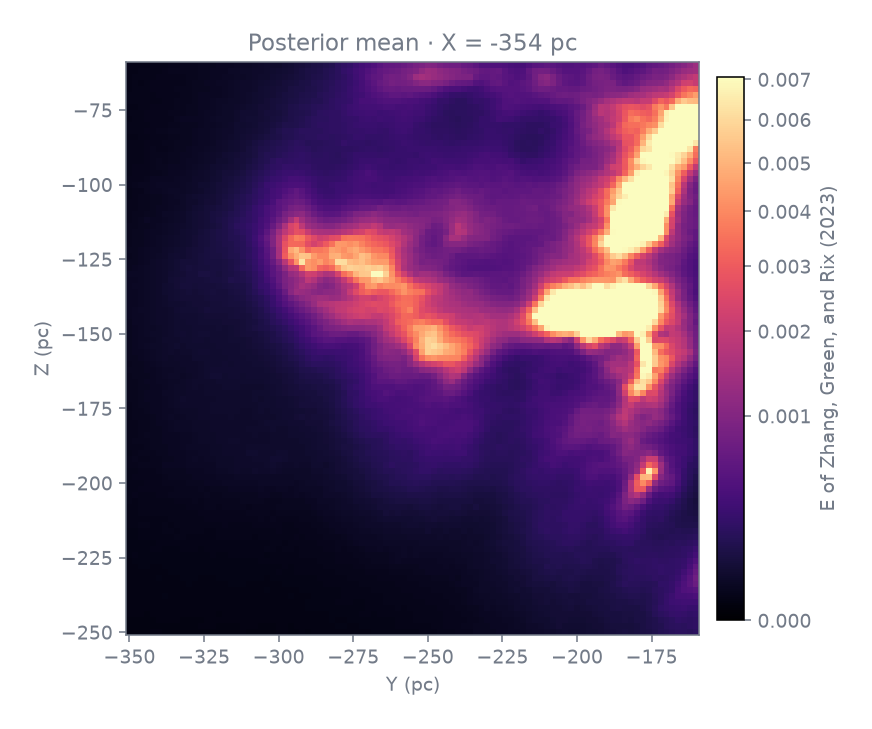
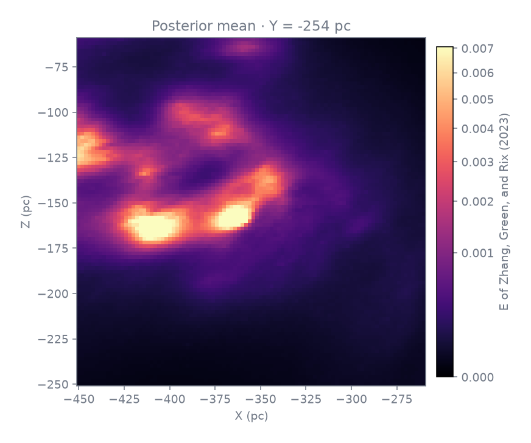

# Edenhofer et al. v1.0.2 physical XYZ demonstrator

This is a narrow, reproducible source boundary for one F16 physical Cartesian
volume. It restores `X[400:496), Y[450:546), Z[500:596)` from the parent
`mean_and_std_xyz.fits` as a 96 x 96 x 96 FITS with `MEAN` and standard-
deviation (`STD.`) image extensions. It is a reconstruction of the parent grid's interpolated dust
density product, not a new measurement.

The source is [Zenodo record 10658339](https://zenodo.org/records/10658339),
[DOI 10.5281/zenodo.10658339](https://doi.org/10.5281/zenodo.10658339),
released under CC-BY-4.0. The record's `mean_and_std_xyz.fits` is 15,662,543,040
bytes and declares MD5 `13ddd81b5e35e01582b74e0ec8db0fe5`. This restore does
not download the whole parent, so it cannot independently verify that whole-file
MD5. It validates HTTP 206, every requested `Content-Range`, response/part
lengths, and the pinned parent byte total instead.

Its two parent image arrays are uncompressed big-endian float32 FITS cubes with
`NAXIS1=NAXIS2=NAXIS3=1251`; their bytes begin at offsets 5,760 (`MEAN`) and
7,831,275,840 (`STD.`). For each selected Z it fetches one contiguous range
from `Y=450` through `Y=545`, including all 1,251 X samples in those rows, and
extracts X indices 400 through 495 locally. The selected plane offset is
`data_offset + (((Z * 1251 + 450) * 1251) * 4)` with inclusive byte bounds
`start..start+(96*1251*4)-1`. This makes 96 bounded ranges per extension (192
total, about 92.2 MB), rather than 9,216 fragile row requests per extension.
Headers are also ranged so the parent never enters the working directory.

The parent’s numbered `CUNIT1..3` are `pc`. Its unnumbered `CUNIT` is the
nonstandard source string `E of Zhang, Green, and Rix (2023)`, retained as the
scalar quantity unit. The coordinates are heliocentric Galactic Cartesian:
`+X` points to Galactic longitude `l=0`, `+Y` to `l=90`, and `+Z` to the north
Galactic pole. `CRPIX1..3` is reduced by `(400,450,500)`, retaining exactly the
parent WCS world coordinate at each cropped voxel. NaN values are source support
information and remain NaN in both MEAN and STD.; they are not replaced by zero.

Run from the repository root after the pinned toolchain is installed:

```sh
node tools/cli/run-typed-module.mjs tools/objects/astronomy-packages/toolchain.mts install
node tools/objects/astronomy-packages/toolchain.mts verify
output/toolchains/astroquery/env/bin/python tools/objects/telescopes/examples/edenhofer-xyz/restore.py \
  --out work/mean_and_std_xyz.crop-400-496-450-546-500-596.fits
```

The command refuses a different Astroquery/Astropy environment and refuses to
overwrite output. A successful restoration is exactly 7,087,680 bytes with
SHA-256 `c4338d130262e349b41951edbdf18b5fcb064ae9f6d0b1ba0d688c20627abd33`.
It uses one ordinary contiguous `Range: bytes=start-end` request for each
selected Z plane. Each response is about 480 KB, and it reports bounded
progress after each cumulative 10 MB. The plane range deliberately includes the
X gaps; that bounded 92.2 MB transfer is the known successful restoration
strategy.

Use the matching data-only F16 local import specification only after restoring
the file at its runtime-provided relative path:

```sh
mkdir -p work/edenhofer-xyz
output/toolchains/astroquery/env/bin/python tools/objects/telescopes/examples/edenhofer-xyz/restore.py \
  --out work/edenhofer-xyz/mean_and_std_xyz.crop-400-496-450-546-500-596.fits
pnpm telescope import tools/objects/telescopes/examples/edenhofer-xyz/edenhofer-xyz.local-import.json \
  --out work/edenhofer-xyz/imported --json
pnpm telescope outputs work/edenhofer-xyz/imported/descriptor.json
```

The relative `path` in the specification is intentional: it is supplied by the
runtime working directory, never an author-machine path. The explicit
`physicalContext` provides the F16 branch contract: the frame, density quantity,
unit, frame and depth bases, HTTPS source URL, citation, license, HDU 1
MEAN/HDU 2 standard deviation pairing, and `F16` family hint.

The checked-in operation parameters carry the rest of the example through the
public family runner. They export the native product, three orthogonal central
slices, and a prepared volume without losing the floating-point source product
or its paired uncertainty:

```sh
pnpm telescope family-run work/edenhofer-xyz/imported/descriptor.json physical-grid-inspect \
  --out work/edenhofer-xyz/inspect
pnpm telescope family-run work/edenhofer-xyz/imported/descriptor.json physical-grid-native \
  --out work/edenhofer-xyz/native
pnpm telescope family-run work/edenhofer-xyz/imported/descriptor.json physical-grid-slice \
  --params tools/objects/telescopes/examples/edenhofer-xyz/slice-x.params.json \
  --out work/edenhofer-xyz/slice-x
pnpm telescope family-run work/edenhofer-xyz/imported/descriptor.json physical-grid-slice \
  --params tools/objects/telescopes/examples/edenhofer-xyz/slice-y.params.json \
  --out work/edenhofer-xyz/slice-y
pnpm telescope family-run work/edenhofer-xyz/imported/descriptor.json physical-grid-slice \
  --params tools/objects/telescopes/examples/edenhofer-xyz/slice-z.params.json \
  --out work/edenhofer-xyz/slice-z
pnpm telescope family-run work/edenhofer-xyz/imported/descriptor.json physical-grid-prepare-volume \
  --params tools/objects/telescopes/examples/edenhofer-xyz/prepare-volume.params.json \
  --out work/edenhofer-xyz/prepared
pnpm telescope outputs work/edenhofer-xyz/prepared/physical-grid-volume.json
```

The final `outputs` call follows the verified wrapper to the ordinary physical
volume object, so callers can continue with the existing `volume` handoff. The
display transfer in `prepare-volume.params.json` is explicit and preserved as
evidence; it changes presentation only, never the native FITS values.

## Evidence and publication boundary

The three checked-in figures are central physical-coordinate slices produced
from the pinned restored FITS crop. The independent readback in
`evidence/real-readback.json` checks their WCS coordinates, the byte-identical
native output, and the prepared scalar encoding.

| X = -354 pc | Y = -254 pc | Z = -154 pc |
| --- | --- | --- |
|  |  |  |

The prepared output was also exercised through the existing css.earth volume
renderer and camera controls; `evidence/app-volume-rotated.png` records that
bounded integration test. `evidence/existing-body-volume-betelgeuse.png`
records the existing body-plus-volume attachment route. These are validation
artifacts only. This example does **not** register the Edenhofer crop as an app
object or publish it in the css.earth catalogue.

`source-record.json` retains the dataset DOI, creators, release, license, and
the exact source evidence used for this example without adding that record to
the app-wide source catalogue.

The offline range-assembly test uses a sparse fake 15.7 GB parent and verifies
the data ordering, output size, WCS shift, unnumbered CUNIT preservation, and
rejection of invalid HTTP range evidence:

```sh
output/toolchains/astroquery/env/bin/python tools/objects/telescopes/examples/edenhofer-xyz/restore.test.py
```
