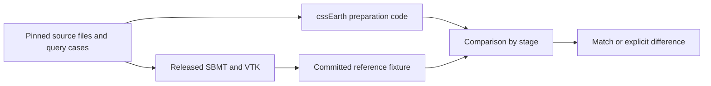

# SBMT preparation oracle

This is an optional native backend for the [shared oracle framework](../README.md).
It runs the released Small Body Mapping Tool's readers, mesh intersection and
texture-coordinate code, then compares saved results with cssEarth preparation
code. It supplies test evidence; it never supplies production source data,
camera solutions, atlases or runtime assets.



## Sources and identity

- [SBMT 0.9.2.1, macOS ARM release dated 2026-09-10](https://sbmt.jhuapl.edu/publicRelease/releases/sbmt-0.9.2.1-2026.09.10_OSX_ARM.pkg).
  [runtime.lock.json](runtime.lock.json) pins the package, bundled Java 17.0.2,
  classpath, native libraries and the installed JNI bridge bytes. SBMT is
  extracted locally; nothing is installed in Applications or run with a GUI.
- [java-bridge 2.8.1](https://github.com/MarkusJx/node-java-bridge) is only a JNI
  transport. Its complete dependency lock is [package-lock.json](package-lock.json).
  All authored orchestration and comparison code is strict TypeScript. No
  patched SBMT code or generated Java implementation stands in for the oracle.
- [Eros sources](../../../src/objects/eros/README.md): Gaskell ver128q and the
  archived NEAR MSI exposure M0146235607, with corrected SUM and SPICE INFO
  pointing tested separately. These two pointing solutions are not identical.
- [Itokawa sources](../../../src/objects/itokawa/README.md): Gaskell ver128q,
  AMICA ST_2402987304 and its archived SUM file.
- [The synthetic concave prism](../../../tests/fixtures/sbmt/concave.tab) is
  labelled test geometry. It is not a celestial-body approximation or asset.

The official binary release is the executed reference. Public
[SBMT source repositories](https://github.com/NASA-Planetary-Science/sbmt-overview)
explain the software, but their default branches must not be assumed to match
the binary release. Each fixture also pins this harness's generator code and
the exact inputs it actually read. Comparisons recheck source bytes immediately
before decoding them.

## Run it

Use the repository's installed dependencies and built preparation entry points.
Ordinary regression checks need neither Java nor SBMT:

```sh
pnpm test:sbmt --unit     # checked-in synthetic case, identity and rejection tests; also runs in CI
pnpm test:sbmt --restore  # restore only missing selected archive inputs, then test every case
pnpm test:sbmt           # every case, offline after restoration
node --max-old-space-size=512 tools/oracles/sbmt/check.mts
```

The last command writes `output/oracles/sbmt/comparison.json` and exits nonzero
if any compared stage differs. Regression tests verify that known discrepancies
are reported; a green test suite does **not** mean every scientific comparison
matched. The report records whether all cases or a selected subset ran.

Native regeneration is opt-in and currently qualified on **macOS ARM**:

```sh
node tools/oracles/setup.mts sbmt
node tools/oracles/run.mts sbmt/projection
```

Setup verifies and reuses `.local/oracles/sbmt`, restores only missing selected
body inputs through their existing acquisition plans, and refuses changed bytes.
It does not acquire the bodies' multi-gigabyte mosaic archives. The first native
setup downloads a 203.7 MB package and expands it locally. Reference generation
runs one child process with a 192 MiB Node heap, 512 MiB Java heap, bounded
threads and a four-minute timeout. Those are heap limits, not a total RSS cap.
Native VTK initialization can take longer on its first run.

Default `node tools/oracles/run.mts` continues to run the Python fixture oracles; it does
not implicitly launch SBMT. Native regeneration on other operating systems needs
its own verified release lock. The committed comparison fixtures are portable.

## Coverage and limits

[cases.json](../../../tests/fixtures/sbmt/cases.json) is the case inventory.
The generator has no body-specific algorithms. Every case uses the same native
reader, locator, UV probes and comparison path. Missing cases, duplicated probes,
changed inputs, wrong software bytes and incomplete stages fail explicitly.

| Case family | Executable evidence | Meaning |
| --- | --- | --- |
| SUM and INFO | Native `SumFileReader` / `InfoFileReader`, independently decoded in `candidate.mts` | Origin, corner order, normalization, km units and camera basis |
| Rectangular and square images | NEAR 537×244; AMICA 1024×1024; synthetic 2×2 | Raw detector dimensions and unequal pixel scales are explicit |
| Source geometry and visibility | Native `loadPDSShapeModel`, `vtkOBBTree`, cssEarth `parsePdsVertexFacetShape` and `mesh.intersect` | 121 rays per case; source vertices, nearest hits, off-limb misses, multiple intersections and concavity |
| Footprints | Native `SmallBodyModel.computeFrustumIntersection` | SBMT footprint cell counts are retained diagnostics; they do not prove a cssEarth footprint implementation |
| Image coordinates and UVs | Native `PolyDataUtil.generateTextureCoordinates` versus cssEarth `project` | Identity, both axis flips, three quarter turns, central crop; every boundary, interior grid, off-image and behind-camera cases |
| FITS image values | SBMT's bundled nom-tam-fits versus `readFitsImage` | Pinned raw axes, encoding and up to 65 distinct samples per image; no photometric normalization claim |
| FITS encodings, missing values and extensions | Existing [FITS oracle](../README.md) and `tools/fits/fits.oracle.test.mts` | Scaled integers, float NaNs, cubes and extension policy; not reimplemented here |
| PDS3/PDS4 image and geometry planes | Existing [PDS oracle comparisons](../README.md) | Label-driven dimensions, offsets, quality and units; this backend consumes SUM/INFO, not SPICE kernels or geometry cubes |
| Released OBJ UV islands and raster sampling | `tools/objects/terrestrial-layers/obj-uv-fits.test.mts` | Barycentric transfer, seams, nearest/bilinear sampling policy, orientation and missing support; existing unit checks, **not native SBMT qualification** |
| Bad or unsupported inputs | `projection.test.mts` | Missing/duplicate fields, unsafe paths, hash drift, dimensions, degenerate cameras, non-affine frusta and unsupported SUM distortion/K matrices |

This is coverage of the named input and numerical cases, not every SBMT feature
or every asteroid. Other PDS shape layouts, DSK/OBJ/STL geometry import, arbitrary image rotation,
distorted camera models, multi-image photometric mosaics and scientific
registration to a different shape version need their own qualified case and
adapter. Unsupported options are rejected, never approximated silently.

### Differences the oracle exposes

The fixed comparison limits are 5 cm for native mesh coordinates/intercepts,
1e-10 for normalized camera directions, exact sampled FITS values and **0.25
pixel for in-image UV projection**. Native VTK reads the released vertices at
float precision; source mesh comparison therefore uses a physical-distance
tolerance. No tolerance is inferred from the current maximum error.

| Reference case | Maximum in-image UV difference | Quarter-pixel comparison |
| --- | ---: | --- |
| Eros SUM | 0.0817 px | Match |
| Eros INFO | 0.0817 px | Match |
| Itokawa SUM | 1.0021 px | **Different** |
| Synthetic concave prism | 0.0541 px | Match |

SBMT's angular UV approximation and cssEarth's projective camera are not
identical. The Itokawa difference stays visible and makes `check.mts` exit 1.
Do not fit a camera to the native UV fixture, loosen the limit or replace the
production projection with SBMT's approximation to manufacture agreement.

SBMT also clamps or mirrors off-image queries into its texture domain. Those
UVs are retained in the fixture for inspection, but unsupported photographic
pixels and points behind the camera must be withheld. Display UVs are not a
coverage mask. A source image, pointing file and shape being loadable together
does not establish their physical registration or certify a new surface lens.

### Known problem: native regeneration is not bit-reproducible

Two consecutive `node tools/oracles/run.mts sbmt/projection` runs against the same pinned
inputs and locked SBMT/Java bytes do not agree byte for byte: 1,643 of 34,777
numeric leaves in `tests/oracles/sbmt/projection.json` differ between runs, with
a maximum absolute difference of about 1.6e-4 and a maximum relative difference
of about 3.1e-4 (checked 2026-09-18, macOS ARM release above). The drift sits far
under the 0.25-pixel UV comparison limit and the 5 cm mesh-distance limit above,
so it has not been observed to flip a comparison result, but it means the native
backend's own output is floating-point-order-dependent (likely thread-scheduling
or JIT-order dependent inside the bundled Java/VTK pipeline; `OMP_NUM_THREADS=1`
and `VTK_SMP_MAX_THREADS=1` do not remove it). Do not add a stricter
byte-identity check against a second live run; compare each run only against the
committed fixture, at its documented tolerance.

## Add a case

1. Pin the selected native inputs in the body's existing source manifest and
   acquisition plan, with source catalogue bindings. Update its investigation
   ledger. A synthetic case belongs in `tests/fixtures/sbmt` and must say so.
2. Add the file identities and dimensions to `cases.json`. Reuse the generic
   path; add a new format adapter only when its scientific convention is known.
3. Run the native generator twice into separate test/scratch files and compare.
   As recorded above, the native backend is not bit-reproducible: expect small
   (≲3.1e-4 relative) floating-point drift, not byte-for-byte agreement, and check
   the new case's values stay within the comparison tolerances on both runs.
   Preserve the committed fixture and run the comparing tests. A repeat checks
   reproducibility bounds, not scientific accuracy.
4. Inspect each stage's result. A new case does not become qualified because
   another body passed, because the fixture exists, or because regression tests
   correctly report its discrepancy. Document new limitations here and the
   scientific outcome in the affected body ledger.
